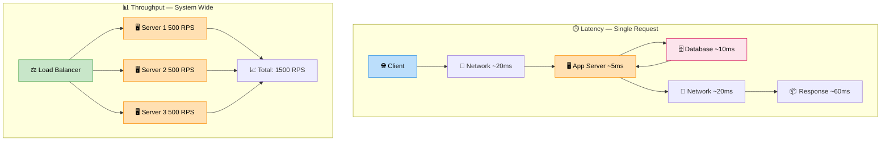

# Latency vs Throughput

> **Subject**: System Design · **Group**: Fundamentals · **Topic**: 02 of 07
> **Status**: ✅ Done

---

## PART 1

---

### 1. What is it?

- **Latency** = time for **one request** to complete (milliseconds). How fast?
- **Throughput** = number of **requests processed per second** (RPS/TPS). How many?
- They are related but not the same — you can have high throughput with high latency (batch jobs) or low latency with low throughput (serial single-user systems).

---

### 2. Why is it needed?

| Scenario             | What matters   | Why                                 |
| -------------------- | -------------- | ----------------------------------- |
| User clicks a button | **Latency**    | User feels the delay directly       |
| Payment processing   | **Both**       | Fast + reliable under load          |
| Data pipeline / ETL  | **Throughput** | Move max data, timing less critical |
| Stock trading system | **Latency**    | Microseconds = money                |

Without understanding this distinction, engineers over-optimize the wrong thing.

---

### 3. Where is it used? (3 Real-World Use Cases)

| Use Case                      | Key Metric                                     | Real Benchmark                                     |
| ----------------------------- | ---------------------------------------------- | -------------------------------------------------- |
| **Google Search**             | Latency < 200ms                                | Anything above = 0.5% drop in clicks               |
| **Kafka event pipeline**      | Throughput > 1M msgs/sec                       | Batch consumers don't care about per-message delay |
| **Ride-sharing (Uber match)** | Both — match in <1s AND handle 10K matches/sec | High bar on both axes                              |

---

### 4. How Does it Work? (High-Level)



```
LATENCY (single request view):
──────────────────────────────
  Client → [Network] → [Server] → [DB] → [Server] → [Network] → Client
            ~20ms        ~5ms      ~10ms    ~5ms        ~20ms
            Total latency = ~60ms

THROUGHPUT (system-wide view):
───────────────────────────────
  [Load Balancer]
      ├── Server1: handles 500 RPS
      ├── Server2: handles 500 RPS
      └── Server3: handles 500 RPS
  Total throughput = 1500 RPS

Key insight:
  ↑ parallelism (more servers)  →  ↑ throughput
  ↓ each step's processing time →  ↓ latency
  These are INDEPENDENT optimizations.
```

**Little's Law** (essential for interviews):
$$L = \lambda \times W$$

- $L$ = avg items in the system (queue depth)
- $\lambda$ = arrival rate (RPS)
- $W$ = avg time in system (latency)

Implication: if latency doubles, queue depth doubles for the same RPS → system backs up.

---

### 5. Types / Variations

| Term                     | Meaning                             | Typical Target          |
| ------------------------ | ----------------------------------- | ----------------------- |
| **p50 latency**          | Median — 50% of requests are faster | General health          |
| **p95 latency**          | 95% of requests are faster          | User-facing APIs        |
| **p99 latency**          | 99% of requests are faster          | SLA commitments         |
| **p99.9 (tail latency)** | 0.1% worst-case                     | Financial / real-time   |
| **Throughput**           | Requests per second (RPS)           | Capacity planning       |
| **Bandwidth**            | Data volume per second (GB/s)       | Storage, CDN, streaming |

> Always measure **p99, not average**. A bad average hides tail latency that affects your heaviest users.

---

## PART 2

---

### 6. Trade-offs

#### Latency vs Throughput Tension

| Optimization           | Latency Effect                  | Throughput Effect          |
| ---------------------- | ------------------------------- | -------------------------- |
| Add more servers       | Neutral (or slight ↓)           | ↑ (more parallel capacity) |
| Add caching            | ↓↓ (huge win)                   | ↑ (fewer DB hits)          |
| Use async processing   | ↑ (request returns immediately) | ↑ (DB writes batched)      |
| Increase batch size    | ↑ (waits for full batch)        | ↑ (fewer round trips)      |
| Add connection pooling | ↓ latency variance              | ↑ stable throughput        |

#### 🚫 When NOT to chase low latency

- **Batch ETL jobs** — optimizing for p99 latency here is wasted effort; maximize throughput
- **Log aggregation** — seconds of delay is fine; don't add complexity for microseconds
- **Async notifications** — eventual delivery is acceptable; focus on delivery guarantee, not speed

---

### 7. Failure Scenarios

| Failure                                        | Impact                                                      | Handling                                                 |
| ---------------------------------------------- | ----------------------------------------------------------- | -------------------------------------------------------- |
| **Latency spike** (slow DB query)              | p99 blows up, users time out                                | Query optimization, read replicas, caching               |
| **Throughput saturation** (traffic > capacity) | Queue grows, latency climbs (Little's Law), cascade failure | Auto-scaling, rate limiting, load shedding               |
| **Head-of-line blocking**                      | One slow request blocks all behind it                       | Async queuing, HTTP/2 multiplexing, timeout + retry      |
| **GC pause (JVM)**                             | Latency spikes randomly for seconds                         | Use G1/ZGC tuning, or Go/Rust for latency-critical paths |
| **Network congestion**                         | High latency + packet retransmits                           | CDN, edge caching, regional deployment                   |

---

### 8. AWS Mapping

| Need                          | AWS Service              | How                                               |
| ----------------------------- | ------------------------ | ------------------------------------------------- |
| **Reduce latency (caching)**  | ElastiCache (Redis)      | Cache hot DB reads → sub-ms response              |
| **Reduce latency (global)**   | CloudFront CDN           | Serve static/dynamic content from edge (< 10ms)   |
| **Increase throughput**       | ALB + EC2 ASG            | Scale horizontally across AZs                     |
| **Measure latency**           | CloudWatch (p50/p95/p99) | Custom metrics from Lambda, ALB, API GW           |
| **Async to improve both**     | SQS + Lambda             | Decouple producers/consumers; scale independently |
| **DB throughput**             | DynamoDB                 | Millions of RPS, single-digit ms latency at scale |
| **High-throughput streaming** | Kinesis / MSK (Kafka)    | Millions of events/sec with replay                |

---

### 9. Interview-Ready Explanation (30–45 sec)

> _"Latency is how long a single request takes — measured in milliseconds. Throughput is how many requests the system can handle per second. They're related but different levers._
>
> _If I have one slow server, latency is bad AND throughput is low. If I add 10 servers, throughput goes up, but each individual request latency is unchanged unless I also optimize the server-side processing or add caching._
>
> _In interviews, I always ask: are we optimizing for user-perceived response time (latency), or for system capacity (throughput)? The answer changes the architecture. For user-facing APIs, I target p99 < 200ms. For pipelines, I target maximum RPS with acceptable lag."_

---

### 10. Quick Example

**E-commerce product page: latency problem**

```
Before optimization:
  GET /product/123
    → DB query (no index): 300ms
    → Image load (origin): 150ms
  Total p99 latency: ~500ms  ❌

After optimization:
  GET /product/123
    → Redis cache hit: 1ms
    → Image from CloudFront CDN: 5ms
  Total p99 latency: ~10ms  ✅
  Throughput: unchanged (capacity comes from servers, not speed)
```

---

### 11. Common Interview Questions

**Q1: How do you improve latency without adding servers?**

> Caching (Redis), DB indexing, query optimization, CDN for static assets, connection pooling to avoid new TCP setup per request. Reduce the work done per request before scaling hardware.

**Q2: Your system has great average latency but users complain it feels slow. Why?**

> Average hides tail latency. Check p95/p99. Common culprits: GC pauses, slow DB queries hitting cache misses, cold starts (Lambda), network timeouts on retry. Fix: trace individual slow requests, not averages.

**Q3: How does Little's Law apply in a system design interview?**

> L = λ × W. If your latency (W) doubles, for the same arrival rate (λ), your queue depth (L) doubles. This means memory/resource usage doubles too. It's why high latency under load cascades into full system failure — the queue never drains.

---

> **Next Topic →** [03 · CAP Theorem](./03-cap-theorem.md)
