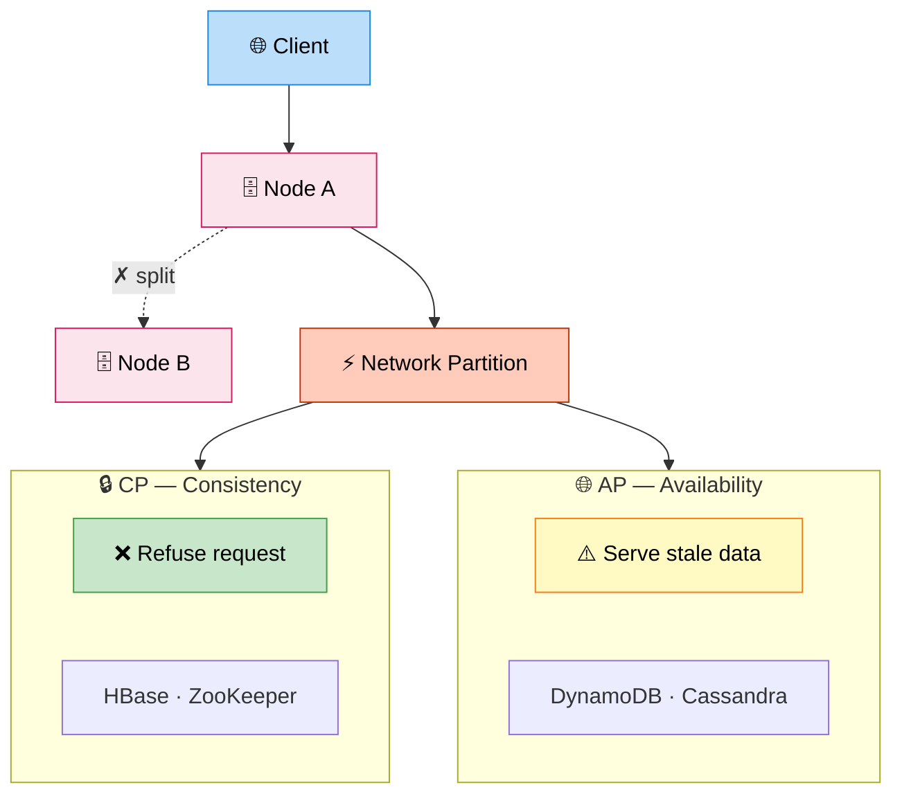

# CAP Theorem (Practical)

> **Subject**: System Design · **Group**: Fundamentals · **Topic**: 03 of 07
> **Status**: ✅ Done

---

## PART 1

---

### 1. What is it?

CAP Theorem states that a **distributed system** can guarantee only **2 of these 3** properties simultaneously:

- **C — Consistency**: Every read returns the most recent write (or an error)
- **A — Availability**: Every request gets a response (no error), even if data might be stale
- **P — Partition Tolerance**: System continues working even when network splits nodes apart

> **Real-world truth**: Network partitions WILL happen. So you actually choose between **C and A** during a partition.

---

### 2. Why is it needed?

When you split a database across multiple nodes/regions, a network failure can split them. At that point, you must decide:

- **Refuse the request** until nodes re-sync → favor **Consistency**
- **Serve stale data** and accept the request → favor **Availability**

This decision **shapes your entire database and architecture choice**.

---

### 3. Where is it used? (3 Real-World Use Cases)

| System                     | Choice | Why                                                                 |
| -------------------------- | ------ | ------------------------------------------------------------------- |
| **Bank balance / payment** | CP     | You cannot show wrong balance — reject request if unsure            |
| **DNS / CDN**              | AP     | Old IP is better than no response; propagation delay acceptable     |
| **Shopping cart (Amazon)** | AP     | Better to show slightly stale cart than error out — revenue matters |

---

### 4. How Does it Work? (High-Level)



```
Normal Operation (no partition):
  [Client] → [Node A] ←sync→ [Node B]
  Reads and writes work fine on both nodes.

During Network Partition:
  [Client] → [Node A]   ✗   [Node B]  ← can't sync

  OPTION 1 — Choose Consistency (CP):
    Node A refuses to serve until partition heals.
    "I'd rather return an error than stale data."
    → Used by: HBase, ZooKeeper, etcd, Spanner

  OPTION 2 — Choose Availability (AP):
    Node A serves its last known data (possibly stale).
    "I'd rather serve old data than nothing."
    → Used by: DynamoDB, Cassandra, CouchDB, DNS
```

---

### 5. Types / Variations (Practical Buckets)

| Category | Properties                      | Systems                                       | Use When                                                   |
| -------- | ------------------------------- | --------------------------------------------- | ---------------------------------------------------------- |
| **CP**   | Consistent + Partition Tolerant | ZooKeeper, etcd, HBase, MongoDB (strong mode) | Financial transactions, config management, leader election |
| **AP**   | Available + Partition Tolerant  | DynamoDB, Cassandra, CouchDB, Riak            | Shopping carts, social feeds, DNS, session data            |
| **CA**   | Consistent + Available (no P)   | Single-node PostgreSQL/MySQL                  | Only valid for single-node — not truly distributed         |

> **CA doesn't exist at scale.** You can't ignore partitions in any real distributed system.

---

## PART 2

---

### 6. Trade-offs

| Choosing CP                         | Choosing AP                             |
| ----------------------------------- | --------------------------------------- |
| ✅ Data is always accurate          | ✅ System never goes down               |
| ✅ No stale reads                   | ✅ Low latency (no wait for sync)       |
| ❌ May reject valid requests        | ❌ Users may see stale/conflicting data |
| ❌ Higher latency (wait for quorum) | ❌ Conflict resolution complexity       |

#### 🚫 When NOT to use strict CP

- **Social media likes/views** — counts don't need to be exact; AP is fine
- **Product catalog browsing** — slightly stale price is okay vs user getting error
- **Any high-traffic read path** — quorum reads add latency and reduce availability

#### 🚫 When NOT to use AP

- **Bank balances** — stale = wrong amount shown = legal/financial risk
- **Inventory reservation** — overselling stock is a business problem
- **Distributed locks / leader election** — must be authoritative; use CP (ZooKeeper/etcd)

---

### 7. Failure Scenarios

| Failure                  | CP Behavior                              | AP Behavior                         | Best Handling                                                 |
| ------------------------ | ---------------------------------------- | ----------------------------------- | ------------------------------------------------------------- |
| **Network partition**    | Returns error / blocks                   | Serves stale data                   | By design — choose your poison                                |
| **Node crash**           | Remaining nodes elect new leader (delay) | Other nodes serve immediately       | CP uses Raft/Paxos for new leader                             |
| **Split-brain**          | Impossible (one leader enforced)         | Both nodes accept writes → conflict | AP needs conflict resolution (last-write-wins, vector clocks) |
| **Slow replication lag** | Quorum enforces latest                   | Reads may return old data           | Use read-repair or anti-entropy in AP systems                 |

---

### 8. AWS Mapping

| CAP Choice               | AWS Service                          | Configuration                                      |
| ------------------------ | ------------------------------------ | -------------------------------------------------- |
| **CP**                   | DynamoDB (strong reads)              | `ConsistentRead: true` — reads from primary        |
| **AP**                   | DynamoDB (eventual reads)            | Default — reads from any replica, cheaper + faster |
| **CP**                   | RDS Multi-AZ                         | All reads/writes go to primary; failover managed   |
| **AP**                   | RDS Read Replicas                    | Reads from replica (slight lag acceptable)         |
| **CP**                   | ElastiCache Redis (cluster mode)     | Consistent writes across shards                    |
| **CP meta-layer**        | AWS Systems Manager Parameter Store  | Config consistency across regions                  |
| **Leader election (CP)** | Amazon ECS + ZooKeeper / etcd on EKS | Distributed lock for microservice coordination     |

---

### 9. Interview-Ready Explanation (30–45 sec)

> _"CAP Theorem says in a distributed system, during a network partition — which will happen — you must choose between Consistency and Availability._
>
> _Consistency means every read gets the latest write or an error. Availability means every request gets a response, even if slightly stale. You can't have both during a partition._
>
> _In practice: for financial data I'd choose CP — use DynamoDB with strong reads or RDS primary. For social feeds or shopping carts, I'd choose AP — use DynamoDB eventual reads or Cassandra, accept slight staleness, and handle conflicts with last-write-wins._
>
> _The CA category doesn't really exist in distributed systems — you can't eliminate network partitions."_

---

### 10. Quick Example

**Scenario: E-commerce checkout inventory check**

```
Two warehouse nodes: Node A (East), Node B (West)

User buys last item of Product X.

NETWORK PARTITION OCCURS:
  Node A sees: qty = 0 (just sold)
  Node B sees: qty = 1 (not yet synced)

CP Choice (correct for inventory):
  User on West coast queries Node B
  Node B: "I can't confirm — partition active"
  → Returns: "Please try again" (or routes to primary)
  → No oversell ✅

AP Choice (wrong for inventory, OK for cart):
  Node B returns qty=1
  → User adds to cart and pays
  → Order placed for out-of-stock item ❌ (oversell)
```

---

### 11. Common Interview Questions

**Q1: Can you give me an example where you'd use AP over CP?**

> User profile views, social media like counts, product recommendations, DNS lookups, shopping cart. All cases where stale data is acceptable and availability is more important than perfect accuracy.

**Q2: How does DynamoDB handle the CAP trade-off?**

> DynamoDB lets you choose per-read: `ConsistentRead=false` (AP, eventually consistent, cheaper, ~2x faster) or `ConsistentRead=true` (CP, strongly consistent, reads from leader, slightly more expensive). This is a great design — let the application decide per use case.

**Q3: What is PACELC and how does it extend CAP?**

> PACELC says: even when there's no partition (normal operation), there's still a trade-off between Latency and Consistency. Lower latency means you can't wait for all replicas to confirm — so you accept eventual consistency. Higher consistency means waiting for quorum writes — adds latency. CAP only covers the partition case; PACELC covers the normal case too.

---

> **Next Topic →** [04 · Consistency Models](./04-consistency-models.md)
