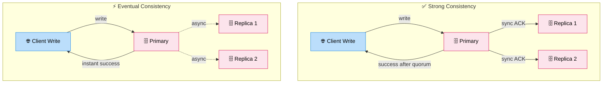

# Consistency Models (Strong vs Eventual)

> **Subject**: System Design · **Group**: Fundamentals · **Topic**: 04 of 07
> **Status**: ✅ Done

---

## PART 1

---

### 1. What is it?

A **consistency model** defines what value a read returns after a write in a distributed system.

- **Strong Consistency**: After a write, all readers immediately see the new value.
- **Eventual Consistency**: After a write, readers will _eventually_ see the new value — but may see stale data temporarily.

These models exist on a spectrum. Strong = safe + slow. Eventual = fast + complex conflict handling.

---

### 2. Why is it needed?

In a distributed system with replicas across nodes/regions, data takes time to propagate. The consistency model is your **contract** with the application about what it can expect from reads:

- Inconsistency causes wrong decisions (double-charging, wrong inventory count)
- Over-strict consistency kills performance (every read must hit the primary)

---

### 3. Where is it used? (3 Real-World Use Cases)

| Use Case                         | Model    | Why                                                   |
| -------------------------------- | -------- | ----------------------------------------------------- |
| **Bank account balance**         | Strong   | Incorrect balance = fraud risk                        |
| **Twitter follower count**       | Eventual | Slightly stale count (1.2M vs 1.2M+1) is totally fine |
| **Multiplayer game leaderboard** | Eventual | Ranks can lag slightly; low latency more important    |

---

### 4. How Does it Work? (High-Level)



```
Write happens on Node A:
  User writes: balance = $500

Strong Consistency:
  Node A syncs → Node B, Node C (waits for ACK from all/quorum)
  Only returns success AFTER all replicas confirm
  Any read from any node: $500 ✅
  Cost: extra latency (~quorum write round trip)

Eventual Consistency:
  Node A writes locally, returns success immediately
  Async replication to Node B, Node C (happens within ms to seconds)
  Read from Node B right after: may return $450 (old value) ⚠️
  Read from Node B 500ms later: returns $500 ✅
  Cost: temporary inconsistency window
```

**Replication quorum formula:**

- $R + W > N$ → strong consistency guaranteed
- $R$ = nodes read from, $W$ = nodes written to, $N$ = total replicas
- Example: $N=3$, $W=2$, $R=2$ → $R+W=4 > 3$ → strong ✅

---

### 5. Types / Variations (Consistency Spectrum)

| Model                        | Guarantee                                                          | Latency    | Used In                          |
| ---------------------------- | ------------------------------------------------------------------ | ---------- | -------------------------------- |
| **Linearizability** (Strict) | Reads see writes immediately, globally ordered                     | Highest    | etcd, ZooKeeper, Spanner         |
| **Sequential**               | All nodes see writes in same order (not necessarily real-time)     | High       | Multi-core CPU memory            |
| **Causal**                   | Causally related operations are ordered; concurrent ops may differ | Medium     | Git-like systems, some DBs       |
| **Read-your-writes**         | You always see your own writes                                     | Low-medium | User profile updates             |
| **Eventual**                 | All replicas converge eventually                                   | Lowest     | DNS, Cassandra, DynamoDB default |
| **Monotonic read**           | Once you read a value, you won't read an older one                 | Low        | Session-scoped reads             |

---

## PART 2

---

### 6. Trade-offs

| Strong Consistency                     | Eventual Consistency                  |
| -------------------------------------- | ------------------------------------- |
| ✅ Predictable, correct data always    | ✅ Lower latency, higher availability |
| ✅ No conflict resolution needed       | ✅ Works well across regions          |
| ❌ Higher write latency (quorum sync)  | ❌ May serve stale data               |
| ❌ Availability drops during partition | ❌ Conflict resolution required       |
| ❌ Harder to scale globally            | ❌ More complex application logic     |

#### 🚫 When NOT to use Strong Consistency

- **Global multi-region reads** — quorum across regions adds 100s of ms
- **High-traffic social data** (likes, views, shares) — eventual is fine
- **Analytics dashboards** — a few seconds of lag is invisible to users

#### 🚫 When NOT to use Eventual Consistency

- **Financial transactions** — double-spend or wrong balance is unacceptable
- **Inventory reservation** — overselling due to stale count = business loss
- **User auth tokens / session revocation** — stale "valid" token = security hole

---

### 7. Failure Scenarios

| Failure                     | Strong Consistency Impact                       | Eventual Consistency Impact         | Handling                                                |
| --------------------------- | ----------------------------------------------- | ----------------------------------- | ------------------------------------------------------- |
| **Network partition**       | Writes blocked until quorum reachable           | Writes succeed; conflict on merge   | Strong: queue writes; Eventual: last-write-wins or CRDT |
| **Slow replica**            | Write latency increases (waiting for slow node) | Replication lag grows               | Timeout + exclude slow replica from quorum              |
| **Split-brain**             | Prevented by quorum (minority can't elect)      | Both sides accept writes → conflict | Eventual: vector clocks or timestamps to resolve        |
| **Read from stale replica** | Impossible (reads go to quorum)                 | Possible by design                  | Application must tolerate or re-read                    |

---

### 8. AWS Mapping

| Consistency Need        | AWS Service                           | Config                                                           |
| ----------------------- | ------------------------------------- | ---------------------------------------------------------------- |
| **Strong reads**        | DynamoDB                              | `ConsistentRead: true` → reads from leader                       |
| **Eventual reads**      | DynamoDB                              | `ConsistentRead: false` (default) → ~50% cheaper                 |
| **Strong writes**       | DynamoDB                              | Strongly consistent by default for writes                        |
| **Strong — global**     | Aurora Global DB                      | Primary region writes; read replicas in other regions (eventual) |
| **Strong — config**     | AWS SSM Parameter Store               | Always consistent within region                                  |
| **Eventual — cache**    | ElastiCache (Redis async replication) | Primary + read replicas (slight replication lag)                 |
| **Causal (CRDT-style)** | DynamoDB Streams + Lambda             | Read-repair pattern: detect and reconcile conflicts              |

---

### 9. Interview-Ready Explanation (30–45 sec)

> _"Consistency models define what a read returns after a write in a distributed system._
>
> _Strong consistency means every read returns the latest write — like reading a bank balance. The system waits for quorum confirmation before returning, which adds latency. Eventual consistency means reads may return stale data temporarily, but all replicas will converge — like seeing a Twitter like count that's a few seconds behind._
>
> _In practice, I design most user-facing systems with eventual consistency for reads — faster, cheaper, more available. But for financial data, inventory, or security-critical operations, I use strong consistency or isolate those writes to a single CP-safe store like DynamoDB with ConsistentRead=true."_

---

### 10. Quick Example

**Social media post like counter:**

```
User A likes a post: count = 1,001,001
  → Written to DynamoDB primary
  → Async replicated to read replicas

User B reads like count 100ms later from replica:
  → Gets 1,001,000 (stale by 1 like) ← ACCEPTABLE ✅

User A reads their own bank balance right after transfer:
  → Reads from DynamoDB with ConsistentRead=true
  → Gets latest value: $1,450 ✅ (not stale $1,500)
```

---

### 11. Common Interview Questions

**Q1: What is "read-your-writes" consistency and when do you need it?**

> After you write data, you're guaranteed to see your own write on any subsequent read — even if other users still see old data. Critical for: profile updates, settings changes, shopping cart. Implementation: route user reads to the same replica they wrote to (sticky sessions) or use strong reads only for the writing user.

**Q2: How does Cassandra handle eventual consistency, and how can you tune it?**

> Cassandra uses a configurable quorum: you set `CONSISTENCY ONE/QUORUM/ALL` per operation. `ONE` = AP (fastest, may be stale). `QUORUM` = majority of nodes must agree → stronger. `ALL` = all replicas must respond → strongest but lowest availability. The R+W>N rule applies.

**Q3: What are CRDTs and when do they matter?**

> Conflict-free Replicated Data Types are data structures that can be merged automatically without conflicts — e.g., a counter that can only increment, or a set with add-only operations. Used in AP systems (like Riak, Redis CRDT mode) to resolve conflicts without coordination. Relevant when you need eventual consistency + no data loss (like a distributed shopping cart that must preserve all added items).

---

> **Next Topic →** [05 · Load Balancing](./05-load-balancing.md)
