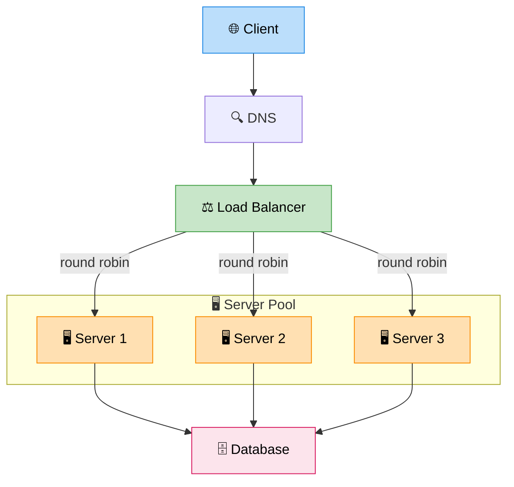

# Load Balancing

> **Subject**: System Design · **Group**: Fundamentals · **Topic**: 05 of 07
> **Status**: ✅ Done

---

## PART 1

---

### 1. What is it?

A **Load Balancer** sits in front of a pool of servers and distributes incoming requests across them. It ensures:

- No single server is overwhelmed
- Requests are only sent to healthy servers
- The system can scale by adding more servers transparently

It's the entry point to any horizontally scaled system.

---

### 2. Why is it needed?

| Problem Without LB          | What Happens                        |
| --------------------------- | ----------------------------------- |
| All traffic hits one server | That server crashes, full outage    |
| Server goes down            | Users get connection refused        |
| You add more servers        | No way for clients to discover them |

Load balancer solves all three: distributes load, detects failures via health checks, and hides the server pool from clients.

---

### 3. Where is it used? (3 Real-World Use Cases)

| Use Case             | Layer     | Example                                                     |
| -------------------- | --------- | ----------------------------------------------------------- |
| **Web tier**         | L7 (HTTP) | ALB routes `/api/*` to API servers, `/` to frontend servers |
| **Microservices**    | L4/L7     | Internal LB routes service-to-service calls (Envoy, Nginx)  |
| **DB read replicas** | L4        | ProxySQL / RDS Proxy distributes reads across replicas      |

---

### 4. How Does it Work? (High-Level)



```
Client → [Load Balancer] → [Server Pool]

Steps:
  1. Client DNS resolves to LB IP
  2. LB receives request
  3. LB picks a server using an algorithm
  4. LB forwards request to chosen server
  5. Response comes back through LB (or directly: DSR mode)
  6. LB runs health checks every N seconds
     → Unhealthy server removed from pool automatically

L4 (Transport Layer): routes by IP + TCP port
  → Faster, no HTTP awareness, can't route by URL path

L7 (Application Layer): routes by HTTP headers, URL, method
  → Smarter: path-based routing, SSL termination, cookies
```

---

### 5. Load Balancing Algorithms

| Algorithm                | How                                           | Best For                           | Weakness                                    |
| ------------------------ | --------------------------------------------- | ---------------------------------- | ------------------------------------------- |
| **Round Robin**          | Send 1→2→3→1→2→3 in order                     | Uniform requests                   | Doesn't account for server capacity         |
| **Weighted Round Robin** | Server A gets 3x more traffic than B          | Heterogeneous servers              | Static weights — doesn't adapt in real-time |
| **Least Connections**    | Send to server with fewest active connections | Long-lived connections (WebSocket) | Overhead of tracking connections            |
| **IP Hash**              | Hash client IP → always same server           | Session stickiness                 | Uneven if few clients, defeats LB           |
| **Random**               | Pick random server                            | Simple low-traffic cases           | No intelligence                             |
| **Least Response Time**  | Send to fastest-responding server             | Latency-sensitive                  | More complex to implement                   |

---

## PART 2

---

### 6. Trade-offs

#### ✅ Pros

| Advantage              | Detail                                         |
| ---------------------- | ---------------------------------------------- |
| High availability      | Failed servers removed from pool automatically |
| Horizontal scalability | Add servers without changing client config     |
| SSL termination        | Offload TLS decryption from app servers        |
| Health-check driven    | Traffic only goes to healthy instances         |

#### ❌ Cons / When NOT to use

| Disadvantage                               | Detail                                                                     |
| ------------------------------------------ | -------------------------------------------------------------------------- |
| **LB itself is a SPOF**                    | If the LB crashes, everything is down → use Active-Active LB pair          |
| **Sticky sessions limit scaling**          | Pinning user to a server defeats the purpose; externalize sessions instead |
| **L7 LB adds latency**                     | Parsing HTTP headers costs ~1ms vs L4; usually worth it                    |
| **Overkill for simple single-server apps** | Don't add LB complexity until you need it                                  |

---

### 7. Failure Scenarios

| Failure                                                | Impact                                       | Handling                                                                               |
| ------------------------------------------------------ | -------------------------------------------- | -------------------------------------------------------------------------------------- |
| **Backend server crashes**                             | Health check fails → LB removes it from pool | Other servers absorb load; ASG replaces crashed instance                               |
| **LB itself crashes**                                  | Total outage                                 | Active-Active LB pair with anycast IP / DNS failover                                   |
| **All servers fail health checks**                     | LB returns 503                               | Set min healthy % threshold; alert on pool drain                                       |
| **Thundering herd after server add**                   | New server gets crushed before warm-up       | Use slow-start: gradually ramp new server's weight                                     |
| **Long-lived connection (WebSocket) with round-robin** | Connection drops on LB re-route              | Use sticky sessions OR session-external state; configure LB for persistent connections |
| **SSL cert expiry on LB**                              | HTTPS breaks for all clients                 | Automate cert renewal (ACM on AWS auto-renews)                                         |

---

### 8. AWS Mapping

| Type                         | AWS Service                         | Use Case                                               |
| ---------------------------- | ----------------------------------- | ------------------------------------------------------ |
| **L7 HTTP/HTTPS LB**         | **ALB** (Application Load Balancer) | Path/host-based routing, microservices, ECS, EKS       |
| **L4 TCP/UDP LB**            | **NLB** (Network Load Balancer)     | Ultra-low latency, static IP, non-HTTP protocols       |
| **Classic (legacy)**         | CLB (Classic LB)                    | Avoid for new systems                                  |
| **Internal service mesh**    | AWS App Mesh + Envoy                | Service-to-service LB inside VPC                       |
| **Global LB**                | AWS Global Accelerator              | Routes users to nearest healthy region                 |
| **DB connection LB**         | RDS Proxy                           | Pools and distributes DB connections; manages failover |
| **Auto-scaling integration** | ALB + Target Groups + ASG           | New EC2 instances auto-registered with LB on scale-out |

**Typical ALB Setup on AWS:**

```
Internet
  ↓
Route 53 (DNS → ALB DNS name)
  ↓
ALB (Multi-AZ, auto-scaled by AWS)
  ├── Target Group A: /api/*  → ECS Tasks (port 8080)
  └── Target Group B: /*      → EC2 Fleet (port 80)

ALB health check: GET /health → 200 every 30s
  → Unhealthy targets removed from routing automatically
```

---

### 9. Interview-Ready Explanation (30–45 sec)

> _"A load balancer distributes incoming requests across a pool of servers. At its core, it solves three problems: it prevents any single server from being overloaded, it detects unhealthy servers via health checks and stops sending them traffic, and it lets you scale horizontally by adding servers without changing client configuration._
>
> _There are two main types: L4 (TCP-level, very fast) and L7 (HTTP-level, smarter — can route by URL path or headers). On AWS, I use ALB for most web workloads — it handles path-based routing, SSL termination, and integrates natively with Auto Scaling Groups and ECS._
>
> _Key pitfall: the load balancer itself must not be a single point of failure. AWS ALB is managed and multi-AZ by default, which solves that."_

---

### 10. Quick Example

**Microservices routing with AWS ALB:**

```
Request: POST /api/orders  → Order Service (ECS)
Request: GET  /api/products → Product Service (ECS)
Request: GET  /             → Static Frontend (S3 via ALB rule)

ALB Listener Rules:
  Rule 1: path /api/orders*   → Target Group: order-service    (3 tasks)
  Rule 2: path /api/products* → Target Group: product-service  (5 tasks)
  Rule 3: path /*             → Target Group: frontend          (S3 bucket)

Result:
  - Each service scales independently
  - SSL terminated at ALB (no TLS overhead on services)
  - Health checks per target group
  - Zero code change in clients when services scale
```

---

### 11. Common Interview Questions

**Q1: What is the difference between ALB and NLB? When do you use each?**

> ALB operates at Layer 7 — it understands HTTP/HTTPS, can route by path/header, supports WebSockets and gRPC. Use it for web apps and microservices. NLB operates at Layer 4 — TCP/UDP, extremely low latency (~100 microseconds), supports static Elastic IPs, handles non-HTTP protocols. Use it for gaming, IoT, financial systems needing static IP or ultra-low latency.

**Q2: How do you handle session stickiness with a load balancer?**

> Avoid it if possible — externalize sessions to Redis/DynamoDB so any server can handle any request. If you must use stickiness (legacy apps), ALB supports sticky sessions via a cookie (`AWSALB` cookie) that pins a user to the same target for a configured duration. The trade-off: if that server fails, the user's session is lost anyway, so externalizing sessions is strictly better.

**Q3: How would you design a highly available load balancer setup?**

> On AWS, ALB is already multi-AZ and managed — AWS handles its availability. In a self-managed setup: use Active-Active pair with a floating VIP (keepalived/VRRP), or use anycast routing. DNS failover (Route 53 health checks) provides the final layer. The pattern: two NLBs + two ALBs → eliminate single points at every layer.

---

> **Next Topic →** [06 · Caching (Redis + Invalidation)](./06-caching.md)
