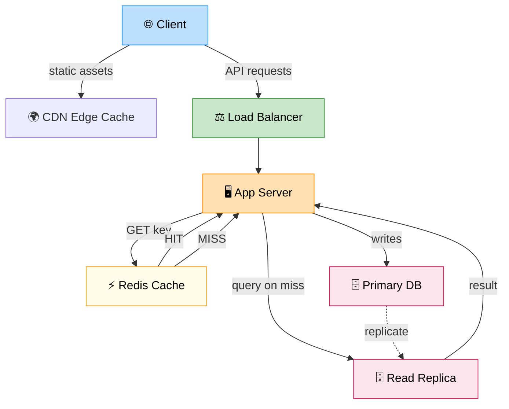

# Caching (Redis + Invalidation)

> **Subject**: System Design · **Group**: Fundamentals · **Topic**: 06 of 07
> **Status**: ✅ Done

---

## PART 1

---

### 1. What is it?

Caching stores frequently accessed data in **fast in-memory storage** so repeated requests don't hit the database or compute layer.

- **Redis**: in-memory data structure store — most popular cache. Sub-millisecond reads.
- **Cache invalidation**: the strategy for keeping cached data fresh when the source changes.
- The hardest part isn't caching — it's knowing **when and how to invalidate**.

---

### 2. Why is it needed?

| Without Cache                       | With Cache             |
| ----------------------------------- | ---------------------- |
| Every request hits DB (~10–50ms)    | Cache hit: ~0.1–1ms    |
| DB becomes bottleneck at scale      | DB load drops 80–95%   |
| Expensive DB queries run repeatedly | Run once, cache result |
| Cold DB under traffic spike = crash | Cache absorbs spike    |

Rule of thumb: **cache the top 20% of data that handles 80% of reads**.

---

### 3. Where is it used? (3 Real-World Use Cases)

| Use Case                  | What's Cached                   | TTL                           |
| ------------------------- | ------------------------------- | ----------------------------- |
| **User session**          | Auth token, user preferences    | 30 min (rolling)              |
| **Product catalog**       | Product details, pricing        | 5 min (refresh on update)     |
| **Twitter home timeline** | Pre-computed feed for each user | Short TTL + push invalidation |

---

### 4. How Does it Work? (High-Level)



```
CACHE-ASIDE (most common pattern):
─────────────────────────────────
  READ:
    App → Redis: GET product:123
      HIT  → return cached data ✅
      MISS → App queries DB → store in Redis → return data

  WRITE:
    App updates DB → App deletes Redis key (or updates)
    Next read: cache miss → re-populated from DB

WRITE-THROUGH:
──────────────
  App writes to cache AND DB simultaneously (synchronous)
  Always consistent; slightly higher write latency

WRITE-BEHIND (Write-Back):
───────────────────────────
  App writes to cache only → async flush to DB later
  Highest write performance; risk of data loss if cache crashes

READ-THROUGH:
─────────────
  App always reads from cache; cache fetches from DB on miss
  Cache is the single read interface (used in CDN, ORM-level caches)
```

---

### 5. Cache Invalidation Strategies

| Strategy                           | How                                              | Use When                              |
| ---------------------------------- | ------------------------------------------------ | ------------------------------------- |
| **TTL (Time-To-Live)**             | Key expires after N seconds automatically        | Data that changes on a schedule       |
| **Event-driven (delete on write)** | App deletes cache key when DB is updated         | Write-heavy, must-be-fresh data       |
| **Cache-aside (lazy load)**        | Only populate on miss, TTL handles expiry        | Most general-purpose                  |
| **Write-through**                  | Always write cache + DB together                 | Strong consistency required           |
| **Pub/Sub invalidation**           | DB change → message → all cache nodes delete key | Distributed cache, multiple app nodes |

> Phil Karlton: _"There are only two hard things in Computer Science: cache invalidation and naming things."_

---

## PART 2

---

### 6. Trade-offs

#### ✅ Pros

| Advantage                 | Detail                                 |
| ------------------------- | -------------------------------------- |
| Massive latency reduction | DB: 10–50ms → Cache: 0.1–1ms           |
| DB offloading             | Reduces DB connections and query load  |
| Handles traffic spikes    | Cache absorbs read load during surges  |
| Cheap reads at scale      | Redis costs less than DB read replicas |

#### ❌ Cons / When NOT to use

| Disadvantage                                            | Detail                                                               |
| ------------------------------------------------------- | -------------------------------------------------------------------- |
| **Stale data**                                          | TTL or poor invalidation = users see old data                        |
| **Cache stampede**                                      | On cold start or expiry: thousands of requests hit DB simultaneously |
| **Memory limit**                                        | Redis is in-memory; eviction policy kicks in when full               |
| **Extra system to manage**                              | Redis cluster, replication, failover adds ops complexity             |
| **Don't cache unique/random queries**                   | Caching `SELECT * WHERE id = <random>` = 0% hit rate                 |
| **Don't cache auth-sensitive data without careful TTL** | Stale revoked tokens = security risk                                 |

---

### 7. Failure Scenarios

| Failure                              | Impact                                                  | Handling                                                                                |
| ------------------------------------ | ------------------------------------------------------- | --------------------------------------------------------------------------------------- |
| **Redis node crash**                 | All cache misses → DB hit surge → potential DB overload | Use Redis Sentinel (HA) or Redis Cluster; DB auto-scaling as backup                     |
| **Cache stampede (thundering herd)** | Expired key → 10K simultaneous DB requests              | Mutex lock on first miss (only one thread re-populates); probabilistic early expiration |
| **Memory exhausted**                 | Redis evicts keys (LRU/LFU) unexpectedly                | Set `maxmemory-policy` correctly; monitor memory usage; use TTLs on all keys            |
| **Stale data after write**           | Users see old product price/balance                     | Invalidate on write (delete key or update); use shorter TTL as safety net               |
| **Cache poisoning**                  | Malformed data cached and served to all users           | Validate data before caching; use signed cache keys for sensitive data                  |

---

### 8. AWS Mapping

| Need                   | AWS Service               | Config                                                        |
| ---------------------- | ------------------------- | ------------------------------------------------------------- |
| **Managed Redis**      | ElastiCache for Redis     | Primary + read replicas; Multi-AZ with automatic failover     |
| **Managed Memcached**  | ElastiCache for Memcached | Simple key-value, no persistence, horizontal scaling          |
| **Serverless cache**   | ElastiCache Serverless    | Auto-scales, no capacity planning; pay per use                |
| **HTTP cache (CDN)**   | CloudFront                | Cache static + dynamic content at edge (200+ PoPs)            |
| **API response cache** | API Gateway Cache         | Cache API responses at gateway level (TTL-based)              |
| **DB query cache**     | RDS Proxy                 | Connection pooling + query result reuse                       |
| **DAX**                | DynamoDB Accelerator      | In-memory cache specifically for DynamoDB (microsecond reads) |

**Recommended ElastiCache setup:**

```
App Servers
    ↓
ElastiCache Redis (Primary)  ←→  ElastiCache Redis (Replica)
    ↓ on miss
RDS PostgreSQL (Primary)     ←→  RDS Read Replica

- Primary Redis: handles writes + reads
- Replica: read scaling + failover target
- Multi-AZ enabled: auto-failover in ~30s
```

---

### 9. Interview-Ready Explanation (30–45 sec)

> _"Caching stores frequently read data in fast in-memory storage — Redis being the most common — to avoid hitting the database on every request. A Redis cache hit returns in under 1ms versus 10–50ms from a database query._
>
> _The common pattern is cache-aside: read from cache first, miss populates from DB. The hard part is invalidation — keeping cached data fresh. I typically combine TTL as a safety net with event-driven deletion: when data changes in the DB, I delete the corresponding cache key so the next read repopulates it fresh._
>
> _On AWS, I use ElastiCache for Redis with Multi-AZ for web tier caching, and CloudFront for edge caching of static and API content."_

---

### 10. Quick Example

**Product detail page — reducing DB load 90%:**

```python
def get_product(product_id):
    cache_key = f"product:{product_id}"

    # 1. Try cache first
    cached = redis.get(cache_key)
    if cached:
        return json.loads(cached)          # ~0.5ms ✅

    # 2. Cache miss → query DB
    product = db.query("SELECT * FROM products WHERE id = ?", product_id)  # ~20ms

    # 3. Store in cache (5-min TTL)
    redis.setex(cache_key, 300, json.dumps(product))
    return product

# On product update:
def update_product(product_id, new_data):
    db.update("UPDATE products SET ... WHERE id = ?", product_id, new_data)
    redis.delete(f"product:{product_id}")  # Invalidate immediately ✅
```

Result: 1st request = 20ms (DB). All subsequent requests within 5 min = 0.5ms (cache). 97.5% latency improvement.

---

### 11. Common Interview Questions

**Q1: What is a cache stampede and how do you prevent it?**

> When a popular cache key expires, many concurrent requests simultaneously miss the cache and all hit the DB — potentially overwhelming it. Prevention: (1) **Mutex/lock**: only one request populates the cache; others wait or serve stale. (2) **Probabilistic early expiry**: slightly before TTL, randomly re-populate for some requests. (3) **Pre-warming**: warm cache on deploy before traffic hits.

**Q2: When would you choose Memcached over Redis?**

> Memcached: simpler, multi-threaded, pure key-value, slightly faster for basic GET/SET. Redis: supports rich data structures (sorted sets, lists, pub/sub, streams), persistence, Lua scripting, clustering, and atomic operations. In practice, choose Redis almost always — the feature set is worth the slightly higher complexity. Only use Memcached if you have an existing Memcached cluster and very simple caching needs.

**Q3: How would you handle cache in a multi-region setup?**

> Option 1: Each region has its own local cache (ElastiCache in each region) — low latency reads, but updates must invalidate all regional caches. Use SQS/SNS fan-out or DynamoDB Streams to broadcast invalidation messages to all regions. Option 2: Use CloudFront at the edge with short TTLs + origin-shield to reduce DB hits globally. Option 3: Accept eventual consistency — different regions may show slightly stale data for a few seconds, which is fine for most content.

---

> **Next Topic →** [07 · Database Basics (SQL vs NoSQL)](./07-db-basics.md)
