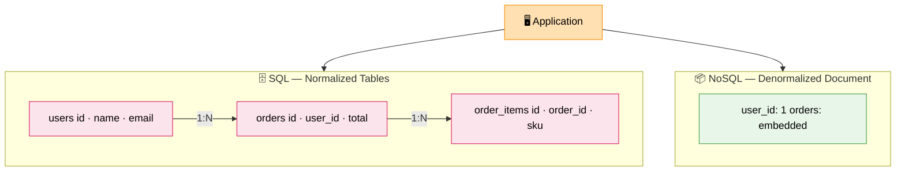

# Database Basics (SQL vs NoSQL)

> **Subject**: System Design · **Group**: Fundamentals · **Topic**: 07 of 07
> **Status**: ✅ Done

---

## PART 1

---

### 1. What is it?

- **SQL (Relational)**: Structured tables with strict schema, relationships via foreign keys, ACID transactions. Examples: PostgreSQL, MySQL, Aurora.
- **NoSQL (Non-relational)**: Flexible schema, built for horizontal scale, varied data models. Examples: DynamoDB (key-value/document), Cassandra (wide-column), MongoDB (document), Redis (in-memory).

The choice is one of the **most important architectural decisions** you make — it affects consistency, scalability, query flexibility, and operational complexity for years.

---

### 2. Why is it needed?

SQL was designed for a single-node world with structured data. NoSQL emerged to handle:

- **Massive scale** (billions of rows, millions of writes/sec)
- **Flexible/variable data structure** (user-generated content, documents)
- **Geographic distribution** (global multi-region writes)

Neither is better — they serve different access patterns.

---

### 3. Where is it used? (3 Real-World Use Cases)

| Use Case                            | DB Choice                  | Why                                                         |
| ----------------------------------- | -------------------------- | ----------------------------------------------------------- |
| **Banking / Orders**                | SQL (PostgreSQL/Aurora)    | ACID transactions, relational integrity, complex queries    |
| **User profiles / Product catalog** | NoSQL (DynamoDB/MongoDB)   | Semi-structured data, high read throughput, flexible schema |
| **Time-series metrics / IoT**       | NoSQL (Cassandra/InfluxDB) | Write-heavy, append-only, horizontal scale critical         |

---

### 4. How Does it Work? (High-Level)



```
SQL — Normalized Relational:
  users         orders          order_items
  ──────────    ──────────────  ───────────────────
  id │ name     id │ user_id    id │ order_id │ sku
  ───┼───────   ───┼──────────  ───┼──────────┼────
  1  │ Alice    1  │ 1          1  │ 1        │ SKU-A

  SELECT u.name, o.id, i.sku
  FROM users u
  JOIN orders o ON u.id = o.user_id
  JOIN order_items i ON o.id = i.order_id
  WHERE u.id = 1
  → Flexible queries, but JOIN cost grows with data size

NoSQL — Denormalized Document (DynamoDB):
  PK: user#1  SK: order#1
  {
    "userId": "1",
    "orderId": "1",
    "items": ["SKU-A", "SKU-B"],
    "total": 99.99
  }
  → GetItem by PK: O(1), sub-ms
  → No JOINs; data modeled for the query, not normalization
```

---

### 5. Types / Variations

| NoSQL Type      | Model                     | Examples                     | Best For                                          |
| --------------- | ------------------------- | ---------------------------- | ------------------------------------------------- |
| **Key-Value**   | Simple KV store           | DynamoDB, Redis              | Sessions, caching, simple lookups                 |
| **Document**    | JSON-like docs            | MongoDB, DynamoDB, Firestore | User profiles, catalogs, CMS                      |
| **Wide-Column** | Rows with dynamic columns | Cassandra, HBase             | Time-series, IoT, audit logs                      |
| **Graph**       | Nodes + edges             | Neo4j, Amazon Neptune        | Social networks, fraud detection, recommendations |
| **Time-Series** | Timestamped data          | InfluxDB, Amazon Timestream  | Metrics, monitoring, IoT sensor data              |

---

## PART 2

---

### 6. Trade-offs

| Dimension                  | SQL                            | NoSQL                                            |
| -------------------------- | ------------------------------ | ------------------------------------------------ |
| **Schema**                 | Strict (DDL enforced)          | Flexible (schema on read)                        |
| **Transactions (ACID)**    | ✅ Native, multi-table         | ⚠️ Limited (DynamoDB: single-table transactions) |
| **Query flexibility**      | ✅ Complex JOINs, aggregations | ❌ Must model data for your query upfront        |
| **Horizontal scaling**     | ❌ Hard (sharding is complex)  | ✅ Built-in (DynamoDB, Cassandra)                |
| **Consistency**            | ✅ Strong by default           | Configurable (eventual → strong)                 |
| **Operational complexity** | Medium (schema migrations)     | Medium (access pattern changes = table redesign) |

#### 🚫 When NOT to use SQL

- Need to write millions of rows per second (Cassandra/DynamoDB better)
- Data has no fixed schema (user-generated content, nested documents)
- Global multi-region writes required (cross-region ACID is very expensive)

#### 🚫 When NOT to use NoSQL

- Complex reporting with ad-hoc JOINs across many entities
- Multi-table ACID transactions required (financial ledgers, booking systems)
- Team is unfamiliar with access-pattern-driven data modeling

---

### 7. Failure Scenarios

| Failure                                | SQL Impact                              | NoSQL Impact                               | Handling                                               |
| -------------------------------------- | --------------------------------------- | ------------------------------------------ | ------------------------------------------------------ |
| **Primary DB crash**                   | Writes stop until failover (~30–60s)    | Shards fail independently; others continue | RDS Multi-AZ; DynamoDB multi-AZ by default             |
| **Schema migration failure**           | Table locked; app broken                | No-op (schema-less)                        | Blue/green migrations; additive changes only           |
| **Query without index on large table** | Full table scan → timeout → DB overload | GetItem by PK always O(1)                  | EXPLAIN ANALYZE; add index; query monitoring           |
| **Hotspot (one partition too busy)**   | Depends on sharding strategy            | DynamoDB throttles hot partition key       | Design keys with high cardinality; add random suffix   |
| **Data inconsistency across tables**   | Foreign key constraint catches it       | No FK; silently inconsistent               | Application-level validation; event-driven consistency |

---

### 8. AWS Mapping

| Database Type              | AWS Service                              | Use Case                                               |
| -------------------------- | ---------------------------------------- | ------------------------------------------------------ |
| **SQL (OLTP)**             | **RDS** (PostgreSQL/MySQL)               | Web apps, e-commerce, ERP                              |
| **SQL (OLTP — high perf)** | **Aurora** (PostgreSQL/MySQL compatible) | 5x faster than RDS MySQL; auto-scaling storage         |
| **NoSQL Key-Value/Doc**    | **DynamoDB**                             | Serverless, auto-scale, single-digit ms, global tables |
| **NoSQL In-Memory**        | **ElastiCache (Redis)**                  | Caching, sessions, leaderboards                        |
| **Graph**                  | **Amazon Neptune**                       | Social graphs, fraud detection                         |
| **Time-Series**            | **Amazon Timestream**                    | IoT, metrics, telemetry                                |
| **Search**                 | **OpenSearch (Elasticsearch)**           | Full-text search, log analytics                        |
| **Data Warehouse (OLAP)**  | **Redshift**                             | Analytics, BI, large-scale aggregations                |

**Decision flowchart:**

```
Need ACID transactions across multiple entities?
  YES → RDS/Aurora (SQL)
  NO  ↓
High write throughput OR global scale?
  YES → DynamoDB
  NO  ↓
Flexible schema / document structure?
  YES → DynamoDB or MongoDB
  NO  ↓
→ RDS (PostgreSQL default for most apps)
```

---

### 9. Interview-Ready Explanation (30–45 sec)

> _"SQL databases give you relational integrity, complex JOINs, and ACID transactions — perfect for financial systems, order management, anything where relationships and correctness matter. The limitation is horizontal write scaling._
>
> _NoSQL trades flexibility for scale — DynamoDB for example can handle millions of writes per second and is serverless. The catch: you must model your data around your access patterns upfront, not normalize it. There are no JOINs._
>
> _My approach: default to PostgreSQL (RDS/Aurora) for most new services. Switch to DynamoDB when I need massive write scale, global distribution, or the data is naturally document-shaped. Use both in the same system — SQL for transactions, NoSQL for high-read product catalogs or user sessions."_

---

### 10. Quick Example

**E-commerce system — using both:**

```
SQL (Aurora PostgreSQL):
  → orders table         ← ACID required (payment + inventory together)
  → payments table       ← financial ledger, no data loss acceptable
  → inventory table      ← consistency critical (no oversell)

NoSQL (DynamoDB):
  → user-sessions        ← millions of concurrent sessions, KV lookup
  → product-catalog      ← 10M products, high read throughput, flexible attrs
  → cart (shopping)      ← per-user, AP is fine, JSON document

Redis (ElastiCache):
  → product page cache   ← sub-ms reads for hot products
  → rate limiting        ← atomic increment per user/IP
```

Each store optimized for its workload. Not one-size-fits-all.

---

### 11. Common Interview Questions

**Q1: How does DynamoDB achieve single-digit millisecond performance?**

> DynamoDB uses consistent hashing to partition data across many internal nodes. Every read/write goes directly to the partition owning that key — no JOINs, no global locks. Data is stored on SSDs. The access pattern is always O(1) by partition key. For even faster reads, DAX (DynamoDB Accelerator) adds an in-memory cache layer for microsecond responses.

**Q2: When would you use Aurora over RDS PostgreSQL?**

> Aurora is MySQL/PostgreSQL-compatible but with a distributed storage engine — it replicates across 6 copies in 3 AZs automatically, supports up to 15 read replicas with low replication lag, and auto-scales storage. Use Aurora when: (1) you need RDS-compatible SQL but with better performance/HA, (2) you're on Aurora Serverless for variable workloads, or (3) you need Aurora Global Database for multi-region reads with < 1 second replication lag.

**Q3: How do you handle a SQL schema migration on a live table with 100M rows?**

> Never do a blocking ALTER TABLE. Use these patterns: (1) **Additive only** — add new nullable columns, never remove/rename in the same deploy. (2) **Dual-write** — write to both old and new schema during migration window. (3) **Online DDL** — PostgreSQL's `ALTER TABLE ... ADD COLUMN` for nullables is non-blocking. For indexes: `CREATE INDEX CONCURRENTLY` (non-blocking). (4) **Shadow table** — create new table, backfill in batches (1K rows at a time), swap at cutover.

---

> ✅ **Fundamentals Group COMPLETE (7/7)**
>
> **Next Group →** [02 · Estimation (🔥 MUST)](../02-Estimation/)
> First topic: [Users → Requests/sec](../02-Estimation/01-users-to-rps.md)
