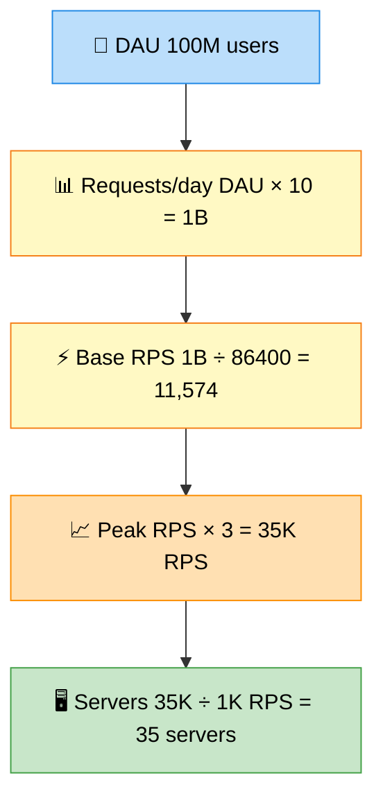

# Users → Requests/sec (Estimation)

> **Subject**: System Design · **Group**: 🔥 Estimation (MUST) · **Topic**: 01 of 03
> **Status**: ✅ Done

---

## PART 1

---

### 1. What is it?

Back-of-envelope estimation converts **DAU (Daily Active Users)** into **Requests Per Second (RPS)** — the load your system must handle at any given moment.

This is the **first calculation** in every system design interview. It determines everything: number of servers, DB size, cache strategy, queue throughput.

---

### 2. Why is it needed?

You cannot design a system without knowing the load. Estimations help you:

- Pick the right DB (single node vs cluster)
- Decide whether you need caching
- Size auto-scaling policies
- Identify bottlenecks before building

Interviewers want to see **structured thinking**, not exact numbers.

---

### 3. Where is it used?

Every system design problem starts here:

- "Design Twitter" → estimate tweet read/write RPS
- "Design WhatsApp" → estimate message throughput
- "Design Netflix" → estimate video streaming bandwidth

---

## PART 2

---

### 4. The Formula



**Step 1: DAU → Requests/day**

$$\text{Requests/day} = \text{DAU} \times \text{avg requests per user per day}$$

**Step 2: Requests/day → RPS**

$$\text{RPS} = \frac{\text{Requests/day}}{86400 \text{ seconds}}$$

> Simplification: use **100,000 seconds/day** (rounds up for safety, easier math)

**Step 3: Account for peak traffic**

$$\text{Peak RPS} = \text{avg RPS} \times \text{peak multiplier (2x–10x)}$$

---

### 5. The Cheat Sheet (Memorize This)

| Users    | Avg Requests/User/Day | Requests/day | Avg RPS | Peak RPS (5x) |
| -------- | --------------------- | ------------ | ------- | ------------- |
| 1M DAU   | 10                    | 10M          | ~100    | ~500          |
| 10M DAU  | 10                    | 100M         | ~1,000  | ~5,000        |
| 100M DAU | 10                    | 1B           | ~10,000 | ~50,000       |
| 500M DAU | 10                    | 5B           | ~50,000 | ~250,000      |

---

### 6. Worked Example — "Design Twitter"

```
Given:
  - 300M DAU
  - Average user: 5 tweets/day, 50 reads/day

Tweet Writes:
  300M × 5 = 1.5B tweets/day
  1.5B / 86,400 = ~17,000 write RPS
  Peak: 17,000 × 3 = ~50,000 write RPS

Timeline Reads:
  300M × 50 = 15B reads/day
  15B / 86,400 = ~175,000 read RPS
  Peak: 175,000 × 3 = ~525,000 read RPS

Read/Write Ratio: ~10:1 (read-heavy)
→ Design decision: aggressive caching, read replicas
```

---

### 7. Key Numbers to Memorize

| Fact                           | Value                                      |
| ------------------------------ | ------------------------------------------ |
| Seconds in a day               | 86,400 (~100K for easy math)               |
| Average request payload        | 1–10 KB                                    |
| Peak = avg × ?                 | 2x–10x (use 5x for general purpose)        |
| Single web server capacity     | ~1,000–5,000 RPS (depends on work per req) |
| DB read capacity (PostgreSQL)  | ~10,000–20,000 simple reads/sec (indexed)  |
| DB write capacity (PostgreSQL) | ~2,000–5,000 writes/sec (single primary)   |
| DynamoDB capacity              | Millions of RPS (auto-scaled)              |

---

### 8. Interview-Ready Explanation (30 sec)

> _"I'll start with estimation. Assume 10M DAU. Average user makes 10 requests per day — that's 100M requests/day. Divided by 86,400 seconds gives us ~1,200 RPS average. With a 5x peak multiplier for traffic spikes, we need to design for ~6,000 peak RPS. That's manageable with 3–5 mid-size servers and a cache layer. Now let me size storage…"_

---

### 9. Common Interview Questions

**Q1: How do you estimate peak traffic?**

> Use a 2x–10x multiplier on average RPS depending on the use case: 2x for steady business apps, 5x for consumer apps with daily patterns (morning news, evening Netflix), 10x for flash-sale e-commerce or breaking news events. Also consider day-of-week patterns (weekends vs weekdays).

**Q2: How many servers do you need for 10,000 RPS?**

> Depends on request complexity. Rule of thumb: a single application server (4–8 vCPU) handles ~1,000–5,000 RPS for typical API workloads. For 10,000 RPS: 3–10 servers behind a load balancer. Add caching to reduce DB round trips per request — that's the real lever.

---

> **Next Topic →** [02 · Storage Calculation](./02-storage-calculation.md)
