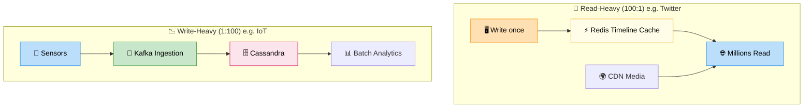

# Read vs Write Ratio

> **Subject**: System Design · **Group**: 🔥 Estimation (MUST) · **Topic**: 03 of 03
> **Status**: ✅ Done

---

## PART 1

---

### 1. What is it?

The **Read/Write Ratio** tells you the proportion of read operations vs write operations your system handles. This single ratio drives your entire architecture:

- **Read-heavy (10:1+)**: Optimize for caching and read replicas
- **Write-heavy (1:1 or inverted)**: Optimize for write throughput and sharding
- **Balanced**: Architect for both

---

### 2. Common Ratios by System Type

| System                         | Read:Write          | Architecture Implication                  |
| ------------------------------ | ------------------- | ----------------------------------------- |
| **Twitter/social feed**        | 100:1               | Pre-compute timelines, aggressive caching |
| **News site**                  | 50:1                | CDN + cache, DB barely touched on reads   |
| **E-commerce product catalog** | 20:1                | Cache-aside, read replicas                |
| **Banking/ledger**             | 3:1                 | ACID, less caching (consistency critical) |
| **IoT sensor data**            | 1:10 (write-heavy)  | Kafka ingestion → Cassandra/Timestream    |
| **Log ingestion**              | 1:100 (write-heavy) | Write-optimized: Kafka → S3 → Athena      |

---

## PART 2

---

### 3. How the Ratio Shapes Your Design



```
READ-HEAVY (Twitter timeline: 100:1):
  Write once (tweet) → read by millions of followers
  Solution:
    - Pre-compute timelines (fan-out on write)
    - Cache timelines in Redis
    - CDN for media
    - DB only handles writes; reads from cache

WRITE-HEAVY (IoT metrics: 1:100):
  1 sensor reads → 100 data points written
  Solution:
    - Kafka for ingestion (absorbs bursts)
    - Cassandra / DynamoDB (write-optimized)
    - No joins, append-only model
    - Batch reads for analytics (not OLTP)
```

---

### 4. Worked Example — "Design a URL Shortener"

```
Assumptions:
  - 10M new URLs created/day (writes)
  - Each short URL accessed 100x/day on average (reads)

Read/Write Ratio:
  Reads:  10M × 100 = 1B reads/day  → ~11,600 RPS
  Writes: 10M writes/day             → ~115 RPS
  Ratio: 11,600 : 115 = ~100:1

Architecture implication:
  - Writes are trivial (115 RPS) → single DB primary is fine
  - Reads are massive (11,600 RPS) →
      ✅ Cache (Redis) for hot short URLs
      ✅ Read replicas if cache misses are frequent
      ✅ CDN for redirect responses (301 cached at edge)
```

---

### 5. Interview-Ready Explanation (30 sec)

> _"Once I have the RPS, I calculate the read/write ratio. For a URL shortener: 115 write RPS vs 11,600 read RPS — that's 100:1 read-heavy. This tells me writes are cheap and a single DB primary handles them easily. Reads need aggressive caching with Redis and potentially CDN-level caching for the most popular short links. This ratio drives the entire architecture."_

---

### 6. Common Interview Questions

**Q1: How does read/write ratio affect DB choice?**

> Read-heavy: SQL with read replicas (Aurora) or DynamoDB with DAX. Write-heavy: Cassandra (designed for write throughput), DynamoDB (auto-scaled writes), or Kafka as write buffer. For mixed: use CQRS — separate read model (optimized for queries) from write model (optimized for consistency).

**Q2: What is CQRS and when does it apply?**

> Command Query Responsibility Segregation — separate your write path (commands) from your read path (queries). Writes go to a normalized SQL DB. Reads come from a denormalized read store (Elasticsearch, Redis, DynamoDB) updated via events. Use when read and write models have very different requirements — e.g., writes need ACID, reads need sub-ms latency at high throughput.

---

> ✅ **Estimation Group COMPLETE (3/3)**
>
> **Next Group →** [03 · Core Components](../03-Core-Components/)
> First topic: [API Gateway](../03-Core-Components/01-api-gateway.md)
