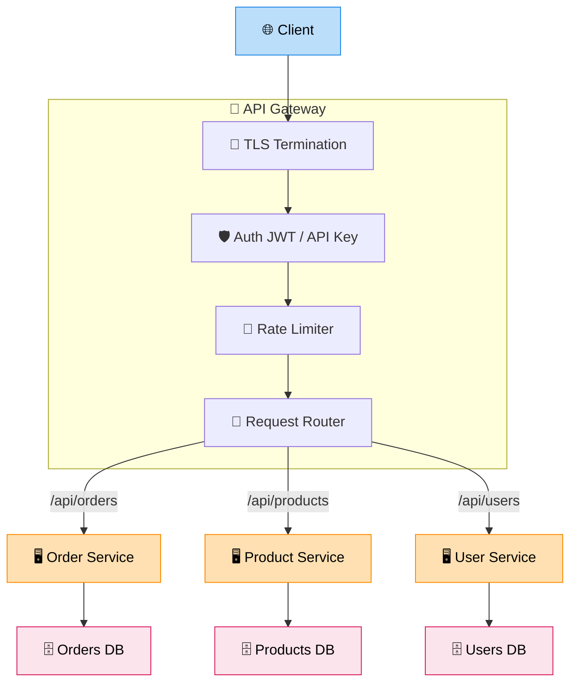

# API Gateway

> **Subject**: System Design · **Group**: Core Components · **Topic**: 01 of 06
> **Status**: ✅ Done

---

## PART 1

---

### 1. What is it?

An **API Gateway** is a single entry point that sits in front of all backend services. It handles cross-cutting concerns so individual services don't have to:

- Routing (which service handles this request?)
- Auth (is this caller allowed?)
- Rate limiting (are they sending too many requests?)
- SSL termination, request transformation, logging

Think of it as the **"front door"** to a microservices system.

---

### 2. Why is it needed?

Without an API Gateway:

- Every microservice implements its own auth, rate limiting, logging → duplicated logic
- Clients need to know every service's address and port
- Adding a new service requires updating all clients
- No single place to enforce security policies

With an API Gateway: clients talk to one URL. All policies enforced centrally.

---

### 3. Where is it used?

| Use Case                     | Example                                                                        |
| ---------------------------- | ------------------------------------------------------------------------------ |
| **Microservices front door** | Netflix, Uber — single domain, 100s of backend services                        |
| **Public API management**    | Stripe, Twilio — rate limiting, API key auth, versioning per external customer |
| **Mobile backend**           | Auth, device-specific request transformation, payload compression              |

---

### 4. How Does it Work? (High-Level)



```
Client
  ↓
[API Gateway]
  ├── Auth (JWT / API key validation)
  ├── Rate Limiting (100 req/min per user)
  ├── SSL Termination
  ├── Request Routing
  │   ├── /api/orders    → Order Service
  │   ├── /api/products  → Product Service
  │   └── /api/users     → User Service
  ├── Request Transformation (header injection, payload mapping)
  └── Response Logging / Metrics

Each backend service:
  - Receives already-authenticated request
  - No need to re-implement auth, rate limiting, CORS
```

---

### 5. Types / Variations

| Type                        | Examples                        | Use Case                                            |
| --------------------------- | ------------------------------- | --------------------------------------------------- |
| **Managed cloud gateway**   | AWS API Gateway, Azure API Mgmt | Serverless, no infra to manage                      |
| **Self-hosted**             | Kong, Nginx, Tyk                | More control, on-prem or VPC                        |
| **Service mesh (internal)** | Envoy, Istio, AWS App Mesh      | Service-to-service (east-west traffic)              |
| **GraphQL gateway**         | Apollo Federation, Hasura       | Aggregate multiple services into one GraphQL schema |

---

## PART 2

---

### 6. Trade-offs

#### ✅ Pros

| Advantage                        | Detail                                                         |
| -------------------------------- | -------------------------------------------------------------- |
| Single entry point               | Simplified client configuration                                |
| Centralized auth + rate limiting | Consistent enforcement, no per-service duplication             |
| Traffic visibility               | All requests logged/traced in one place                        |
| Decoupling                       | Backend services can change URL/port without affecting clients |

#### ❌ Cons / When NOT to use

| Disadvantage                | Detail                                                                   |
| --------------------------- | ------------------------------------------------------------------------ |
| **Single point of failure** | Must deploy as HA (multi-AZ)                                             |
| **Added latency**           | ~1–10ms per request for processing (usually acceptable)                  |
| **Can become a bottleneck** | Must scale the gateway as traffic grows                                  |
| **Overkill for monolith**   | Adding a gateway to a single-service app adds complexity without benefit |

---

### 7. Failure Scenarios

| Failure                      | Impact                                         | Handling                                                                                               |
| ---------------------------- | ---------------------------------------------- | ------------------------------------------------------------------------------------------------------ |
| **Gateway crashes**          | Total outage for all services                  | Multi-AZ deployment; health checks; auto-restart                                                       |
| **Rate limit misconfigured** | Legitimate users blocked                       | Test limits in staging; use per-customer limits, not global blunt limits                               |
| **Auth service down**        | Gateway can't validate tokens                  | Cache token validation results with short TTL (30s); fail-open for read-only or fail-closed for writes |
| **Backend service slow**     | Gateway connections pile up                    | Set per-route timeouts; circuit breaker on gateway                                                     |
| **DDoS attack**              | Gateway overwhelmed before rate limits kick in | WAF (Web Application Firewall) in front of gateway; AWS Shield                                         |

---

### 8. AWS Mapping

| Need                       | AWS Service                               | Notes                                                      |
| -------------------------- | ----------------------------------------- | ---------------------------------------------------------- |
| **Serverless API Gateway** | **AWS API Gateway** (REST/HTTP/WebSocket) | Managed, auto-scaled, integrates with Lambda, IAM, Cognito |
| **Low-latency gateway**    | **API Gateway HTTP API**                  | 70% cheaper than REST API; less features but faster        |
| **Self-managed**           | **Kong on EC2/EKS** or **Nginx**          | Full control; extra ops overhead                           |
| **Internal service mesh**  | **AWS App Mesh** + Envoy                  | East-west service-to-service traffic                       |
| **Auth integration**       | Cognito User Pools + API Gateway          | JWT validation at gateway, no backend code needed          |
| **WAF**                    | AWS WAF + API Gateway                     | Block SQL injection, XSS, rate limit by IP at edge         |

```
Client
  ↓
Route 53 → CloudFront (CDN + WAF)
  ↓
API Gateway (HTTP API)
  ├── JWT Authorizer (Cognito)
  ├── Rate limiting: 1000 req/sec per IP
  ├── Route: POST /orders → Lambda: order-handler
  └── Route: GET /products → Lambda: product-handler
```

---

### 9. Interview-Ready Explanation (30 sec)

> _"An API Gateway is the single entry point to a microservices system. It handles routing, authentication, rate limiting, SSL termination, and observability — all centrally, so individual services don't need to reimplement those concerns._
>
> _On AWS, I use API Gateway HTTP API for most projects — it's cheap, auto-scaled, and integrates natively with Lambda and Cognito. For higher-traffic scenarios or when I need custom plugins, I'd use Kong or Nginx as a self-hosted gateway on EKS."_

---

### 10. Quick Example

**Before API Gateway (chaos):**

```
Mobile App → auth.myapp.com:3001 (handles auth itself)
Mobile App → orders.myapp.com:3002 (handles auth itself)
Mobile App → products.myapp.com:3003 (handles auth itself)
→ 3 services, 3 auth implementations, 3 rate limiters
```

**After API Gateway:**

```
Mobile App → api.myapp.com (API Gateway)
  → validates JWT once
  → routes to correct service
  → enforces rate limit centrally
  → logs all requests in one place
```

---

### 11. Common Interview Questions

**Q1: How does API Gateway differ from a Load Balancer?**

> A load balancer (ALB) distributes requests across identical instances of the same service — it doesn't understand the application. An API Gateway routes between _different_ services based on URL path/method, enforces auth and rate limiting, and transforms requests. They're complementary: API Gateway → routes to services → each service has its own ALB/target group.

**Q2: How do you handle API versioning with an API Gateway?**

> Three strategies: (1) **URL versioning**: `/v1/orders`, `/v2/orders` — most visible, easy to route. (2) **Header versioning**: `Accept: application/vnd.myapp.v2+json` — cleaner URLs, harder to test. (3) **Query param**: `?version=2`. API Gateway routes each version to a different Lambda alias or service. Deprecate old versions with sunset headers; never delete until traffic drops to zero.

**Q3: What is a BFF (Backend for Frontend) pattern?**

> Instead of one generic gateway, you create a specialized API Gateway _per client type_: BFF-Mobile, BFF-Web, BFF-Partner. Each BFF aggregates calls from multiple services and transforms the response for its specific client's needs. Reduces over-fetching/under-fetching (mobile needs less data than web). On AWS: separate API Gateway + Lambda per client type.

---

> **Next Topic →** [02 · CDN](./02-cdn.md)
