# CDN (Content Delivery Network)

> **Subject**: System Design · **Group**: Core Components · **Topic**: 02 of 06
> **Status**: ✅ Done

---

## PART 1

---

### 1. What is it?

A **CDN** is a globally distributed network of edge servers (Points of Presence / PoPs) that cache and serve content from the location **closest to the user**.

Instead of every user's request crossing continents to your origin server, the CDN serves cached content from ~50–100ms away.

Key metrics: CloudFront has **450+ PoPs** across 90+ cities. Average latency improvement: from 200ms (cross-continent) to < 10ms (local PoP).

---

### 2. Why is it needed?

| Without CDN                          | With CDN                                    |
| ------------------------------------ | ------------------------------------------- |
| User in India → Server in US → 200ms | User in India → PoP in Mumbai → 5ms         |
| All traffic hits origin              | 90%+ served from cache at edge              |
| Origin bandwidth = full traffic      | Origin only handles cache misses            |
| Static file served slowly            | Static file served in milliseconds globally |

---

### 3. Where is it used?

| Use Case                               | Benefit                                                       |
| -------------------------------------- | ------------------------------------------------------------- |
| **Static assets** (JS, CSS, images)    | Zero origin load; global sub-10ms delivery                    |
| **Video streaming** (Netflix, YouTube) | Segment caching at edge; adaptive bitrate                     |
| **API acceleration**                   | Dynamic content still benefits from TCP termination near user |

---

### 4. How Does it Work? (High-Level)

```mermaid
graph TD
    classDef client fill:#BBDEFB,stroke:#1E88E5,color:#000
    classDef cdn fill:#C8E6C9,stroke:#43A047,color:#000
    classDef server fill:#FFE0B2,stroke:#FB8C00,color:#000
    classDef hit fill:#E8F5E9,stroke:#43A047,color:#000
    classDef miss fill:#FFF9C4,stroke:#F57F17,color:#000

    UserIN["🌐 User (Mumbai)"]
    PoP["🌍 CDN PoP Mumbai"]
    Origin["🖥️ Origin Server US-East"]

    subgraph CacheMiss["🟡 First Request (MISS)"]
        UserIN -->|request| PoP
        PoP -->|fetch from origin| Origin
        Origin -->|response + cache| PoP
    end

    subgraph CacheHit["🟢 Subsequent Requests (HIT)"]
        User2["🌐 User (Mumbai)"]
        PoP2["🌍 CDN PoP Mumbai"]
        User2 -->|request| PoP2
        PoP2 -->|served instantly ~5ms| User2
    end

    UserIN:::client
    User2:::client
    PoP:::cdn
    PoP2:::cdn
    Origin:::server
```



```
Without CDN:
  User (Mumbai) → Origin Server (US-East) = 180ms RTT

With CDN (first request — cache MISS):
  User (Mumbai) → PoP (Mumbai) → Origin (US-East)
                ← content fetched & cached at PoP

With CDN (subsequent requests — cache HIT):
  User (Mumbai) → PoP (Mumbai) ← served directly = ~5ms ✅

Cache Control flow:
  Origin sets: Cache-Control: max-age=3600
  CDN caches content for 1 hour
  After 1 hour: next request fetches fresh from origin
```

---

### 5. Types / Variations

| Type              | What it Caches                              | Example                                        |
| ----------------- | ------------------------------------------- | ---------------------------------------------- |
| **Static CDN**    | Images, JS, CSS, fonts                      | S3 + CloudFront                                |
| **Dynamic CDN**   | API responses with short TTL                | CloudFront with API Gateway origin             |
| **Video CDN**     | HLS/DASH video segments                     | CloudFront + S3 (Netflix uses this)            |
| **Security CDN**  | DDoS mitigation + WAF at edge               | Cloudflare, AWS Shield + CloudFront            |
| **Origin Shield** | Extra caching layer between PoPs and origin | CloudFront Origin Shield — reduces origin hits |

---

## PART 2

---

### 6. Trade-offs

#### ✅ Pros

| Advantage                 | Detail                                                          |
| ------------------------- | --------------------------------------------------------------- |
| Drastically lower latency | Serve from edge ~5ms vs origin 200ms                            |
| Origin offloading         | 80–95% of requests served from cache                            |
| DDoS protection           | Attack absorbed at edge, not origin                             |
| Global availability       | Works even if origin is slow/down (cached content still served) |

#### ❌ Cons / When NOT to use

| Disadvantage                                     | Detail                                                                                 |
| ------------------------------------------------ | -------------------------------------------------------------------------------------- |
| **Cache invalidation complexity**                | Pushing updates before TTL requires explicit invalidation (costs money on CloudFront)  |
| **Not for highly dynamic, personalized content** | Per-user data can't be cached globally                                                 |
| **Security: cached stale data after breach**     | If you invalidate secrets (API keys in JS), CDN may serve old version for TTL duration |
| **Cost at extreme scale**                        | CloudFront data transfer costs can be significant (price per GB egress)                |

---

### 7. Failure Scenarios

| Failure                  | Impact                                                    | Handling                                                                   |
| ------------------------ | --------------------------------------------------------- | -------------------------------------------------------------------------- |
| **Stale content served** | Users see old version of CSS/JS after deploy              | Cache-busting: filename hash (`app.a1b2c3.js`); or CloudFront invalidation |
| **Origin is down**       | CDN serves cached content (graceful degradation)          | Set `Stale-While-Revalidate` header; Origin failover to S3 backup          |
| **PoP itself down**      | CDN routes to next nearest PoP automatically              | CloudFront handles this automatically with health routing                  |
| **DDoS hits edge**       | CloudFront + AWS Shield absorbs; WAF blocks malicious IPs | Pre-configure WAF rules; enable Shield Advanced for L7 protection          |
| **Cache poisoning**      | Attacker tricks CDN into caching malicious response       | Validate `Host` header at origin; use signed URLs for private content      |

---

### 8. AWS Mapping

| Need                   | AWS Service                                          | Notes                                                |
| ---------------------- | ---------------------------------------------------- | ---------------------------------------------------- |
| **Static CDN**         | **CloudFront + S3**                                  | Most common pattern; S3 as origin, CloudFront as CDN |
| **API CDN**            | **CloudFront + API Gateway/ALB**                     | Short TTL caching of API responses                   |
| **Video delivery**     | **CloudFront + S3 (HLS segments)**                   | Netflix-style streaming                              |
| **DDoS protection**    | **AWS Shield Standard** (free) / **Advanced** (paid) | Integrated with CloudFront                           |
| **WAF**                | **AWS WAF + CloudFront**                             | Block at edge before origin                          |
| **Private content**    | **CloudFront Signed URLs/Cookies**                   | Time-limited access to S3 objects                    |
| **Cache invalidation** | **CloudFront CreateInvalidation API**                | Costs $0.005 per path; use sparingly                 |

**Typical setup:**

```
User → CloudFront PoP (450+ global)
         ├── HIT: serve cached response (<10ms)
         └── MISS: CloudFront → Origin Shield → S3/ALB
                    ← cache for TTL (e.g., 1 day for images)

S3 bucket: NOT public
CloudFront uses OAC (Origin Access Control) to access S3
→ Users can ONLY access content via CloudFront, not S3 directly
```

---

### 9. Interview-Ready Explanation (30 sec)

> _"A CDN distributes your content to edge servers globally so users get data from the nearest location instead of your origin server. For a user in Mumbai, that's 5ms from a local PoP vs 200ms from US-East._
>
> _I use CloudFront for all static assets — images, JS, CSS — with S3 as origin. For API responses, I add CloudFront with short TTLs (30–60 seconds) to reduce origin load. The biggest gotcha is cache invalidation: I use filename-based cache-busting for static assets so deployments are instant without needing expensive CloudFront invalidation calls."_

---

### 10. Quick Example

**React app deployment with CloudFront:**

```
Build output:
  index.html          → Cache-Control: no-cache (always fetch fresh)
  app.a1b2c3.js       → Cache-Control: max-age=31536000 (1 year cache)
  styles.d4e5f6.css   → Cache-Control: max-age=31536000 (1 year cache)

Deploy process:
  1. Upload to S3
  2. Invalidate only /index.html in CloudFront (costs $0.005)
  3. Browser gets fresh index.html → loads new hashed JS/CSS

Result:
  - JS/CSS served from edge for 1 year: zero origin cost
  - HTML always fresh: app updates instantly on new deploy
  - Global users: <10ms for all static assets
```

---

### 11. Common Interview Questions

**Q1: How does CloudFront differ from a load balancer?**

> CloudFront is a globally distributed cache network — it caches content at edge locations worldwide and reduces latency for end users. A load balancer (ALB) distributes requests across backend servers in a single region. They work together: CloudFront at the edge → ALB at the origin region → app servers.

**Q2: How do you serve user-specific (private) content through a CDN?**

> Use CloudFront **Signed URLs** (per-object) or **Signed Cookies** (per-session). The application generates a time-limited signed URL for each user (e.g., expires in 60 minutes). CloudFront validates the signature before serving. The S3 bucket is private; only CloudFront (via OAC) can access it. Users never get a direct S3 URL.

**Q3: What is Origin Shield and why use it?**

> Origin Shield is an additional caching layer between CloudFront PoPs and your origin. Normally, 20 different PoPs might each make a separate cache-miss request to your origin. With Origin Shield, all PoP cache misses go through one Shield node — drastically reducing origin load. Use it when your origin is expensive (Lambda, RDS) or bandwidth is costly.

---

> **Next Topic →** [03 · Load Balancer](./03-load-balancer.md)
