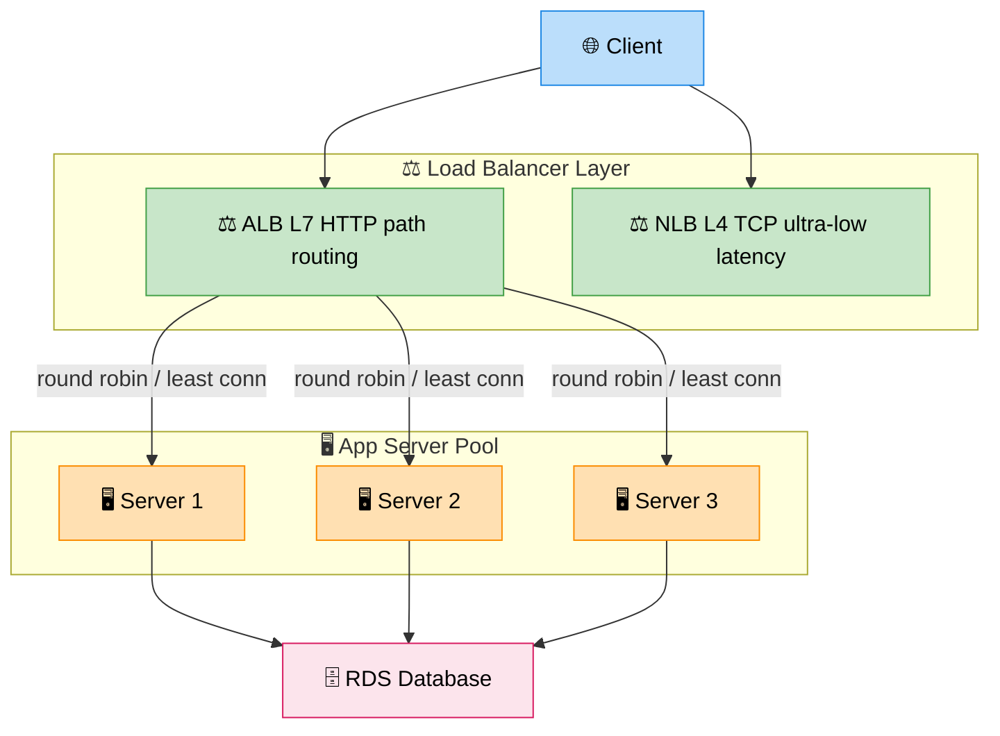

# Load Balancer (Core Component)

> **Subject**: System Design · **Group**: Core Components · **Topic**: 03 of 06
> **Status**: ✅ Done

---

> This topic is a focused reference for interviews. For the full deep-dive including all algorithms and failure scenarios, see [Fundamentals: Load Balancing](../01-Fundamentals/05-load-balancing.md).

---

## Quick Reference

### What it does

Distributes incoming requests across a pool of backend servers. Detects unhealthy servers via health checks and removes them from rotation.

### L4 vs L7

| Layer  | Operates On                        | AWS Service | Use When                               |
| ------ | ---------------------------------- | ----------- | -------------------------------------- |
| **L4** | TCP/UDP (IP + port)                | NLB         | Non-HTTP, static IP, ultra-low latency |
| **L7** | HTTP/HTTPS (URL, headers, cookies) | ALB         | Web apps, microservices, path routing  |

### Algorithms (Interview Shortlist)

| Algorithm         | Use When                            |
| ----------------- | ----------------------------------- |
| Round Robin       | Default; uniform stateless requests |
| Least Connections | WebSockets / long-lived connections |
| IP Hash           | Sticky sessions (avoid if possible) |
| Weighted          | Heterogeneous server sizes          |

### AWS ALB — Key Features

- Path-based routing: `/api/*` → Service A, `/admin/*` → Service B
- SSL termination at ALB — no TLS overhead on app servers
- Integrates with ASG — new instances auto-registered
- Multi-AZ by default — no single point of failure

### Critical Design Point

**The load balancer must not be a SPOF.** AWS ALB is managed + multi-AZ. Self-hosted: use Active-Active pair with VIP/anycast.

### 30-sec Interview Answer

> _"A load balancer distributes traffic across server instances, removing unhealthy ones via health checks. On AWS, I use ALB for HTTP workloads — it supports path routing, SSL termination, and natively integrates with Auto Scaling Groups. For non-HTTP or ultra-low latency, I use NLB. ALB is already multi-AZ, so it doesn't introduce a single point of failure."_

---

> **Next Topic →** [04 · Message Queue (Kafka + SQS)](./04-message-queue.md)
