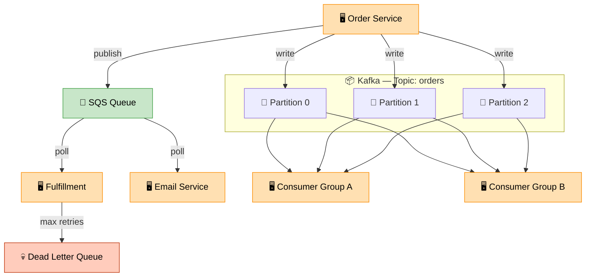

# Message Queue (Kafka + SQS)

> **Subject**: System Design · **Group**: Core Components · **Topic**: 04 of 06
> **Status**: ✅ Done

---

## PART 1

---

### 1. What is it?

A **message queue** is a durable buffer that decouples a **producer** (who creates work) from a **consumer** (who processes work). Producers write messages; consumers process them independently and at their own pace.

- **SQS**: AWS-managed, simple queue, at-least-once delivery, no replay
- **Kafka**: distributed log, messages retained and replayable, ordered per partition, extremely high throughput

---

### 2. Why is it needed?

| Problem                                              | Solution via Queue                             |
| ---------------------------------------------------- | ---------------------------------------------- |
| Upstream service faster than downstream              | Queue absorbs the difference (buffering)       |
| Service B crashes                                    | Messages wait safely in queue until B recovers |
| Synchronous call chain — one slow service blocks all | Async via queue; producer doesn't wait         |
| Need to fan-out one event to many consumers          | Pub/Sub over message queue                     |

---

### 3. Where is it used?

| Use Case                         | Queue     | Why                                                      |
| -------------------------------- | --------- | -------------------------------------------------------- |
| **Order processing**             | SQS       | Decouple checkout from inventory/email; retry on failure |
| **Real-time analytics pipeline** | Kafka     | 1M+ events/sec; stream processing (Flink, Spark)         |
| **Notification fan-out**         | SNS → SQS | One event → many queues → many consumers                 |

---

### 4. How Does it Work? (High-Level)



```
BASIC QUEUE (SQS):
────────────────────────────────────────────
Producer                Queue           Consumer
[Order Service] → [SQS Queue] → [Fulfillment Service]
                  ↑ message stays until
                    consumer deletes it (at-least-once)

KAFKA (Distributed Log):
────────────────────────────────────────────
Topic: "orders" — 3 partitions

Producer: Writes msg to partition (key-based routing)
  Partition 0: msg1, msg4, msg7 ...
  Partition 1: msg2, msg5, msg8 ...
  Partition 2: msg3, msg6, msg9 ...

Consumer Group A (Fulfillment): reads all partitions
Consumer Group B (Analytics): reads all partitions independently
→ Same messages, two consumer groups, zero interference
→ Messages retained for 7 days (replayable)
```

---

### 5. SQS vs Kafka Comparison

| Dimension           | SQS                                 | Kafka                                  |
| ------------------- | ----------------------------------- | -------------------------------------- |
| **Retention**       | 4 days max                          | Configurable (days to forever)         |
| **Replay**          | ❌ Once consumed + deleted          | ✅ Replay from any offset              |
| **Ordering**        | Standard: no order; FIFO: per-group | Per partition (strict ordering)        |
| **Throughput**      | Thousands/sec                       | Millions/sec per partition             |
| **Consumer groups** | One queue = one consumer            | Multiple consumer groups independently |
| **Setup**           | Zero (managed)                      | Cluster setup (or use MSK)             |
| **Best for**        | Task queues, decoupling, retries    | Event streaming, audit log, analytics  |

---

## PART 2

---

### 6. Trade-offs

#### ✅ Pros

| Advantage   | Detail                                         |
| ----------- | ---------------------------------------------- |
| Decoupling  | Producer and consumer evolve independently     |
| Durability  | Messages survive consumer crashes              |
| Buffering   | Absorbs traffic spikes without losing work     |
| Scalability | Add consumers to scale processing horizontally |

#### ❌ Cons / When NOT to use

| Disadvantage                | Detail                                                                       |
| --------------------------- | ---------------------------------------------------------------------------- |
| **Adds latency**            | Async = response not immediate; bad for real-time user-facing operations     |
| **Ordering complexity**     | SQS Standard: no order guarantee; Kafka: ordered per partition, not globally |
| **At-least-once delivery**  | Consumers must be **idempotent** — same message may arrive twice             |
| **Debugging complexity**    | Harder to trace failures through async flows                                 |
| **Don't use for RPC-style** | If caller needs an immediate result, use sync API call, not a queue          |

---

### 7. Failure Scenarios

| Failure                            | Impact                                                 | Handling                                                                  |
| ---------------------------------- | ------------------------------------------------------ | ------------------------------------------------------------------------- |
| **Consumer crashes mid-process**   | Message becomes visible again (SQS visibility timeout) | Message re-delivered; consumer must be idempotent                         |
| **Poison pill message**            | Consumer crashes on every retry; queue blocked         | SQS: max receive count → DLQ (Dead Letter Queue); Kafka: skip + alert     |
| **Queue depth grows uncontrolled** | Memory/storage fills; lag grows                        | Auto-scale consumers on queue depth metric (CW Alarm); set queue alarms   |
| **Kafka broker fails**             | Partition leader election (~seconds)                   | Kafka replication factor ≥ 3; ISR (in-sync replicas) ensures no data loss |
| **Duplicate message processing**   | Double charge, double send                             | Idempotency key: check if already processed before acting                 |

---

### 8. AWS Mapping

| Need                   | AWS Service                                  | Notes                                     |
| ---------------------- | -------------------------------------------- | ----------------------------------------- |
| **Simple task queue**  | **SQS Standard**                             | At-least-once, high throughput, unordered |
| **Ordered task queue** | **SQS FIFO**                                 | Exactly-once within group, 3K TPS limit   |
| **Dead letter queue**  | **SQS DLQ**                                  | Failed messages after N retries           |
| **Fan-out**            | **SNS → SQS**                                | One event → multiple subscriber queues    |
| **Managed Kafka**      | **Amazon MSK** (Managed Streaming for Kafka) | Full Kafka API, AWS-managed               |
| **Serverless Kafka**   | **MSK Serverless**                           | Auto-scales, no capacity planning         |
| **Lambda trigger**     | **SQS → Lambda**                             | Lambda polls SQS; auto-scaled consumers   |
| **Stream processing**  | **Kinesis Data Streams**                     | Kafka alternative for AWS-native teams    |

**Common Pattern — Order Processing:**

```
[Checkout Service]
    ↓ Publish: {orderId, items, total}
[SNS Topic: order-placed]
    ├── SQS: fulfillment-queue  → Lambda: process-fulfillment
    ├── SQS: email-queue        → Lambda: send-confirmation-email
    └── SQS: analytics-queue   → Lambda: update-dashboard
```

---

### 9. Interview-Ready Explanation (30 sec)

> _"A message queue decouples producers from consumers. When a user places an order, the checkout service writes to an SQS queue and immediately returns success — it doesn't wait for inventory, email, or analytics to finish. Each downstream service processes at its own pace from the queue._
>
> _For simple task queues with retry and DLQ, I use SQS. For high-throughput event streaming where I need replay, multiple consumer groups, and ordering per key — I use Kafka (or MSK on AWS). The critical design principle: all consumers must be idempotent, because queues guarantee at-least-once delivery."_

---

### 10. Quick Example

**Flash sale — queue absorbs the spike:**

```
Flash sale starts: 50,000 orders in 60 seconds

Without queue:
  Checkout → directly calls Inventory Service (500 RPS capacity)
  50,000/60 = 833 orders/sec → Inventory overloaded → 503 errors ❌

With queue:
  Checkout → SQS Queue (absorbs all 50,000 instantly) ✅
  Inventory Service pulls at 500 RPS → processes all 50,000 in 100 seconds ✅
  User gets: "Order received!" immediately
  No inventory service crash
  No lost orders
```

---

### 11. Common Interview Questions

**Q1: How do you prevent duplicate processing in a message queue system?**

> Consumers must be idempotent. Use a unique `messageId` (from SQS or Kafka offset). Before processing: check a Redis key or DB record — `if processed[messageId]: skip`. After processing: mark as done. For payments specifically: database UNIQUE constraint on the idempotency key prevents double-charge even if the same message is processed twice concurrently.

**Q2: When would you use Kafka over SQS?**

> Use Kafka when: (1) you need message replay (audit trail, re-processing after a bug fix), (2) multiple independent consumer groups must read the same events, (3) throughput exceeds millions of messages/sec, (4) you need strict ordering per partition key. SQS is better when: managed simplicity matters, volume is moderate, and replay/ordering aren't required.

**Q3: What is backpressure and how does a queue help?**

> Backpressure is when a slow consumer causes upstream pressure to build up — eventually crashing the producer. A queue solves this by acting as a buffer: the producer writes as fast as it can, the queue holds the overflow, and the consumer drains at its own pace. You monitor queue depth as a health signal: growing depth = need to scale consumers or fix slow processing.

---

> **Next Topic →** [05 · Rate Limiting](./05-rate-limiting.md)
