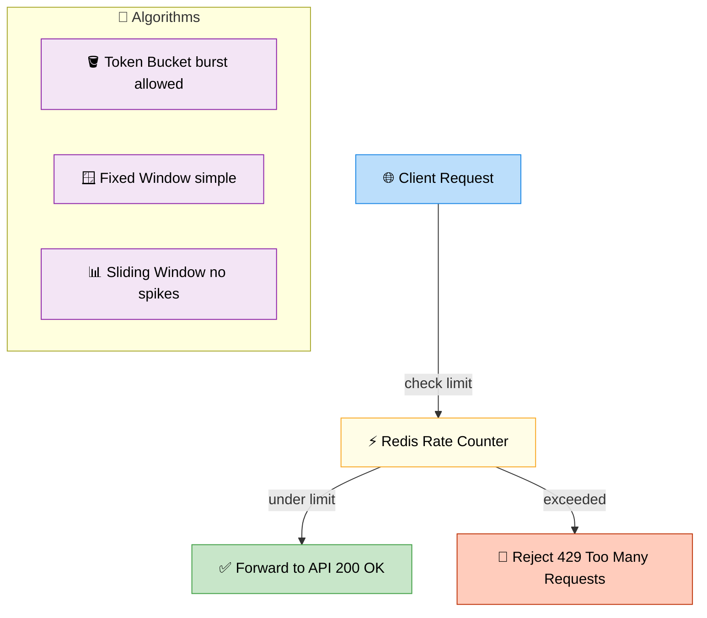

# Rate Limiting

> **Subject**: System Design · **Group**: Core Components · **Topic**: 05 of 06
> **Status**: ✅ Done

---

## PART 1

---

### 1. What is it?

Rate limiting **controls how many requests a client can make in a time window**. It protects your system from abuse, overload, and ensures fair usage across all clients.

Types of limits:

- Per user/API key
- Per IP address
- Per endpoint
- Global system-wide

---

### 2. Why is it needed?

| Without Rate Limiting             | Impact                          |
| --------------------------------- | ------------------------------- |
| One bad client hammers your API   | DB/server crashes for all users |
| Scrapers pull your entire catalog | Bandwidth cost + data theft     |
| Brute-force login attempts        | Account takeover risk           |
| DDoS traffic spike                | System-wide outage              |

---

### 3. Where is it used?

| Use Case                        | Limit Type                              |
| ------------------------------- | --------------------------------------- |
| **Public API (Stripe, Twilio)** | 100 req/sec per API key                 |
| **Login endpoint**              | 5 attempts/min per IP                   |
| **Search API**                  | 10 req/sec per user (expensive queries) |

---

### 4. How Does it Work? — Algorithms



```
TOKEN BUCKET (most common):
  - Bucket capacity: 10 tokens
  - Refill: 1 token/second
  - Each request consumes 1 token
  - If bucket empty: 429 Too Many Requests
  ✅ Allows burst up to bucket size
  ✅ Smooth average rate
  → Used by: most APIs (Stripe, GitHub)

FIXED WINDOW:
  - Counter resets every 60 seconds
  - Allow max 100 requests per window
  ❌ Boundary problem: 100 req at :59 + 100 req at :01 = 200 in 2 seconds
  → Simple but flawed

SLIDING WINDOW LOG:
  - Store timestamp of each request
  - Count requests in past 60 seconds
  ✅ Accurate, no boundary problem
  ❌ High memory (store all timestamps)

SLIDING WINDOW COUNTER:
  - Weighted blend of current + previous window counts
  ✅ Low memory, approximately accurate
  → Production sweet spot
```

---

### 5. Implementation with Redis

```python
# Token Bucket with Redis atomic operations
def is_allowed(user_id: str, limit: int, window_sec: int) -> bool:
    key = f"rate:{user_id}"
    now = time.time()

    pipe = redis.pipeline()
    pipe.zadd(key, {str(now): now})           # add request timestamp
    pipe.zremrangebyscore(key, 0, now - window_sec)  # remove old
    pipe.zcard(key)                            # count remaining
    pipe.expire(key, window_sec)
    _, _, count, _ = pipe.execute()

    return count <= limit
```

---

## PART 2

---

### 6. Trade-offs

| Approach                   | Pros                                | Cons                                                           |
| -------------------------- | ----------------------------------- | -------------------------------------------------------------- |
| **In-memory (per server)** | Fast, no network hop                | Inaccurate in multi-server setup (each server has own counter) |
| **Redis centralized**      | Accurate, shared across all servers | Single Redis = SPOF; adds ~1ms per request                     |
| **API Gateway (AWS)**      | Zero code, managed                  | Less flexible (hard to customize per user tier)                |
| **Token Bucket**           | Allows bursts, smooth average       | Slightly complex to implement                                  |
| **Fixed Window**           | Simplest                            | Boundary attack (burst at window edge)                         |

#### 🚫 When rate limiting causes problems

- **Too strict on legitimate power users** → use tiered limits (Free: 100/min, Pro: 1000/min, Enterprise: 10000/min)
- **Shared IP (corporate NAT)** → hundreds of users behind one IP → IP-based limits too aggressive → prefer API key limits

---

### 7. Failure Scenarios

| Failure                                | Impact                                         | Handling                                                                                  |
| -------------------------------------- | ---------------------------------------------- | ----------------------------------------------------------------------------------------- |
| **Redis down**                         | Can't check rate limit                         | Fail open (allow requests) or use local in-memory fallback with degraded accuracy         |
| **Redis slow**                         | Rate limit check adds 50ms to every request    | Use Redis pipelining; set low timeout (5ms); circuit breaker on rate limiter              |
| **Distributed race condition**         | Two servers both "see" count=99 and both allow | Use Redis atomic Lua script or `INCR` + `EXPIRE` for atomic check-and-increment           |
| **Client retries aggressively on 429** | Amplifies load                                 | Return `Retry-After` header with exact wait time; implement exponential backoff on client |

---

### 8. AWS Mapping

| Need                         | AWS Service                              | Notes                                     |
| ---------------------------- | ---------------------------------------- | ----------------------------------------- |
| **API-level rate limiting**  | **API Gateway** (Usage Plans + API Keys) | Built-in throttling: requests/sec + burst |
| **IP-based rate limiting**   | **AWS WAF** (rate-based rules)           | Block IP after N requests in 5 min window |
| **Custom rate limiting**     | **ElastiCache Redis** + app code         | Full flexibility, per-user limits         |
| **Lambda concurrency limit** | **Lambda reserved concurrency**          | Prevents Lambda from using all capacity   |
| **DDoS protection**          | **AWS Shield + WAF**                     | L3/L4 DDoS + L7 rate limiting combined    |

**AWS API Gateway throttling config:**

```
Usage Plan:
  - Rate: 1000 requests/second (steady state)
  - Burst: 2000 requests (token bucket — burst capacity)
  - Quota: 1,000,000 requests/month (API key limit)

→ Per API key: associate with Usage Plan
→ Over limit: returns 429 TooManyRequestsException
```

---

### 9. Interview-Ready Explanation (30 sec)

> _"Rate limiting controls how many requests a client can make in a time window to protect the system from abuse and overload. I implement it using Redis with a sliding window counter — each request increments a Redis counter per user, and we reject with 429 if the count exceeds the limit._
>
> _The token bucket algorithm is best for allowing short bursts while enforcing an average rate. On AWS, I use API Gateway Usage Plans for external API keys, and AWS WAF rate-based rules for IP-level DDoS protection."_

---

### 10. Quick Example

**Tiered API rate limiting:**

```
Free tier:     100 req/min per API key
Pro tier:      1,000 req/min per API key
Enterprise:    10,000 req/min per API key

Redis key: rate:{api_key}:{minute_bucket}
  Increment on each request
  Expire after 60 seconds

On limit exceeded:
  HTTP 429 Too Many Requests
  Headers:
    X-RateLimit-Limit: 100
    X-RateLimit-Remaining: 0
    X-RateLimit-Reset: 1713500460  (Unix timestamp when window resets)
    Retry-After: 23                 (seconds until retry)
```

---

### 11. Common Interview Questions

**Q1: How do you implement rate limiting across multiple servers without a central Redis?**

> Use approximate rate limiting with local in-memory counters + periodic sync, accepting some inaccuracy. Or use consistent hashing to route each user's requests to the same server (but this defeats horizontal scaling). In practice, Redis with replication is the right answer — the accuracy and simplicity outweigh the added Redis dependency.

**Q2: What is the difference between throttling and rate limiting?**

> Rate limiting: hard cap — reject requests over the limit (429). Throttling: slow down processing — accept requests but delay/queue them (softer degradation). Rate limiting is for protecting against abuse. Throttling is for graceful degradation under load. In practice, both terms are often used interchangeably.

**Q3: How would you design rate limiting for a multi-tenant SaaS platform?**

> Three levels: (1) Per tenant (API key): separate limits per customer tier. (2) Per endpoint: expensive endpoints (search, export) get stricter limits than cheap ones (read profile). (3) Global circuit breaker: if total system load > 80%, apply emergency throttling to all tenants. Store limits in a config table (DynamoDB) so they can be changed without deploy.

---

> **Next Topic →** [06 · Circuit Breaker](./06-circuit-breaker.md)
