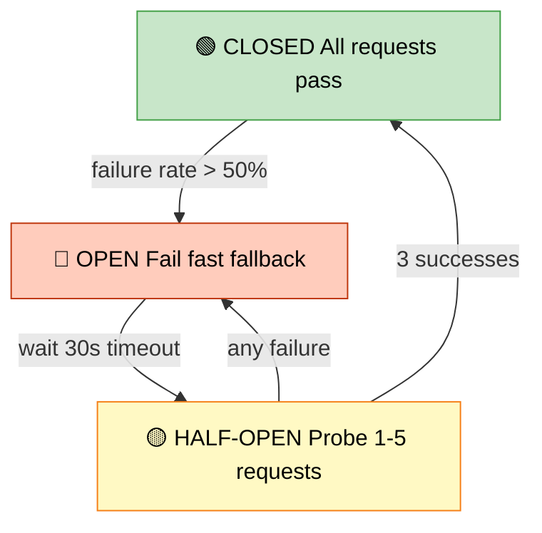

# Circuit Breaker

> **Subject**: System Design · **Group**: Core Components · **Topic**: 06 of 06
> **Status**: ✅ Done

---

## PART 1

---

### 1. What is it?

A **Circuit Breaker** is a resilience pattern that **stops calling a failing downstream service** when it detects repeated failures, preventing cascade failures across your system.

Named after electrical circuit breakers — when too much current flows (too many errors), it "trips" and cuts the connection to protect the wider circuit.

States:

- **CLOSED**: Normal operation — requests pass through
- **OPEN**: Too many failures — requests are blocked (fail fast)
- **HALF-OPEN**: Probe state — let a few requests through to test if service recovered

---

### 2. Why is it needed?

| Without Circuit Breaker               | With Circuit Breaker                      |
| ------------------------------------- | ----------------------------------------- |
| Service B is slow/down                | Service B is slow/down                    |
| Service A keeps calling B             | Service A stops calling B after threshold |
| All A's threads blocked waiting for B | A fails fast, frees threads               |
| A's thread pool exhausted             | A stays healthy                           |
| Cascade failure: A crashes too        | A serves fallback or partial response     |

**The core problem it solves**: a slow dependency is worse than a failed one — it blocks resources instead of failing fast.

---

### 3. Where is it used?

| Use Case                                    | Why Circuit Breaker                                          |
| ------------------------------------------- | ------------------------------------------------------------ |
| **Microservice calling payment service**    | Payment latency spikes → break circuit → serve cached result |
| **API calling third-party (weather, maps)** | 3rd party rate-limited → stop hammering, serve stale data    |
| **Service calling DB**                      | DB overloaded → break circuit → read from cache              |

---

### 4. How Does it Work? (State Machine)



```
      [All requests pass through]
              CLOSED ──────────────────────────────────────┐
              │                                             │
    failure rate > threshold                         success rate restored
    (e.g., 50% errors in 10 calls)                  (e.g., 3 successes in HALF-OPEN)
              │                                             │
              ▼                                             │
            OPEN ─────── wait timeout (e.g., 30s) ──► HALF-OPEN
    [All requests fail fast]                   [Let 1–5 requests through to probe]
    [Return fallback immediately]               → failures → back to OPEN
                                                → successes → back to CLOSED

CLOSED → OPEN trigger:  failure rate > 50% in last 10 requests
OPEN → HALF-OPEN:       after 30-second timeout
HALF-OPEN → CLOSED:     3 consecutive successes
HALF-OPEN → OPEN:       any failure
```

---

### 5. Types / Variations

| Type                 | Description                                                               | Library                            |
| -------------------- | ------------------------------------------------------------------------- | ---------------------------------- |
| **Count-based**      | Trip after N consecutive failures                                         | Resilience4j, Hystrix (deprecated) |
| **Rate-based**       | Trip when failure rate % exceeds threshold in sliding window              | Resilience4j default               |
| **Timeout-based**    | Treat slow responses (>N ms) as failures                                  | Combine with circuit breaker       |
| **Bulkhead pattern** | Isolate thread pools per service so one failing service can't exhaust all | Resilience4j Bulkhead              |

---

## PART 2

---

### 6. Trade-offs

#### ✅ Pros

| Advantage                | Detail                                                             |
| ------------------------ | ------------------------------------------------------------------ |
| Prevents cascade failure | Failure in one service doesn't bring down the whole system         |
| Fail fast                | Better UX to get immediate error vs waiting 30 seconds for timeout |
| Automatic recovery       | HALF-OPEN state probes recovery without manual intervention        |
| Thread pool protection   | Stops resource exhaustion from blocked calls                       |

#### ❌ Cons / When NOT to use

| Disadvantage                                | Detail                                                                                                |
| ------------------------------------------- | ----------------------------------------------------------------------------------------------------- |
| **Complexity**                              | State management adds code complexity; must configure thresholds carefully                            |
| **False positives**                         | Transient spike trips breaker → healthy service rejected unnecessarily → tune sliding window          |
| **Wrong for synchronous user-facing flows** | Don't block a critical write path behind a circuit breaker without a fallback; user gets error anyway |
| **Not a substitute for retry**              | Use both: retry for transient errors, circuit breaker for sustained failures                          |

---

### 7. Failure Scenarios

| Failure                                     | Circuit Breaker Behavior                                       | Without CB                                        |
| ------------------------------------------- | -------------------------------------------------------------- | ------------------------------------------------- |
| **Downstream DB crashes**                   | Opens after threshold failures → fail fast → serve cached data | All threads block → service crashes too           |
| **Downstream slow (timeout)**               | Treat timeouts as failures → trips if persistent               | Threads pile up, memory exhausted                 |
| **Partial failure (50% of instances down)** | Rate-based: trips when error rate > 50%                        | Some requests succeed, some hang                  |
| **Downstream recovers**                     | HALF-OPEN → test → CLOSED automatically                        | Manual intervention needed in naive retry loops   |
| **Fallback itself fails**                   | Must handle; fallback can't be another fragile call            | Ensure fallback is local (cache, static response) |

---

### 8. AWS Mapping

| Need                             | AWS Service / Pattern                                             | Notes                                                                          |
| -------------------------------- | ----------------------------------------------------------------- | ------------------------------------------------------------------------------ |
| **Circuit breaker in code**      | **Resilience4j** (Java), **Polly** (.NET), **pybreaker** (Python) | App-level; most commonly used                                                  |
| **Service mesh CB**              | **AWS App Mesh** (Envoy proxy)                                    | Envoy has built-in outlier detection = circuit breaker at infrastructure level |
| **Lambda invocation protection** | **Lambda Reserved Concurrency** + **SQS DLQ**                     | Prevents Lambda from overwhelming downstream                                   |
| **API Gateway CB**               | **API Gateway + Lambda authorizer**                               | Can reject calls when backend is known-down                                    |
| **Health-based routing**         | **Route 53 failover routing**                                     | DNS-level circuit breaker: fail to secondary region                            |
| **ECS/EKS level**                | **App Mesh + Envoy outlier detection**                            | Automatic host removal from load balancer when error rate spikes               |

**Envoy outlier detection (App Mesh):**

```yaml
outlierDetection:
  consecutive5xx: 5 # 5 consecutive 5xx → eject host
  interval: 10s # check every 10s
  baseEjectionTime: 30s # eject for 30s minimum
  maxEjectionPercent: 50 # never eject more than 50% of hosts
```

---

### 9. Interview-Ready Explanation (30 sec)

> _"A circuit breaker stops calling a failing downstream service after repeated failures, preventing cascade failures. It has three states: CLOSED (normal), OPEN (fail fast, don't call downstream), and HALF-OPEN (probe recovery with a few test requests)._
>
> _Without it, a slow database or service B will exhaust all of service A's threads — it's waiting for timeouts — and crash service A too. With a circuit breaker, service A fails fast, frees those threads, and serves a fallback response._
>
> _In practice, I use Resilience4j in Java services for code-level circuit breaking, and AWS App Mesh Envoy for infrastructure-level protection in microservices."_

---

### 10. Quick Example

**Payment service calling fraud detection (external API):**

```java
// Resilience4j circuit breaker
CircuitBreaker cb = CircuitBreaker.ofDefaults("fraudDetection");

// Decorate the external call
Supplier<FraudResult> decorated = CircuitBreaker.decorateSupplier(cb,
    () -> fraudApi.check(payment));  // external API call

try {
    FraudResult result = decorated.get();
    return result;
} catch (CallNotPermittedException e) {
    // Circuit OPEN — fail fast
    log.warn("Circuit OPEN: fraud API unavailable, using fallback");
    return FraudResult.ALLOW_WITH_MONITORING;  // fallback: allow + flag for review
} catch (Exception e) {
    // Actual error — circuit tracks this failure
    return FraudResult.DENY;
}

// CB config:
//   failureRateThreshold: 50%
//   slidingWindowSize: 10 calls
//   waitDurationInOpenState: 30s
```

---

### 11. Common Interview Questions

**Q1: What is the difference between a circuit breaker and a retry?**

> Retry handles transient errors (network blip, brief unavailability) — try again after a short delay. Circuit breaker handles sustained failures — stops trying entirely after a threshold. Use them together: retry with exponential backoff for transient errors, circuit breaker to stop retrying when the service is clearly down. Without a circuit breaker, aggressive retries amplify load on an already failing service.

**Q2: How do you determine the right threshold to trip a circuit breaker?**

> No universal answer — it's workload-specific. Start with: failure rate > 50% in a 10-request sliding window, timeout > 2s counts as failure. Monitor false positive rate (healthy service getting tripped) vs time-to-trip on real failures. In production: instrument with metrics (CLOSED/OPEN/HALF-OPEN state transitions) → alert when breaker trips → tune thresholds based on observed patterns.

**Q3: What fallback strategies do you use when a circuit is open?**

> (1) **Cached data**: serve last known good value from Redis (product price, user profile). (2) **Default response**: return a reasonable default (empty recommendations, "service unavailable" message). (3) **Fail gracefully**: return partial data instead of all-or-nothing. (4) **Queue for later**: write the request to a queue, process when service recovers. Never use a fallback that calls another fragile service.

---

> ✅ **Core Components Group COMPLETE (6/6)**
>
> **Next Group →** [04 · Data Layer](../04-Data-Layer/)
> First topic: [Indexing](../04-Data-Layer/01-indexing.md)
