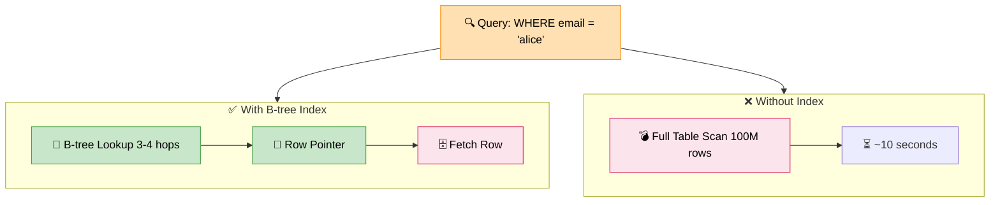

# Indexing

> **Subject**: System Design · **Group**: Data Layer · **Topic**: 01 of 04
> **Status**: ✅ Done

---

## PART 1

---

### 1. What is it?

A **database index** is a separate data structure (usually a B-tree or hash) that allows the DB to find rows **without scanning the entire table**. Like the index at the back of a book — find the page without reading every page.

Without an index: full table scan = O(n).
With an index: B-tree lookup = O(log n). For a table of 100M rows, that's 100M operations vs ~27 operations.

---

### 2. Why is it needed?

| Query on 100M rows    | Without Index      | With Index             |
| --------------------- | ------------------ | ---------------------- |
| `WHERE user_id = 123` | Scan all 100M rows | B-tree: 27 comparisons |
| Time                  | ~10 seconds        | ~1ms                   |
| DB CPU                | 100%               | negligible             |

Unindexed queries on large tables = the #1 cause of production DB slowdowns.

---

### 3. Where is it used?

| Use Case                      | Index Type                          |
| ----------------------------- | ----------------------------------- |
| User lookup by email at login | B-tree on `users.email`             |
| Orders for a specific user    | B-tree on `orders.user_id`          |
| Full-text product search      | Full-text index (GIN in PostgreSQL) |

---

### 4. How Does it Work? (High-Level)



```
B-tree Index (most common — for range and equality queries):
  Table: users (10M rows)
  Index: CREATE INDEX ON users(email)

  B-tree structure:
                [M–Z]
               /     \
           [M–R]     [S–Z]
           /   \     /   \
         [M-N] [O-R] [S-T] [U-Z]
          ↓
        [row pointers: email → row_id → actual row data]

  Query: SELECT * FROM users WHERE email = 'alice@example.com'
    Without index: read all 10M rows → check email → return match
    With index:    traverse B-tree (3–4 hops) → get row_id → fetch row ✅

Hash Index (for equality only — O(1)):
  Redis uses hash internally
  PostgreSQL: Hash index for = comparisons, faster than B-tree
  ❌ Cannot do range queries: WHERE age > 25

Composite Index:
  CREATE INDEX ON orders(user_id, created_at)
  → Efficient for: WHERE user_id = 1 AND created_at > '2024-01-01'
  → Prefix rule: must use user_id in query; created_at alone won't use index
```

---

### 5. Index Types

| Type                     | Best For                                           | DB Support                    |
| ------------------------ | -------------------------------------------------- | ----------------------------- |
| **B-tree**               | Equality, range, ORDER BY                          | PostgreSQL, MySQL, most RDBMS |
| **Hash**                 | Equality only (=)                                  | PostgreSQL, Redis             |
| **Full-text (GIN/GiST)** | Text search (`LIKE '%word%'`, `tsvector`)          | PostgreSQL, Elasticsearch     |
| **Composite**            | Multi-column queries                               | All RDBMS                     |
| **Partial**              | Index subset of rows (`WHERE active = true`)       | PostgreSQL                    |
| **Covering index**       | Index includes all query columns (no table lookup) | PostgreSQL, MySQL             |

---

## PART 2

---

### 6. Trade-offs

| Dimension            | Benefit                        | Cost                                                         |
| -------------------- | ------------------------------ | ------------------------------------------------------------ |
| **Read speed**       | ↑↑↑ (10,000x for large tables) | —                                                            |
| **Write speed**      | —                              | ↓ Every INSERT/UPDATE/DELETE must update index               |
| **Storage**          | —                              | ↓ Index takes additional disk space                          |
| **Too many indexes** | —                              | ↓ Writes slow down significantly; index maintenance overhead |

#### 🚫 When NOT to index

- **Small tables** (< 10K rows) → full scan is fast; index overhead not worth it
- **Write-heavy tables** (logs, metrics) → index slows every insert
- **Low-cardinality columns** → index on `gender` (M/F) is useless; DB will full-scan anyway
- **Never-queried columns** → wasted storage and write overhead

---

### 7. Failure Scenarios

| Failure                            | Impact                                                             | Handling                                                                     |
| ---------------------------------- | ------------------------------------------------------------------ | ---------------------------------------------------------------------------- |
| **Missing index on large table**   | Query takes seconds, timeouts, DB CPU spikes                       | EXPLAIN ANALYZE to find slow queries; add index (CONCURRENTLY to avoid lock) |
| **Index bloat**                    | Index grows large due to dead rows; slows queries                  | PostgreSQL: VACUUM; MySQL: OPTIMIZE TABLE                                    |
| **Wrong index type**               | Hash index used for range query → falls back to full scan          | Use B-tree for range; verify with EXPLAIN                                    |
| **Composite index wrong order**    | `INDEX (status, user_id)` won't help `WHERE user_id = ?` alone     | Always put high-selectivity + query-prefix column first                      |
| **Index not used (implicit cast)** | `WHERE user_id = '123'` (string) on integer column → index skipped | Match types; avoid wrapping indexed columns in functions                     |

---

### 8. AWS Mapping

| Need                            | AWS Approach                     | Notes                                                                |
| ------------------------------- | -------------------------------- | -------------------------------------------------------------------- |
| **Query optimization**          | RDS Performance Insights         | Shows slow queries, index recommendations                            |
| **Add index without downtime**  | `CREATE INDEX CONCURRENTLY`      | PostgreSQL on RDS; non-blocking                                      |
| **Automatic index suggestions** | RDS / Aurora Query Advisor       | Recommends missing indexes from slow query log                       |
| **DynamoDB indexing**           | **GSI (Global Secondary Index)** | Create alternate access patterns (query by non-PK)                   |
| **DynamoDB local**              | **LSI (Local Secondary Index)**  | Same partition key, different sort key                               |
| **Full-text search**            | **Amazon OpenSearch**            | Don't use DB full-text for large-scale search; offload to OpenSearch |

**DynamoDB GSI Example:**

```
Base table PK: userId
GSI: email → userId mapping

GET user by email:
  Without GSI: Scan entire table (expensive)
  With GSI:    Query GSI by email → O(1) ✅
```

---

### 9. Interview-Ready Explanation (30 sec)

> _"An index is a separate data structure — usually a B-tree — that lets the database find rows without scanning the entire table. The difference is dramatic: 100 million rows, a full scan takes seconds; with a B-tree index on the query column, it's milliseconds._
>
> _The trade-off: indexes speed up reads but slow down writes because every insert/update must update the index too. So I index selectively — the columns that appear in WHERE clauses, JOINs, and ORDER BY. On DynamoDB, I use GSIs to create alternative access patterns beyond the primary key."_

---

### 10. Common Interview Questions

**Q1: How do you find which queries need indexes?**

> In PostgreSQL: `EXPLAIN ANALYZE` on slow queries — look for "Seq Scan" on large tables. Use `pg_stat_statements` to find top slow queries. On AWS RDS: Performance Insights shows queries by load; Trusted Advisor flags missing indexes. Also check slow query log.

**Q2: What is a covering index?**

> An index that includes all columns a query needs, so the DB never needs to fetch the actual row. Example: `CREATE INDEX ON orders(user_id) INCLUDE (status, total)`. A query `SELECT status, total FROM orders WHERE user_id = 1` is satisfied entirely from the index — no table lookup (index-only scan). Much faster for read-heavy queries.

**Q3: What is index cardinality and why does it matter?**

> Cardinality = number of unique values in a column. High cardinality (user_id, email) = index is selective = very useful. Low cardinality (gender, status with 3 values) = index is not selective = DB may skip it and full-scan anyway. Rule: only index high-cardinality columns or combinations that narrow results significantly.

---

> **Next Topic →** [02 · Sharding](./02-sharding.md)
