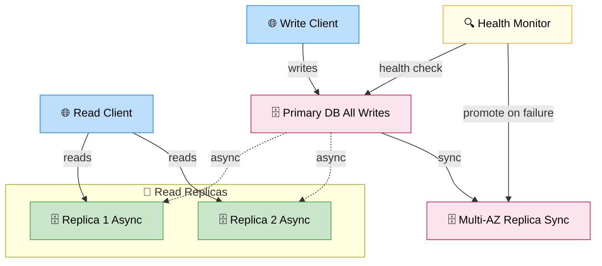

# Replication

> **Subject**: System Design · **Group**: Data Layer · **Topic**: 03 of 04
> **Status**: ✅ Done

---

## PART 1

---

### 1. What is it?

**Replication** copies the same data to multiple database nodes (replicas). Unlike sharding (which splits data), replication keeps **full copies** of the data on each node.

Two primary goals:

1. **High Availability (HA)**: If primary fails, replica takes over
2. **Read Scaling**: Route read queries to replicas; primary handles writes only

---

### 2. Why is it needed?

| Without Replication                | With Replication                                   |
| ---------------------------------- | -------------------------------------------------- |
| Primary DB crashes → full downtime | Replica promoted → minimal downtime (~30s)         |
| All reads hit primary → bottleneck | Reads distributed across replicas                  |
| Single DC failure → data loss      | Replicas in other AZs/regions → survive DC failure |

---

### 3. Where is it used?

| Use Case                                   | Replication Type                              |
| ------------------------------------------ | --------------------------------------------- |
| **HA for RDS**                             | Multi-AZ (synchronous replica in same region) |
| **Global read performance**                | Read replicas in multiple regions             |
| **Analytics without impacting production** | Read replica for analytics queries            |

---

### 4. How Does it Work?



```
PRIMARY-REPLICA (Single Primary / Leader-Follower):
─────────────────────────────────────────────────
  [Primary]  ──── replicate ───► [Replica 1]
                                 [Replica 2]
  - All writes go to Primary
  - Reads can go to Primary OR Replicas
  - Replica lag: typically <1 second (async) or 0 (sync)

SYNC vs ASYNC Replication:
  Synchronous: Primary waits for replica to confirm write
    → 0 data loss on failover
    → Higher write latency (wait for replica ACK)
    → AWS RDS Multi-AZ uses synchronous mirroring

  Asynchronous: Primary writes, replica catches up
    → Lower write latency
    → Small replication lag (ms to seconds)
    → Risk: if primary crashes, replica may miss recent writes
    → AWS RDS Read Replicas use asynchronous

MULTI-PRIMARY (Multi-Master):
──────────────────────────────
  [Primary A] ←──sync──► [Primary B]
  Both accept writes → conflict resolution required
  → Used by: Aurora Multi-Master (deprecated), CockroachDB, Galera
  → Complex: avoid unless global write distribution is required
```

---

### 5. Types / Variations

| Type                        | Writes                         | Reads                    | Use Case                  | Risk                           |
| --------------------------- | ------------------------------ | ------------------------ | ------------------------- | ------------------------------ |
| **Primary + Read Replicas** | Primary only                   | Any replica              | Read scaling              | Replication lag                |
| **Multi-AZ (RDS)**          | Primary only (sync to standby) | Primary only             | HA, failover              | Standby not used for reads     |
| **Multi-Region replica**    | Primary region                 | Local replica per region | Global read latency       | ~seconds lag across regions    |
| **Multi-Primary**           | Any node                       | Any node                 | Global write distribution | Conflict resolution complexity |

---

## PART 2

---

### 6. Trade-offs

| Sync Replication                      | Async Replication                      |
| ------------------------------------- | -------------------------------------- |
| ✅ Zero data loss on failover         | ✅ Lower write latency                 |
| ✅ Replicas always up-to-date         | ✅ Replica can be far away             |
| ❌ Higher write latency               | ❌ Replication lag (stale reads)       |
| ❌ Write fails if replica unreachable | ❌ Data loss window if primary crashes |

#### 🚫 When NOT to add read replicas

- **Write-heavy workload** — replicas don't help; use sharding instead
- **Consistency-critical reads** — always read from primary; replicas may lag
- **Very small DB** — single node handles the load; replicas add complexity

---

### 7. Failure Scenarios

| Failure                                 | Impact                                | Handling                                                                                 |
| --------------------------------------- | ------------------------------------- | ---------------------------------------------------------------------------------------- |
| **Primary crashes**                     | Write path broken                     | Multi-AZ: automatic failover to standby ~30–60s; DNS updated                             |
| **Replica lag spike**                   | Reads return stale data               | Monitor `ReplicaLag` metric; alert if > threshold; route critical reads to primary       |
| **Split-brain (multi-primary)**         | Both nodes accept conflicting writes  | Quorum writes; conflict resolution (last-write-wins, vector clocks); avoid multi-primary |
| **Replica falls too far behind**        | Replica useless for reads             | Check replication slot lag (PostgreSQL); long-running queries on replica block log apply |
| **Failover but old primary comes back** | Old primary has newer data → diverged | RDS handles this: old primary demoted to replica; WAL log resolved                       |

---

### 8. AWS Mapping

| Need                       | AWS Service                | Config                                                     |
| -------------------------- | -------------------------- | ---------------------------------------------------------- |
| **HA failover**            | **RDS Multi-AZ**           | Synchronous standby in different AZ; auto-failover in ~30s |
| **Read scaling**           | **RDS Read Replicas**      | Up to 15 replicas; async; can be cross-region              |
| **Global read**            | **Aurora Global Database** | Primary region + secondary regions (< 1s replication lag)  |
| **Zero-downtime failover** | **Aurora**                 | < 30s failover; shared storage layer (faster than RDS)     |
| **Analytics replica**      | **RDS Read Replica**       | Dedicated replica for heavy analytics queries              |
| **Monitor lag**            | CloudWatch: `ReplicaLag`   | Alert if > 30 seconds                                      |

**Aurora vs RDS replication:**

```
RDS Multi-AZ:
  Primary ─── sync log ──► Standby (same region, different AZ)
  Standby: hot spare, not readable
  Failover: ~60s (DNS update)

Aurora:
  Shared storage across 6 nodes in 3 AZs
  Up to 15 read replicas share the storage layer
  Failover: < 30s (no storage copy needed)
  Read replicas: lag typically < 100ms
```

---

### 9. Interview-Ready Explanation (30 sec)

> _"Replication maintains copies of your data on multiple nodes for availability and read scaling. There are two modes: synchronous — primary waits for replica to confirm, zero data loss but higher latency — and asynchronous — lower latency but small risk of data loss on failover._
>
> _On AWS, I use RDS Multi-AZ for HA: a synchronous standby in a different AZ with automatic failover in ~30 seconds. For read scaling, I add async read replicas and route read queries to them. For global systems, Aurora Global Database maintains secondary regions with under 1 second replication lag."_

---

### 10. Common Interview Questions

**Q1: What is the difference between RDS Multi-AZ and a Read Replica?**

> Multi-AZ: synchronous standby for HA — the standby is not readable, just a failover target. Automatic failover if primary fails (~30–60s). Read Replica: asynchronous copy for read scaling — you route read traffic here to offload the primary. You can promote a read replica to primary manually, but it's not automatic failover. Use both together for production.

**Q2: How do you handle replication lag for read-after-write consistency?**

> Route reads immediately after writes to the primary, not replicas. Techniques: (1) sticky routing — after a write, route the next N reads for that user to primary. (2) Read-your-writes token — pass a replication timestamp; read replicas wait until they've applied up to that point. (3) Application flag — if user just modified data, read from primary for next 5 seconds.

**Q3: When would you use Aurora over RDS for replication?**

> Aurora's shared storage architecture makes replication fundamentally different: all nodes share the same distributed storage layer, so "replication" is just metadata — not physical data copies. This gives faster failover (<30s vs ~60s), lower replica lag (<100ms vs seconds), and up to 15 read replicas. Use Aurora when HA and read scaling are critical and you can afford the slight cost premium.

---

> **Next Topic →** [04 · Partitioning Basics](./04-partitioning.md)
