# Retry Mechanisms

> **Subject**: System Design · **Group**: 🔥 Reliability & Failure (MUST) · **Topic**: 01 of 05
> **Status**: ✅ Done

---

## PART 1

---

### 1. What is it?

A **retry mechanism** automatically re-attempts a failed operation — typically a network call or DB query — when the failure is likely transient (temporary). Most network failures are transient: brief unavailability, timeout, rate limit.

**Key principle**: retry transient errors, NOT permanent ones (400 Bad Request, 404 Not Found — retrying those wastes resources).

---

### 2. Why is it needed?

| Without Retry                            | With Retry                                   |
| ---------------------------------------- | -------------------------------------------- |
| Network blip → request fails permanently | Network blip → retry succeeds on 2nd attempt |
| Rate limit 429 → error returned to user  | 429 → wait → retry → success                 |
| User sees error for a fixable failure    | User sees slight delay, transparent recovery |

---

### 3. Retry Strategies

```mermaid
graph TD
    classDef client fill:#BBDEFB,stroke:#1E88E5,color:#000
    classDef good fill:#C8E6C9,stroke:#43A047,color:#000
    classDef bad fill:#FFCCBC,stroke:#BF360C,color:#000
    classDef best fill:#E8F5E9,stroke:#2E7D32,color:#000

    subgraph Immediate["❌ Immediate Retry"]
        I1["Try"] --> I2["Fail"]
        I2 --> I3["Retry immediately"]
        I3 --> I4["Thundering herd"]
    end

    subgraph Exponential["✅ Exponential Backoff"]
        E1["Try"] --> E2["Fail"]
        E2 -->|wait 1s| E3["Retry"]
        E3 -->|wait 2s| E4["Retry"]
        E4 -->|wait 4s| E5["Retry"]
    end

    subgraph Jitter["🏆 Backoff + Jitter"]
        J1["Try"] --> J2["Fail"]
        J2 -->|random delay| J3["Retry"]
        J3 -->|random delay| J4["Success"]
    end

    I1:::bad
    E1:::good
    J1:::best
    J4:::best
```



```
IMMEDIATE RETRY (bad for most cases):
  Try → Fail → Retry immediately → Fail → Retry immediately
  ❌ Thundering herd: floods already-struggling service

FIXED DELAY:
  Try → Fail → Wait 1s → Try → Fail → Wait 1s → Try
  ✅ Simple
  ❌ Synchronized retries if many clients fail at same time

EXPONENTIAL BACKOFF (industry standard):
  Try → Fail → Wait 1s → Try → Fail → Wait 2s → Try → Fail → Wait 4s
  Delay = base_delay × 2^attempt_number
  ✅ Gives system time to recover
  ✅ Reduces load on recovering service

EXPONENTIAL BACKOFF + JITTER (best practice):
  Delay = random(0, base_delay × 2^attempt)
  ✅ Prevents synchronized retry storms
  → AWS SDK uses this by default
```

---

### 4. Which Errors to Retry

| HTTP Status               | Retry?              | Reason                                     |
| ------------------------- | ------------------- | ------------------------------------------ |
| 429 Too Many Requests     | ✅ Yes              | Rate limited; wait and retry               |
| 500 Internal Server Error | ✅ Yes (with limit) | Transient server error                     |
| 503 Service Unavailable   | ✅ Yes              | Overloaded; will recover                   |
| 408 Request Timeout       | ✅ Yes              | Network timeout; transient                 |
| 400 Bad Request           | ❌ No               | Client error; retrying won't fix it        |
| 401 Unauthorized          | ❌ No               | Auth issue; fix credentials first          |
| 404 Not Found             | ❌ No               | Resource doesn't exist; retrying is futile |

---

## PART 2

---

### 5. Trade-offs

| Approach                 | Pros                  | Cons                                 |
| ------------------------ | --------------------- | ------------------------------------ |
| **No retry**             | Simple, fast feedback | User sees transient errors           |
| **Immediate retry**      | Fast recovery         | Amplifies load on struggling service |
| **Fixed delay**          | Simple                | Synchronized retries (herd effect)   |
| **Exponential + jitter** | Standard, effective   | Slightly more code; latency added    |

#### 🚫 When NOT to retry

- **Non-idempotent operations** without idempotency keys: `POST /payments` — retry may double-charge
- **Client errors (4xx)** — they will always fail; stop immediately
- **After circuit breaker opens** — retrying into an open circuit wastes time

---

### 6. Failure Scenarios

| Failure                  | Without Retry             | With Retry                                               |
| ------------------------ | ------------------------- | -------------------------------------------------------- |
| **Network blip (100ms)** | Request fails permanently | Retry after 1s → succeeds                                |
| **DB restart (~30s)**    | All requests fail         | Retry with backoff → succeed after DB comes back         |
| **Retry storm**          | N/A                       | All clients retry at once → amplify load → use jitter    |
| **Non-idempotent retry** | N/A                       | Payment processed twice → add idempotency key            |
| **Infinite retry loop**  | N/A                       | Set max retries (3–5); after max → DLQ or error response |

---

### 7. AWS Mapping

| Service            | Built-in Retry                                                               |
| ------------------ | ---------------------------------------------------------------------------- |
| **AWS SDK**        | Exponential backoff + jitter by default; configurable max retries            |
| **Lambda → SQS**   | SQS message becomes visible again after visibility timeout → automatic retry |
| **Step Functions** | Per-state retry config with `MaxAttempts`, `IntervalSeconds`, `BackoffRate`  |
| **API Gateway**    | No auto-retry (returns error to client); client must retry                   |
| **DynamoDB SDK**   | Built-in retry with backoff for `ProvisionedThroughputExceededException`     |
| **SQS DLQ**        | After N retries, message moves to Dead Letter Queue                          |

---

### 8. Interview-Ready Explanation (30 sec)

> _"Retry mechanisms re-attempt failed operations for transient errors. The key is using exponential backoff with jitter — on each retry, the wait time doubles, plus a random offset. This gives the system time to recover and prevents synchronized retry storms where thousands of clients retry at exactly the same moment._
>
> _Critical rule: only retry idempotent operations. For non-idempotent calls like payments, I add an idempotency key so retrying the same operation is safe. AWS SDKs do exponential backoff by default. For async flows, SQS handles retries automatically via visibility timeout and Dead Letter Queues after max retries."_

---

### 9. Common Interview Questions

**Q1: What is the difference between retry and circuit breaker?**

> Retry handles transient failures — try again a few times. Circuit breaker handles sustained failures — stop trying after a threshold to protect your service. Use both: retry first (3 attempts with backoff), and if the circuit breaker trips (50%+ failure rate), stop retrying entirely until service recovers.

**Q2: How do you make a payment API safe to retry?**

> Add an idempotency key: the client generates a unique UUID per payment attempt and sends it as a header (`Idempotency-Key: uuid`). The server stores processed keys in DB/Redis. On retry, the server detects the duplicate key and returns the original response without processing again. Stripe and PayPal implement this pattern.

---

> **Next Topic →** [02 · Idempotency](./02-idempotency.md)
