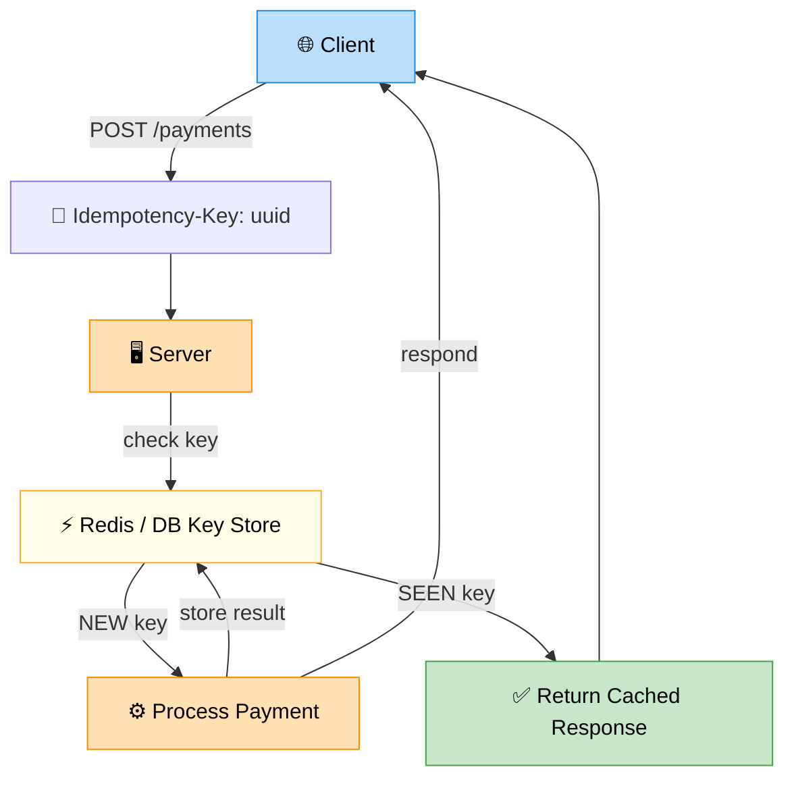

# Idempotency

> **Subject**: System Design · **Group**: 🔥 Reliability & Failure (MUST) · **Topic**: 02 of 05
> **Status**: ✅ Done

---

## PART 1

---

### 1. What is it?

An operation is **idempotent** if performing it multiple times produces the **same result** as performing it once. No extra side effects on retry.

$$f(f(x)) = f(x)$$

- `GET /users/1` → idempotent (always returns same user, no change)
- `DELETE /items/5` → idempotent (deleted is deleted; re-deleting = same state)
- `POST /payments` → **NOT idempotent** by default (each call creates a new charge)
- `POST /payments` **with idempotency key** → idempotent ✅

---

### 2. Why is it needed?

Networks are unreliable. When you send a request and get no response:

- Did the server receive it? Process it? Crash after processing?
- You don't know → you retry

If the operation isn't idempotent, your retry may **create duplicate side effects**: double payment, double order, duplicate notification.

Idempotency is the **safety net for retries**.

---

### 3. Where is it used?

| Use Case                   | Why                                                            |
| -------------------------- | -------------------------------------------------------------- |
| **Payment processing**     | Retry-safe charging — no double billing                        |
| **Order creation**         | Retry-safe order submission                                    |
| **Queue consumers**        | Messages delivered at-least-once → consumer must be idempotent |
| **Distributed saga steps** | Compensating transactions must be safe to re-run               |

---

### 4. How Does it Work?



```
CLIENT SIDE — Idempotency Key:
─────────────────────────────────────────────────
POST /payments
Headers:
  Idempotency-Key: a3b4c5d6-1234-5678-9012-abcdef123456

Server logic:
  1. Receive request with idempotency_key
  2. Check DB/Redis: has this key been processed?
     - YES → return cached response immediately (no re-processing)
     - NO  → process payment → store result against key → return response

  If network drops after processing but before response:
    Client retries with same key
    Server: key found → return cached response ✅
    Client: gets response without double-charge ✅

KEY STORAGE:
  Redis: SET idempotency:{key} {response_json} EX 86400
  DB:    INSERT INTO processed_keys (key, response, created_at)
         ON CONFLICT (key) DO UPDATE SET last_seen = NOW()
```

---

### 5. HTTP Methods — Idempotency by Default

| Method | Idempotent?        | Safe?  | Notes                                                |
| ------ | ------------------ | ------ | ---------------------------------------------------- |
| GET    | ✅ Yes             | ✅ Yes | No side effects                                      |
| PUT    | ✅ Yes             | ❌ No  | Replace resource (same result each time)             |
| DELETE | ✅ Yes             | ❌ No  | Delete is idempotent (deleted twice = still deleted) |
| HEAD   | ✅ Yes             | ✅ Yes | Like GET, no body                                    |
| POST   | ❌ No (by default) | ❌ No  | Creates new resource each time → use idempotency key |
| PATCH  | ❌ No              | ❌ No  | Depends on operation (set vs increment)              |

---

## PART 2

---

### 6. Trade-offs

| Approach                              | Pros                            | Cons                                          |
| ------------------------------------- | ------------------------------- | --------------------------------------------- |
| **Client-generated idempotency key**  | Simple; works with any backend  | Client must generate UUID properly            |
| **Server-side deduplication (Redis)** | Fast lookup; TTL-based expiry   | Redis must be HA; adds dependency             |
| **DB unique constraint**              | Strong guarantee; no TTL needed | Slower than Redis; DB write for every request |
| **No idempotency**                    | Simple                          | Double charges, duplicate orders on retry     |

#### 🚫 When NOT to use idempotency keys

- **Read operations** — already idempotent by nature; no key needed
- **Very high-throughput endpoints where retries are truly rare** — cost vs benefit analysis

---

### 7. Failure Scenarios

| Failure                                            | Without Idempotency                                   | With Idempotency Key                                                           |
| -------------------------------------------------- | ----------------------------------------------------- | ------------------------------------------------------------------------------ |
| **Network drops after processing**                 | Client retries → double charge                        | Client retries → server returns cached response                                |
| **Server crashes after DB write, before response** | Client retries → duplicate DB row                     | DB UNIQUE constraint on idempotency_key blocks duplicate                       |
| **Idempotency key TTL expires**                    | N/A                                                   | Retry after TTL → treated as new request (intended; old enough to retry fresh) |
| **Consumer processes same SQS message twice**      | Duplicate email sent                                  | Check processed_messages table before processing                               |
| **Idempotency key store (Redis) down**             | Can't check → either block all requests or skip check | Fail-safe: allow with monitoring; or queue to be re-processed                  |

---

### 8. AWS Mapping

| Service                  | Idempotency Support                                                   |
| ------------------------ | --------------------------------------------------------------------- |
| **Lambda**               | Powertools `@idempotent` decorator — built-in with DynamoDB backing   |
| **SQS**                  | `MessageDeduplicationId` on FIFO queues (5-min dedup window)          |
| **API Gateway + Lambda** | Idempotency via Lambda Powertools                                     |
| **DynamoDB**             | Conditional writes: `condition_expression='attribute_not_exists(id)'` |
| **Step Functions**       | Each execution has unique execution ARN (input dedup)                 |
| **SNS → SQS**            | SQS FIFO + dedup ID prevents duplicate delivery                       |

**AWS Lambda Powertools Idempotency:**

```python
from aws_lambda_powertools.utilities.idempotency import (
    idempotent, DynamoDBPersistenceLayer
)

persistence_layer = DynamoDBPersistenceLayer(table_name="IdempotencyTable")

@idempotent(persistence_store=persistence_layer)
def lambda_handler(event, context):
    # Process payment — only runs once per unique event hash
    return process_payment(event['payment_id'], event['amount'])
```

---

### 9. Interview-Ready Explanation (30 sec)

> _"Idempotency means performing an operation multiple times gives the same result as once — critical for retry safety. Without it, a retry after a network timeout might charge a user twice._
>
> _The pattern: client generates a unique UUID (idempotency key) and sends it in the request header. The server stores processed results against that key in Redis or DynamoDB. On retry with the same key, the server returns the cached response without reprocessing. AWS Lambda Powertools has built-in idempotency using DynamoDB. SQS FIFO queues have native deduplication with a 5-minute window."_

---

### 10. Common Interview Questions

**Q1: How is idempotency different from at-most-once delivery?**

> At-most-once: the system tries to deliver a message once; if it fails, it's lost (no retry). Idempotency is about retries being safe — it works with at-least-once delivery (retries happen, duplicates may occur). Idempotent consumers handle at-least-once safely. At-exactly-once is the ideal but expensive to achieve; idempotent consumers + at-least-once delivery is the practical production standard.

**Q2: How long should you keep idempotency keys?**

> Long enough to cover the maximum retry window. For payments: 24 hours (Stripe uses 24h). For event consumers: longer than the SQS visibility timeout + max message retention. For Step Functions: lifetime of the workflow. Delete expired keys automatically via Redis TTL or DynamoDB TTL to save storage.

---

> **Next Topic →** [03 · Circuit Breaker (Deeper)](./03-circuit-breaker-deep.md)
