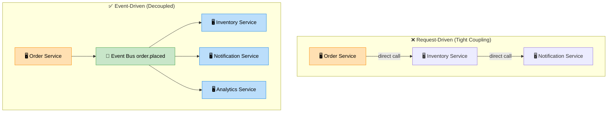

# Event-Driven Architecture

> **Subject**: System Design · **Group**: 🏗️ Design Patterns · **Topic**: 01 of 03
> **Status**: ✅ Done

---

## PART 1

---

### 1. What is it?

**Event-Driven Architecture (EDA)** is a design pattern where components communicate by **producing and consuming events** rather than calling each other directly. A producer emits an event ("order placed") without knowing or caring who handles it.

```
TRADITIONAL (Request-Driven):
  OrderService → calls → InventoryService → calls → NotificationService
  Tight coupling: if any service is down, entire flow fails

EVENT-DRIVEN:
  OrderService → emits → [Event: order.placed] → EventBus
       InventoryService ←──────────────────────── EventBus
       NotificationService ←─────────────────────  EventBus
       AnalyticsService ←────────────────────────  EventBus

  Decoupled: OrderService doesn't know what handles the event
  New consumer? Just subscribe — no OrderService changes
```

---

### 2. Why is it needed?

| Problem it solves               | How EDA fixes it                                |
| ------------------------------- | ----------------------------------------------- |
| **Tight coupling**              | Services know only about events, not each other |
| **Synchronous bottlenecks**     | Producers don't wait for consumer processing    |
| **Scaling individual services** | Each consumer scales independently              |
| **Adding new consumers**        | Zero changes to producer — just subscribe       |

---

### 3. Where is it used?

| System         | Events                                                     |
| -------------- | ---------------------------------------------------------- |
| **E-commerce** | `order.placed`, `payment.succeeded`, `item.shipped`        |
| **Banking**    | `transaction.created`, `fraud.detected`, `account.debited` |
| **IoT**        | Temperature reading, sensor alert, device status change    |

---

### 4. How Does it Work?



```
KEY COMPONENTS:
─────────────────────────────────────────────────────────

PRODUCER  →  EVENT  →  EVENT BUS/BROKER  →  CONSUMER(S)

Event structure:
{
  "eventType": "order.placed",
  "eventId": "evt-123",
  "timestamp": "2025-01-15T10:00:00Z",
  "version": "1.0",
  "data": {
    "orderId": "ord-456",
    "userId": "usr-789",
    "items": [...],
    "totalAmount": 99.99
  }
}

PATTERNS:
  Event Notification  → small event, consumer fetches details if needed
  Event-Carried State → event contains all needed data (above example)
  Event Sourcing      → events ARE the source of truth (all state = replay of events)

AWS MAPPING:
  EventBus = SNS (pub/sub) or EventBridge (rule-based routing)
  Queue per consumer = SQS (each consumer has its own SQS queue)
  Consumer = Lambda, ECS, EC2
```

---

### 5. Event Routing Patterns

| Pattern           | Mechanism                                          | Use Case                                  |
| ----------------- | -------------------------------------------------- | ----------------------------------------- |
| **Fan-out**       | SNS → multiple SQS queues                          | All consumers get every event             |
| **Filtering**     | EventBridge rule: route only if `status=FAILED`    | Consumer-specific routing                 |
| **Choreography**  | Services react to events independently             | Simple, decentralized flows               |
| **Orchestration** | Central orchestrator tells each service what to do | Complex flows needing centralized control |

---

## PART 2

---

### 6. Trade-offs

#### ✅ Pros

| Advantage         | Detail                                                       |
| ----------------- | ------------------------------------------------------------ |
| **Decoupling**    | Producer and consumers evolve independently                  |
| **Scalability**   | Consumer queues absorb spikes; consumers scale independently |
| **Extensibility** | New consumer = subscribe to event; no producer changes       |
| **Resilience**    | Consumer down? Messages queue up; process when recovered     |

#### ❌ Cons

| Disadvantage              | Detail                                                                           |
| ------------------------- | -------------------------------------------------------------------------------- |
| **Eventual consistency**  | Inventory update may lag seconds behind order placement                          |
| **Complex debugging**     | Tracing a flow across 5 consumers requires correlation IDs + distributed tracing |
| **Event ordering**        | Standard queues don't guarantee order; FIFO queues have throughput limits        |
| **Schema evolution**      | Changing event structure breaks consumers without versioning strategy            |
| **No immediate feedback** | Producer doesn't know if processing succeeded                                    |

---

### 7. Failure Scenarios

| Failure                                 | Impact                                           | Handling                                                     |
| --------------------------------------- | ------------------------------------------------ | ------------------------------------------------------------ |
| **Consumer crashes mid-processing**     | Message invisible timeout expires → reprocessing | Idempotent consumers + DLQ                                   |
| **Event published twice**               | Duplicate processing                             | Idempotency key in event; deduplicate on consumer side       |
| **Schema changed without coordination** | Consumer parses wrong fields                     | Event versioning; schema registry (AWS Glue Schema Registry) |
| **Consumer too slow (lag building up)** | SQS queue depth grows                            | Auto-scale consumers on SQS queue depth CloudWatch metric    |
| **Poison pill event**                   | Consumer fails N times                           | DLQ: move to dead letter queue after maxReceiveCount         |

---

### 8. AWS Mapping

```
ORDER PLACED EVENT FLOW:
─────────────────────────────────────────────────────────

[OrderService (ECS)]
    ↓ publishes to
[SNS Topic: order-events]
    ↓ fans out to:

[SQS: inventory-queue] → [Lambda: update-inventory]
[SQS: payment-queue]   → [Lambda: charge-payment]
[SQS: notify-queue]    → [Lambda: send-confirmation-email]
[SQS: analytics-queue] → [Kinesis Firehose → S3]

EventBridge alternative (for complex routing):
[OrderService] → [EventBridge Bus: orders]
  Rule 1: status=PLACED → SQS inventory-queue
  Rule 2: status=FAILED → SQS alerts-queue → PagerDuty Lambda
  Rule 3: all events → Kinesis → analytics

Distributed tracing:
  X-Ray: add traceId to event; all consumers inherit trace
  Correlation ID: add to event.headers → log everywhere
```

---

### 9. Interview-Ready Explanation (30 sec)

> _"Event-driven architecture decouples services by having them communicate through events rather than direct calls. When an order is placed, OrderService emits an `order.placed` event to SNS. Inventory, Notification, and Analytics services each have their own SQS queues subscribed to that SNS topic — they process independently, scale independently, and a failure in one doesn't affect the others._
>
> _The tradeoff is eventual consistency and harder debugging. I solve the latter with correlation IDs in every event and AWS X-Ray for distributed tracing. For failure handling: idempotent consumers + DLQ for poison pill messages."_

---

### 10. Common Interview Questions

**Q1: When would you NOT use event-driven architecture?**

> Avoid EDA when you need immediate, synchronous confirmation — for example, a payment: the user needs to know right now if payment succeeded. Also avoid it for simple CRUD APIs where the overhead of event infrastructure isn't justified. EDA shines for cross-service workflows where decoupling matters more than immediacy. Simple rule: if the upstream caller needs the result to continue, use synchronous. If the result is for another service's benefit, use events.

**Q2: Choreography vs orchestration — when to use each?**

> Choreography: services react to events independently, no central coordinator. Pros: fully decoupled, each service is autonomous. Cons: hard to see the overall flow, distributed logic hard to debug. Orchestration: a central service (like AWS Step Functions) tells each service what to do in sequence. Pros: clear visibility of the flow, easy to handle failures centrally. Cons: orchestrator is a dependency. Use choreography for simple, stable flows. Use orchestration for complex business processes with conditional logic and error handling (order fulfillment, multi-step approval workflows).

**Q3: How do you handle event schema evolution?**

> Three strategies: (1) Additive changes only — only add new optional fields, never remove or rename; consumers ignore unknown fields. (2) Event versioning — include `version` field in every event; consumers check version and handle accordingly. (3) Schema Registry — AWS Glue Schema Registry validates events against registered schema; prevents malformed events from reaching consumers. The producer should be backward-compatible: don't break existing consumers when adding new event fields.

---

> **Next Topic →** [02 · Microservices Architecture](./02-microservices.md)
