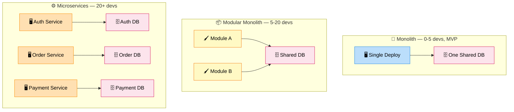

# Monolith vs Microservices

> **Subject**: System Design · **Group**: 🏗️ Design Patterns · **Topic**: 03 of 03
> **Status**: ✅ Done

---

## PART 1

---

### 1. What is it?

The **Monolith vs Microservices** decision is one of the most consequential architectural trade-offs. Neither is universally better — the right answer depends on team size, scale, and product maturity.

| Architecture         | Definition                                                                                                 |
| -------------------- | ---------------------------------------------------------------------------------------------------------- |
| **Monolith**         | Single deployable unit containing all business logic and data                                              |
| **Microservices**    | Multiple independently deployable services, each owning one domain                                         |
| **Modular Monolith** | Single deployment but internally structured with strong module boundaries (best of both for growing teams) |

---

### 2. The Spectrum



```
← SIMPLE ──────────────────────────────────── COMPLEX →

  Monolith     Modular Monolith     Microservices
  (1 service)  (1 deploy, N modules) (N services)

  0-5 devs     5-20 devs             20+ devs
  MVP/startup  Growing product       Large org, multiple teams
  Simple domain Complex domain       Multiple business domains
```

---

### 3. Monolith — Full Profile

| Dimension               | Monolith                                             |
| ----------------------- | ---------------------------------------------------- |
| **Deployment**          | Deploy entire app together                           |
| **Scaling**             | Scale entire app (vertical or horizontal)            |
| **Data**                | Single shared database                               |
| **Testing**             | Simple: one process, no network calls                |
| **Debugging**           | Simple: one log stream, one trace                    |
| **Team size**           | Best: 1-10 developers                                |
| **When it breaks down** | Large teams, independent scaling needs, many domains |

---

### 4. Microservices — Full Profile

| Dimension               | Microservices                                     |
| ----------------------- | ------------------------------------------------- |
| **Deployment**          | Deploy each service independently                 |
| **Scaling**             | Scale individual services (fine-grained)          |
| **Data**                | Database per service                              |
| **Testing**             | Complex: integration tests across services        |
| **Debugging**           | Hard: distributed tracing required                |
| **Team size**           | Best: 10+ developers in multiple teams            |
| **When it breaks down** | Small teams (too much overhead), immature domains |

---

### 5. Decision Framework

```
USE MONOLITH WHEN:
  ✅ MVP / early-stage product (domain not fully understood yet)
  ✅ Team < 10 engineers
  ✅ Simple domain with few distinct capabilities
  ✅ Speed of feature development is the priority
  ✅ No strong independent scaling requirements

USE MICROSERVICES WHEN:
  ✅ Multiple teams working on the same system
  ✅ Different parts of the system have different scaling needs
  ✅ Different parts need different tech (ML service in Python, API in Java)
  ✅ Independent deployment needed (team A deploys without blocking team B)
  ✅ Domain is well-understood and stable boundaries exist

GOLDEN RULE:
  "Don't start with microservices. Start with a monolith,
   identify the seams, then extract services where the pain is."
   — Martin Fowler
```

---

## PART 2

---

### 6. Trade-offs Table

| Dimension                | Monolith                     | Microservices                             |
| ------------------------ | ---------------------------- | ----------------------------------------- |
| **Complexity**           | Low (single process)         | High (distributed system)                 |
| **Developer velocity**   | High (initially)             | High at scale (each team independent)     |
| **Deployment frequency** | Low (whole app deploys)      | High (each service deploys independently) |
| **Operational overhead** | Low (one app, one DB)        | High (N CI/CD pipelines, N monitors)      |
| **Data consistency**     | Easy (ACID transactions)     | Hard (eventual consistency, Saga pattern) |
| **Fault isolation**      | Poor (one crash = all down)  | Good (one service crash is isolated)      |
| **Performance**          | Best (in-process calls)      | Worse (network calls, 1000x latency)      |
| **Team scaling**         | Bottleneck (shared codebase) | Good (each team owns one service)         |

---

### 7. Migration Path: Monolith → Microservices

```
THE STRANGLER FIG PATTERN:
─────────────────────────────────────────────────────
  Phase 1: Monolith handles everything
           [Client] → [Monolith]

  Phase 2: Add proxy/facade; route some traffic to new service
           [Client] → [Proxy] → [Monolith] (most traffic)
                              → [New Payment Service] (payment traffic)

  Phase 3: Extract more services incrementally
           [Client] → [Proxy] → [User Service]
                              → [Product Service]
                              → [Payment Service]
                              → [Monolith] (legacy, shrinking)

  Phase 4: Monolith deleted when fully replaced

  Key: never rewrite everything at once — migrate seam by seam

  On AWS:
    Proxy = API Gateway or ALB path-based routing
    Old monolith = EC2 (gradually decommissioned)
    New services = ECS Fargate / Lambda
```

---

### 8. AWS Mapping

| Phase                    | AWS Architecture                                                           |
| ------------------------ | -------------------------------------------------------------------------- |
| **Monolith**             | EC2 + RDS + Elastic Load Balancer                                          |
| **Modular Monolith**     | ECS single task + RDS (module isolation in code)                           |
| **Strangler transition** | API Gateway routing + ALB rules → split traffic                            |
| **Full Microservices**   | ECS Fargate per service + App Mesh + X-Ray + CloudWatch Container Insights |

---

### 9. Interview-Ready Explanation (30 sec)

> _"The monolith vs microservices decision depends on team size, domain maturity, and scaling requirements. A monolith is the right default for early-stage products: simple to operate, ACID transactions, fast iteration. Microservices make sense when multiple teams need to deploy independently, different components have different scaling needs, or the domain is well-understood with clear boundaries._
>
> _The biggest mistake is starting with microservices on day one — the distributed system overhead slows small teams down and you don't yet know where the service boundaries should be. My approach: start monolith, identify the pain points, then use the Strangler Fig pattern to extract services incrementally."_

---

### 10. Common Interview Questions

**Q1: Netflix started as a monolith. Was that a mistake?**

> No — it was the right call. In 2008 when Netflix began migrating to microservices, they had massive scale, many independent teams, and clear domain boundaries. A microservices-first approach in 2007 (before they understood their domain) would have created wrong boundaries, wasted engineering time on infrastructure, and slowed iteration. The pattern holds: start monolith → understand the domain → identify scaling bottlenecks → extract carefully.

**Q2: What is a modular monolith and when would you use it?**

> A modular monolith is a single deployable application with strict internal module boundaries — modules communicate only through defined interfaces, own their data (separate DB schemas or separate tables with no cross-module JOINs), and could theoretically be extracted as separate services. Use it when: team is 5-20 engineers, you don't yet need independent deployability, but you want to enforce domain boundaries for when you do. It gives development simplicity of a monolith + the structural discipline of microservices.

**Q3: How do you define service boundaries in microservices?**

> Use Domain-Driven Design (DDD) Bounded Contexts. Each bounded context is a natural service boundary — it represents a cohesive domain with its own ubiquitous language. Signs of wrong boundaries: services that always deploy together (merge them), services that constantly call each other synchronously (wrong split, likely should be one service), and services where a single user action requires changes to 5 services (too fine-grained). Conway's Law: team structure often drives service structure — if two teams own the same service, they'll argue; if one team owns two services, consider merging them.

---

> ✅ **Design Patterns Group COMPLETE (3/3)**
>
> **Next Group →** [07 · Trade-offs](../07-Trade-offs/)
> First topic: [SQL vs NoSQL](../07-Trade-offs/01-sql-vs-nosql.md)
