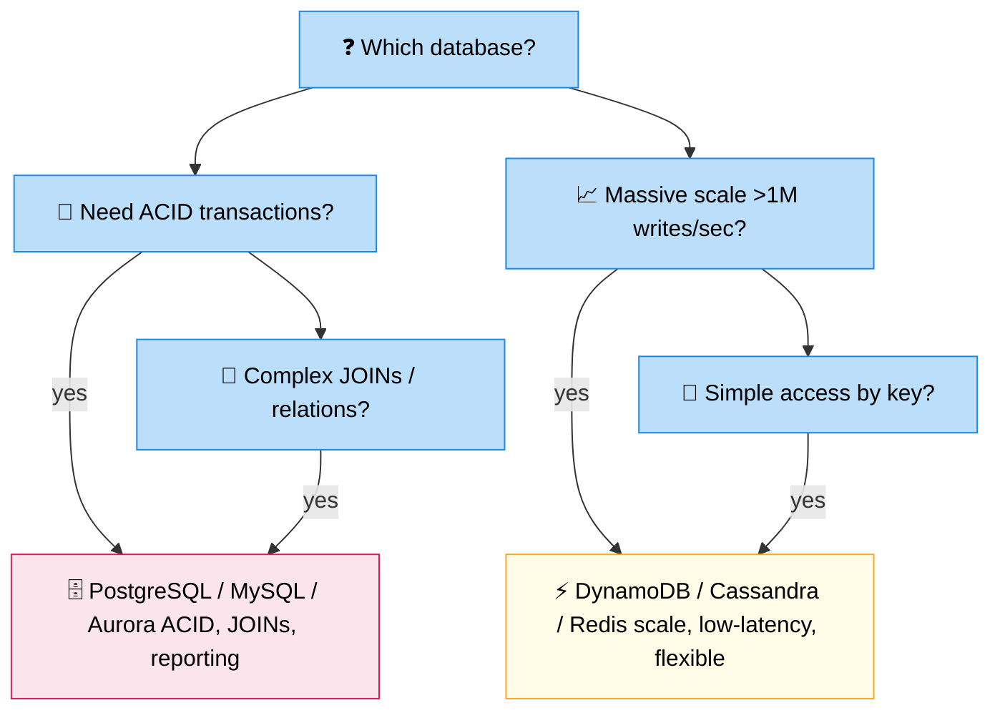

# SQL vs NoSQL

> **Subject**: System Design · **Group**: ⚖️ Trade-offs · **Topic**: 01 of 04
> **Status**: ✅ Done

---

## PART 1

---

### 1. What is it?

The **SQL vs NoSQL** choice is a foundational data storage decision. SQL databases store structured data in tables with predefined schemas and support ACID transactions. NoSQL databases trade some guarantees for flexibility, scale, and performance on specific access patterns.

---

### 2. SQL (Relational) Databases

| Property        | Detail                                                    |
| --------------- | --------------------------------------------------------- |
| **Structure**   | Tables with rows and columns; predefined schema           |
| **Query**       | SQL: JOINs, aggregations, complex filters                 |
| **Consistency** | ACID (Atomicity, Consistency, Isolation, Durability)      |
| **Scaling**     | Vertical (bigger machine); horizontal sharding is complex |
| **Examples**    | PostgreSQL, MySQL, Aurora, SQL Server                     |
| **Best for**    | Transactional data, complex relationships, reporting      |

---

### 3. NoSQL Databases — Types

| Type              | Examples                              | Data Model                 | Best For                                          |
| ----------------- | ------------------------------------- | -------------------------- | ------------------------------------------------- |
| **Key-Value**     | Redis, DynamoDB (simple), ElastiCache | Key → Value                | Sessions, caching, simple lookups                 |
| **Document**      | MongoDB, DynamoDB, DocumentDB         | JSON documents             | User profiles, product catalogs, flexible schemas |
| **Column-family** | Cassandra, DynamoDB                   | Columns grouped by row key | Time-series, high-write workloads                 |
| **Graph**         | Neptune, Neo4j                        | Nodes and edges            | Social graphs, recommendation engines             |
| **Search**        | OpenSearch, Elasticsearch             | Inverted index             | Full-text search, log analytics                   |

---

### 4. Decision Framework



```
USE SQL WHEN:
  ✅ Data has complex relationships (foreign keys, JOINs needed)
  ✅ ACID transactions required (financial, inventory, bookings)
  ✅ Schema is well-known and stable
  ✅ Complex queries / reporting / ad-hoc analytics
  ✅ Data integrity is paramount

USE NOSQL WHEN:
  ✅ Massive scale (millions of writes/sec)
  ✅ Simple access patterns (always lookup by user_id)
  ✅ Schema-flexible data (user preferences, product attributes)
  ✅ Very low latency requirements (<1ms reads)
  ✅ Distributed/global data (DynamoDB global tables)
  ✅ Specific data types: graph, time-series, search

COMMON COMBINATION:
  Orders DB: PostgreSQL (ACID, complex joins)
  Product catalog: DynamoDB (flexible schema, high reads)
  Sessions: Redis (sub-millisecond, TTL auto-expiry)
  Search: OpenSearch (full-text, faceted filtering)
```

---

### 5. Concrete Example

```
E-COMMERCE SYSTEM:
─────────────────────────────────────────────────────

Table: users (PostgreSQL)
  user_id | email | name | created_at
  Simple ACID inserts; JOIN with orders for reports

Table: orders (PostgreSQL)
  order_id | user_id | status | total
  Transactions: insert order + decrement inventory atomically

Table: products (DynamoDB)
  pk: product_id | attributes: {name, price, images, specs}
  Read-heavy, flexible schema (different product types have different fields)
  High throughput: 100k reads/sec on sale days

Cache: Redis
  Key: "session:abc123" → user session data
  Key: "cart:user-789" → shopping cart items
  TTL: 24 hours auto-expiry

Search: OpenSearch
  Full-text search on product name, description
  Filter by category, price range, ratings
```

---

## PART 2

---

### 6. Trade-offs

| Dimension                  | SQL                            | NoSQL                                        |
| -------------------------- | ------------------------------ | -------------------------------------------- |
| **Consistency**            | Strong (ACID)                  | Eventual (tunable in some)                   |
| **Schema**                 | Fixed (migrations needed)      | Flexible (schema-less)                       |
| **Queries**                | Flexible (ad-hoc SQL)          | Limited (predefined access patterns)         |
| **Scaling**                | Vertical (harder to scale out) | Horizontal (built for scale-out)             |
| **Joins**                  | Native, efficient              | Not supported (denormalize data)             |
| **Transactions**           | Multi-row, multi-table         | Single-item (DynamoDB single-partition)      |
| **Operational complexity** | Moderate                       | Low (managed services: DynamoDB, DocumentDB) |
| **Cost**                   | Predictable                    | Can be unpredictable with DynamoDB on-demand |

---

### 7. Common Mistakes

| Mistake                                                              | Impact                                             | Fix                                            |
| -------------------------------------------------------------------- | -------------------------------------------------- | ---------------------------------------------- |
| **Using NoSQL because "it scales" without defining access patterns** | Full table scans, no query flexibility             | Define exact queries first, then choose DB     |
| **Using SQL for schema-less data**                                   | Too many migrations, sparse columns                | Use DynamoDB/DocumentDB for flexible data      |
| **No caching layer on top of either**                                | DB overwhelmed on read spikes                      | Add Redis/ElastiCache in front                 |
| **NoSQL for complex joins**                                          | Either impossible or requires multiple round-trips | Use SQL for join-heavy data                    |
| **Storing everything in one DB type**                                | Wrong tool for each access pattern                 | Polyglot persistence: right DB for each domain |

---

### 8. AWS Mapping

| Use Case                        | AWS Service           | Notes                                    |
| ------------------------------- | --------------------- | ---------------------------------------- |
| **OLTP / Transactional**        | RDS Aurora PostgreSQL | Multi-AZ, automated backups              |
| **Key-Value / Document**        | DynamoDB              | Serverless, auto-scaling, global tables  |
| **In-memory cache**             | ElastiCache (Redis)   | Sub-millisecond reads                    |
| **Full-text search**            | OpenSearch Service    | Managed Elasticsearch                    |
| **Graph**                       | Neptune               | Fully managed graph DB                   |
| **Time-series**                 | Timestream            | Optimized for IoT/metric data            |
| **Data warehouse**              | Redshift              | Analytical queries on large datasets     |
| **MySQL/PostgreSQL compatible** | Aurora                | 5x faster than MySQL, 3x than PostgreSQL |

---

### 9. Interview-Ready Explanation (30 sec)

> _"SQL and NoSQL aren't competitors — they solve different problems. SQL gives you ACID transactions, complex joins, and flexible ad-hoc queries, making it ideal for transactional data like orders and payments. NoSQL gives you horizontal scale, flexible schemas, and optimized performance for specific access patterns._
>
> _In practice, most systems use both: PostgreSQL for transactional data, DynamoDB for high-throughput key-value lookups, Redis for caching, and OpenSearch for full-text search. The key question when choosing is: what are your access patterns? If you need joins and ad-hoc queries, SQL. If you have a fixed access pattern at massive scale, NoSQL."_

---

### 10. Common Interview Questions

**Q1: Can DynamoDB do transactions?**

> Yes, but with important limitations. DynamoDB supports ACID transactions via `TransactWriteItems` and `TransactGetItems`, but only within a single AWS account and region, and with a cap of 25 items per transaction. Multi-table transactions are possible but more expensive (2 WCUs per write instead of 1). It also doesn't support arbitrary cross-partition queries — all transactional items still need to fit within the transaction API limits. For complex financial transactions requiring multi-table JOINs and rollback logic, PostgreSQL/Aurora is still the better choice.

**Q2: How would you migrate from PostgreSQL to DynamoDB?**

> Start by identifying access patterns — what queries does your code actually run? DynamoDB requires you to define a primary key (partition key + optional sort key) optimized for those patterns. Use DMS (Database Migration Service) to replicate data in transit. Run both databases in parallel with dual-write during cutover. Validate data consistency. The hardest part is denormalizing data: relationships that used JOINs must be embedded in the DynamoDB item or handled via multiple round-trips at the application level. Don't migrate if you have complex query requirements — the pain isn't worth it.

**Q3: What is the N+1 query problem?**

> A common SQL performance anti-pattern: fetching a list of items (1 query), then for each item, fetching related data (N queries). Total: N+1 queries. Example: get 100 orders → for each order, get the user (100 more queries) = 101 queries. Fix: use JOIN in a single query, or use an ORM feature like eager loading / `include`. In NoSQL, this manifests as multiple round-trips — for example, fetching a DynamoDB item, then using a foreign key to fetch related items. Fix in NoSQL: denormalize (embed the related data directly in the item, accepting data duplication).

---

> **Next Topic →** [02 · Cache vs No Cache](./02-cache-vs-no-cache.md)
