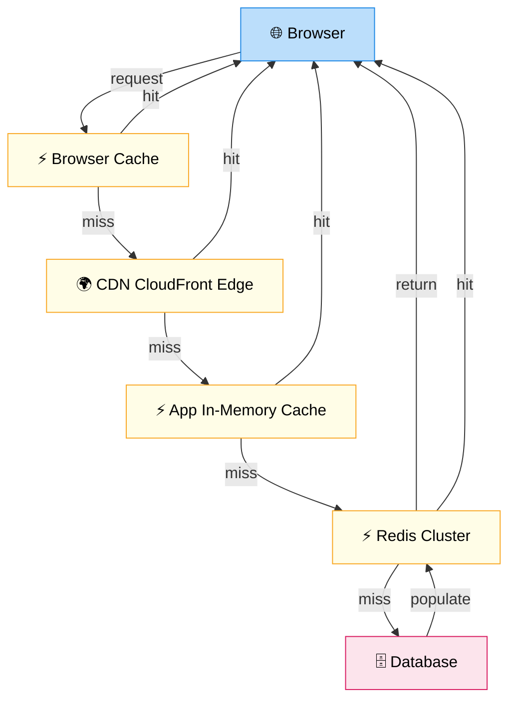

# Cache vs No Cache

> **Subject**: System Design · **Group**: ⚖️ Trade-offs · **Topic**: 02 of 04
> **Status**: ✅ Done

---

## PART 1

---

### 1. What is it?

**Caching** is storing computed or fetched data in fast storage so future requests are served without re-fetching from the slower source. The trade-off: speed and reduced DB load vs potential staleness and complexity.

---

### 2. Why Cache?

| Without Cache                           | With Cache                                 |
| --------------------------------------- | ------------------------------------------ |
| Every request hits DB                   | Cache absorbs 80-95% of reads              |
| DB under load → slow queries → slow API | DB sees only cache misses (low load)       |
| Repeated expensive computations         | Compute once, serve many times             |
| Geographic latency (DB in one region)   | CDN or edge cache serves from closest node |

---

### 3. Caching Layers



```
REQUEST JOURNEY WITH ALL CACHE LAYERS:
─────────────────────────────────────────────────────────

Browser → [Browser Cache] ─ HIT ─→ serve from browser
    ↓ MISS
    ↓
[CDN (CloudFront)] ─ HIT ─→ serve from edge location
    ↓ MISS
    ↓
[API Gateway / Server] → [App Cache (local in-memory)] ─ HIT ─→ serve
    ↓ MISS
    ↓
[Redis / ElastiCache] ─ HIT ─→ serve cached DB result
    ↓ MISS
    ↓
[Database] ─→ fetch + populate Redis + return
```

---

### 4. Cache Strategies

| Strategy                      | How                                                | When to Use                               |
| ----------------------------- | -------------------------------------------------- | ----------------------------------------- |
| **Cache-Aside (Lazy)**        | App checks cache; miss → fetch DB → populate cache | Most common; good for read-heavy          |
| **Write-Through**             | Write to cache AND DB simultaneously               | When you can't tolerate stale reads       |
| **Write-Behind (Write-Back)** | Write to cache; async write to DB                  | High-write throughput; risk of data loss  |
| **Read-Through**              | Cache layer fetches from DB on miss                | Simplifies app code; cache manages itself |
| **Refresh-Ahead**             | Pre-populate cache before TTL expires              | Predictable access patterns; no cold miss |

---

### 5. What to Cache vs What NOT to Cache

| Cache ✅                          | Don't Cache ❌                         |
| --------------------------------- | -------------------------------------- |
| Product catalog, prices           | User's active session after logout     |
| User profiles (non-sensitive)     | Financial balances (must be real-time) |
| API responses (external services) | PII/sensitive data (security risk)     |
| Aggregated counts (likes, views)  | Highly unique per-user computation     |
| Static homepage content           | One-time requests (no reuse)           |

---

## PART 2

---

### 6. Trade-offs

| Dimension          | No Cache              | With Cache                             |
| ------------------ | --------------------- | -------------------------------------- |
| **Data freshness** | Always fresh          | Potentially stale (TTL-based)          |
| **Read latency**   | 10-100ms (DB)         | <1ms (Redis in-memory)                 |
| **DB load**        | 100% queries hit DB   | 80-95% absorbed by cache               |
| **Complexity**     | None                  | Cache invalidation, TTL management     |
| **Cost**           | DB scaling costs      | ElastiCache cost + DB savings          |
| **Consistency**    | Eventual = same as DB | May serve stale data during TTL window |

---

### 7. Cache Problems & Solutions

| Problem                              | Description                                                   | Solution                                     |
| ------------------------------------ | ------------------------------------------------------------- | -------------------------------------------- |
| **Cache Stampede / Thundering Herd** | Cache key expires → 10,000 simultaneous requests all hit DB   | Mutex lock on first miss; pre-warm on expiry |
| **Cache Invalidation**               | Data changes in DB but cache still has old value              | TTL + explicit invalidation on write         |
| **Cache Penetration**                | Request for non-existent key → always misses → always hits DB | Cache null results with short TTL            |
| **Hot Key**                          | One cache key gets 90% of traffic → Redis node bottleneck     | Key sharding: product-123-shard-{0-9}        |
| **Cold Start**                       | Fresh deploy or cache flush → all traffic hits DB             | Cache warming: pre-populate on deploy        |

---

### 8. AWS Mapping

| Layer              | AWS Service           | TTL              | Best For                            |
| ------------------ | --------------------- | ---------------- | ----------------------------------- |
| **CDN**            | CloudFront            | Minutes to days  | Static assets, API responses        |
| **In-memory**      | ElastiCache Redis     | Seconds to hours | DB results, sessions, computed data |
| **In-memory**      | ElastiCache Memcached | Seconds to hours | Simple key-value, horizontal scale  |
| **App-level**      | DynamoDB DAX          | Seconds          | DynamoDB read acceleration          |
| **DB query cache** | Aurora read replicas  | Real-time        | Read scaling (not true cache)       |

```
EVICTION POLICIES (Redis / ElastiCache):
  allkeys-lru:     evict least recently used key (most common)
  volatile-lru:    evict LRU keys that have TTL set
  allkeys-lfu:     evict least frequently used key
  noeviction:      return error when memory full (use when no eviction acceptable)

RECOMMENDATION: allkeys-lru for general use cases
```

---

### 9. Interview-Ready Explanation (30 sec)

> _"Caching reduces read latency from ~50ms DB reads to sub-millisecond Redis reads, and reduces DB load by absorbing cache hits. The trade-off is data staleness: cached data may be seconds to minutes old._
>
> _I use cache-aside as the default pattern: check Redis first, on miss fetch from DB and populate Redis with a TTL. I also set up CloudFront for static assets and API responses that change infrequently. The key problems to watch: cache stampede on key expiry (solved with mutex/lock), cache invalidation on writes (explicit delete on write + TTL backup), and hot keys on highly popular items (solved by key sharding)."_

---

### 10. Common Interview Questions

**Q1: How do you handle cache invalidation?**

> The hardest problem in caching. Three strategies: (1) TTL-based: set an appropriate TTL; accept stale data during the window. Simple, low complexity. (2) Event-driven invalidation: on every write, delete or update the cache key. More complex but fresher data. (3) Cache-through pattern: writes go through cache so cache and DB stay in sync. The key insight: invalidation should happen on WRITE, not READ. If you can tolerate stale data (product catalog: yes; order status: no), TTL alone is fine.

**Q2: What is cache stampede and how do you prevent it?**

> Cache stampede: a popular key expires → thousands of simultaneous requests all cache-miss simultaneously → all hit the DB at once → DB overwhelmed. Prevention: (1) Probabilistic early expiration: a small chance of refreshing the cache before it actually expires, spreading the load. (2) Mutex/distributed lock: first miss acquires a lock and populates cache; other misses wait or serve stale data. (3) Staggered TTLs: add random jitter to TTL so keys don't expire simultaneously. AWS ElastiCache uses lazy refresh for DAX to handle this.

**Q3: When should you NOT use a cache?**

> Don't cache: (1) Financial data that must be accurate in real-time (account balance, stock price for trading). (2) Data updated on every read (counters that are read and incremented — use atomic Redis operations instead). (3) Data that's unique per request with no reuse. (4) Highly sensitive data unless you've handled cache security (encrypted at rest, access control, audit logging). The cost of a cache is operational complexity — only add it when the performance benefit justifies the complexity.

---

> **Next Topic →** [03 · Sync vs Async](./03-sync-vs-async.md)
