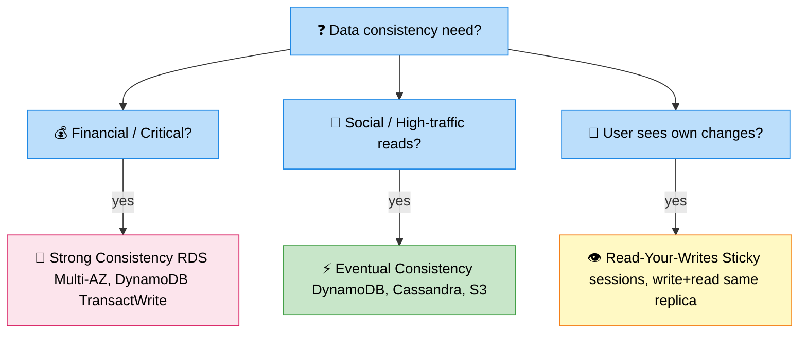

# Consistency Trade-off

> **Subject**: System Design · **Group**: ⚖️ Trade-offs · **Topic**: 04 of 04
> **Status**: ✅ Done

---

## PART 1

---

### 1. What is it?

The **consistency trade-off** is about choosing how "current" data must be at any given moment in a distributed system. Strong consistency guarantees every read sees the latest write. Eventual consistency means reads may see older data, but the system will converge to the correct state eventually.

---

### 2. The Spectrum

```
STRONG ────────────────────────────────────────────── EVENTUAL

  Strong         Read-Your-Writes    Monotonic Read    Eventual
  Consistency    Consistency         Consistency       Consistency

  All nodes      Your own writes     You never see     Replicas
  agree on       are always          data go backward  converge
  same data      visible to you      in time           over time
  immediately

  Slowest        ←────────────────────────────────→    Fastest
  Most available                                       Most available
```

---

### 3. Examples in Real Systems

| System                                 | Consistency Level         | Why                                       |
| -------------------------------------- | ------------------------- | ----------------------------------------- |
| **Bank balance**                       | Strong                    | Overdraft = money loss                    |
| **Amazon product inventory**           | Eventual (usually)        | "Only 2 left" can be slightly stale       |
| **Social media likes count**           | Eventual                  | 1,243 vs 1,244 likes — doesn't matter     |
| **User's own posts on their timeline** | Read-Your-Writes          | User must see their own post immediately  |
| **DNS records**                        | Eventual                  | Updates propagate over minutes            |
| **Shopping cart**                      | Session-level consistency | Cart must be accurate within your session |

---

### 4. How to Choose



```
STRONG CONSISTENCY WHEN:
  ✅ Financial data: balance, transfers, payments
  ✅ Inventory: if exact stock count matters (airline seats, ticket reservations)
  ✅ Leader election / distributed locks
  ✅ Metadata: which shard owns what data

EVENTUAL CONSISTENCY WHEN:
  ✅ High read throughput needed (social feeds, product views)
  ✅ Global replication (accept cross-region lag)
  ✅ Non-critical aggregations: likes, views, shares
  ✅ Analytics pipelines (process in batch; exact real-time not needed)
  ✅ Product catalog: prices, descriptions (seconds of staleness acceptable)

QUESTIONS TO ASK:
  1. What is the impact if user reads stale data?
  2. Can we use compensating transactions if inconsistency is discovered?
  3. What is the write rate? (High write rate → strong consistency is costly)
  4. Is this cross-region? (Strong consistency across regions = high latency)
```

---

### 5. Consistency in Databases

| Database                | Default                          | Tunable?                                         |
| ----------------------- | -------------------------------- | ------------------------------------------------ |
| **PostgreSQL / Aurora** | Strong (ACID)                    | Yes — read from replica = eventual               |
| **DynamoDB**            | Eventual by default              | Yes — strong consistency per read (double cost)  |
| **Cassandra**           | Tunable (quorum)                 | Yes — ALL, QUORUM, ONE                           |
| **Redis**               | Strong (single node)             | Eventual with replicas                           |
| **S3**                  | Strong consistency               | No — S3 made all ops strongly consistent in 2020 |
| **ElastiCache**         | Eventually consistent (replicas) | No direct control                                |

---

## PART 2

---

### 6. Trade-offs

| Dimension            | Strong Consistency                      | Eventual Consistency                  |
| -------------------- | --------------------------------------- | ------------------------------------- |
| **Data accuracy**    | Always current                          | May be seconds/minutes stale          |
| **Latency**          | Higher (wait for all replicas)          | Lower (read from nearest replica)     |
| **Availability**     | Lower (network partition = unavailable) | Higher (each node responds locally)   |
| **Write throughput** | Limited (coordination needed)           | High (write locally, propagate later) |
| **Complexity**       | Lower (simpler programming model)       | Higher (handle stale reads in app)    |

---

### 7. Conflict Resolution in Eventual Consistency

When two nodes accept writes concurrently, they may conflict. Resolution strategies:

| Strategy                  | How                                                     | Used In                                |
| ------------------------- | ------------------------------------------------------- | -------------------------------------- |
| **Last-Write-Wins (LWW)** | Timestamp-based; latest write survives                  | DynamoDB, Cassandra (default)          |
| **CRDT**                  | Conflict-free data structures; mathematically mergeable | Shopping carts, collaborative docs     |
| **Versioning (MVCC)**     | Keep multiple versions; return conflict to client       | Amazon shopping cart (dynamo paper)    |
| **Quorum reads**          | Read from majority of replicas; return most recent      | Cassandra QUORUM, DynamoDB strong read |

---

### 8. AWS Mapping

```
CHOOSING CONSISTENCY IN AWS:
─────────────────────────────────────────────────────────

DynamoDB read consistency:
  Eventually consistent read:  0.5 RCU per read  (default)
  Strongly consistent read:    1.0 RCU per read  (add ConsistentRead=true)

  Use case:
    Eventually: product catalog reads (stale by milliseconds — fine)
    Strongly: inventory check before purchase (must be accurate)

Aurora Read Replicas:
  Write to primary → replication lag: typically <100ms
  Read from replica: eventually consistent (lag period)

  Pattern: write to primary; read from primary for critical ops;
           read from replica for analytics/reporting

DynamoDB Global Tables (multi-region):
  Active-Active: write to any region
  Replication lag: typically <1 second
  Conflict resolution: Last-Write-Wins (LWW)

  Pattern: write to local region; read from local region
           Accept: same item written in two regions simultaneously = one wins

S3 (as of December 2020):
  Strong consistency for all operations including GET/PUT/DELETE
  No extra cost; no configuration needed
```

---

### 9. Interview-Ready Explanation (30 sec)

> _"The consistency trade-off is about whether every read sees the latest write. Strong consistency guarantees it but costs latency and availability. Eventual consistency allows stale reads but enables much higher throughput and availability._
>
> _My rule: financial data (balance, payments, inventory for reservations) must be strongly consistent. Social features, product views, analytics can be eventually consistent. On AWS, DynamoDB defaults to eventual consistency with an option for strong consistency at double the read cost. For global replication, I accept eventual consistency with last-write-wins conflict resolution, which is fine for most data except financial transactions — those stay single-region with strong consistency."_

---

### 10. Common Interview Questions

**Q1: How does CAP theorem relate to this trade-off?**

> CAP theorem states a distributed system can only provide 2 of 3: Consistency (all nodes see same data), Availability (every request gets a response), Partition Tolerance (system works despite network splits). Network partitions are unavoidable in distributed systems, so you must choose between CP (consistency + partition tolerance — sacrifice availability) or AP (availability + partition tolerance — sacrifice consistency). In practice: CP systems (PostgreSQL, ZooKeeper) become unavailable during partitions to protect consistency. AP systems (Cassandra, DynamoDB) stay available but may return stale data. Modern systems are tunable — DynamoDB lets you choose per-operation.

**Q2: How would you design an inventory system that never oversells?**

> Two approaches: (1) Strong consistency with DB transactions: when user attempts purchase, run a transaction: `UPDATE inventory SET count=count-1 WHERE item_id=X AND count>0`. Returns 0 rows if out of stock — atomic, prevents overselling. Use Aurora/PostgreSQL. (2) Reservation pattern for high-throughput: use DynamoDB conditional writes (`ConditionExpression: count > 0`). Reserve the item atomically; confirm or release after payment. This allows high throughput while still preventing overselling. Avoid: doing a read, then a separate write — race condition between read and write allows overselling.

**Q3: What is read-your-writes consistency and why does it matter?**

> Read-your-writes guarantees that after you write something, your subsequent reads will see that write — even if other clients might not yet. This matters for user experience: if a user posts a comment and immediately refreshes the page, they must see their own comment. Without this guarantee, they'd see their comment missing and assume the post failed (and repost). Implementation: route a user's reads to the same DB replica they wrote to, or always read from the primary for a brief window after a write. DynamoDB's strongly consistent reads on the same key achieve this.

---

> ✅ **Trade-offs Group COMPLETE (4/4)**
>
> **Next Group →** [08 · Must Practice Designs](../08-Must-Practice-Designs/)
> First topic: [URL Shortener](../08-Must-Practice-Designs/01-url-shortener.md)
