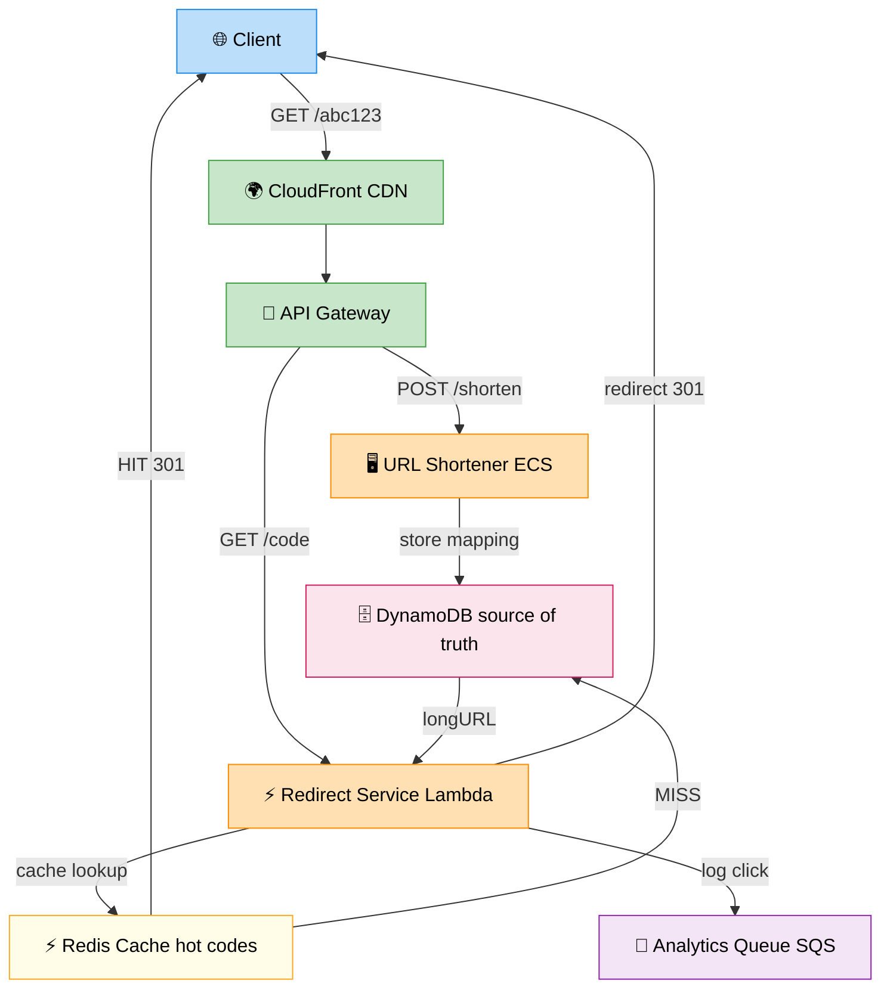

# URL Shortener — System Design

> **Subject**: System Design · **Group**: 🎯 Must Practice Designs · **Topic**: 01 of 06
> **Status**: ✅ Done

---

## Part 1: Requirements & Estimation

---

### Functional Requirements

| Requirement      | Detail                                                         |
| ---------------- | -------------------------------------------------------------- |
| **Shorten URL**  | Given a long URL, return a short URL (e.g., `short.ly/abc123`) |
| **Redirect**     | Given short URL, redirect to original long URL                 |
| **Custom alias** | Optionally allow user to specify short code                    |
| **Expiry**       | URLs can have optional expiration time                         |
| **Analytics**    | Track click count per short URL                                |

### Non-Functional Requirements

| Requirement      | Target                                             |
| ---------------- | -------------------------------------------------- |
| **Availability** | 99.99% (redirect is critical)                      |
| **Latency**      | Redirect: <10ms; Shortening: <200ms                |
| **Scale**        | 100M URLs shortened per day; 10B redirects per day |
| **Durability**   | Short URLs must never be lost                      |

---

### Back-of-Envelope Estimation

```
WRITE (shortening):
  100M URLs/day = 100M / 86400 ≈ 1,157 writes/sec ≈ ~1K RPS

READ (redirects):
  10B redirects/day = 10B / 86400 ≈ 115,740 reads/sec ≈ ~115K RPS
  Read:Write ratio = 100:1

STORAGE:
  Average URL size: 500 bytes
  Short code: 7 characters
  Row size: ~600 bytes
  Per day: 100M × 600 bytes = 60 GB/day
  5 years: 60 GB × 365 × 5 ≈ 109 TB

SHORT CODE SPACE:
  7 characters, base62 (a-z, A-Z, 0-9)
  62^7 = 3.5 trillion unique codes ← enough for decades
```

---

## Part 2: High-Level Design + Detailed Design

---

### High-Level Architecture



```
                        [DNS: short.ly]
                              ↓
                    [CloudFront CDN]  ← cache popular redirects
                              ↓
                      [API Gateway]
                     ↙           ↘
           POST /shorten      GET /{code}
                ↓                   ↓
    [URL Shortener Service]   [Redirect Service]
          (ECS)                  (Lambda)
               ↓                    ↓
        [DynamoDB]            [ElastiCache Redis]
        (source of truth)       (hot code cache)
                                    ↓ MISS
                              [DynamoDB]

ANALYTICS (async, non-blocking):
  GET /{code} → Redirect Service → SNS event → Kinesis → Lambda → DynamoDB analytics table
```

---

### Short Code Generation

```
OPTION 1: MD5 Hash (simple, collision-prone)
  md5(long_url) → 128-bit hash → take first 7 chars
  Problem: collisions possible; same URL for different long URLs

OPTION 2: Base62 Counter (preferred)
  Maintain a global atomic counter in Redis
  counter++ → encode in base62 → short code

  counter 1 → "0000001"
  counter 2 → "0000002"
  ...
  counter 3,521,614,606 → "zzzzzz9"

  Problem: counter is a single point of failure; sequential = predictable

OPTION 3: Distributed ID + Base62 (production)
  Use range-based ID allocation per server:
    Server A gets range 1-10M
    Server B gets range 10M-20M
  Each server uses its range independently

  OR: Use UUID/NanoID → take first 7 chars → check for collision (rare)

OPTION 4: Zookeeper / Snowflake ID (Netflix pattern)
  Snowflake ID: 64-bit = timestamp + machine ID + sequence
  Unique, monotonic, distributed
  Encode in base62 → short code

IMPLEMENTATION CHOICE: Base62 with distributed range allocation
  Pros: no collisions, predictable space, fast
  Cons: requires coordinator (Redis INCR is atomic and sufficient)
```

---

### Data Model

```
Table: urls (DynamoDB)
  Partition Key: short_code (String)
  Attributes:
    long_url:    "https://www.example.com/very/long/path?with=params"
    user_id:     "usr-123" (optional)
    created_at:  1705123200
    expires_at:  1736659200 (optional; TTL attribute — DynamoDB auto-deletes)
    is_custom:   true/false

Table: analytics (DynamoDB)
  Partition Key: short_code
  Sort Key: date (YYYY-MM-DD)
  Attributes:
    click_count: 1543 (atomic increment)

GSI (optional): user_id index → list all URLs for a user
```

---

## Part 3: Scaling, Failure Handling & AWS Architecture

---

### Scaling Strategy

| Component                     | Bottleneck              | Solution                                                |
| ----------------------------- | ----------------------- | ------------------------------------------------------- |
| **Redirect reads (115K RPS)** | DynamoDB read cost      | Redis cache — hot codes cached for 1 hour               |
| **Code generation**           | Redis INCR contention   | Range allocation; each server pre-fetches 10K IDs       |
| **CDN**                       | Geographic latency      | CloudFront — cache redirects at edge, TTL = URL expiry  |
| **Write path**                | DynamoDB write capacity | Auto-scaling DynamoDB; short codes are simple PK writes |

---

### Failure Handling

| Failure                        | Impact                                        | Solution                                                                       |
| ------------------------------ | --------------------------------------------- | ------------------------------------------------------------------------------ |
| **Redis down**                 | Cache misses → all reads hit DynamoDB         | DynamoDB can handle it; Redis in cluster mode with replicas                    |
| **DynamoDB partition hot key** | Short codes go viral → 1 partition overloaded | DynamoDB auto-scaling + DAX caching layer                                      |
| **Code collision**             | Two long URLs map to same short code          | Check existence before insert; retry with new code                             |
| **URL expiry not cleaned**     | Expired URLs still redirect                   | DynamoDB TTL attribute auto-deletes; also check `expires_at` in redirect logic |
| **Region failure**             | Service unavailable                           | DynamoDB Global Tables (multi-region); Route 53 failover                       |

---

### AWS Architecture (Production)

```
[Route 53] → [CloudFront] → [API Gateway] → [Lambda or ECS]
                    ↓
          Cache: GET /{code} responses (TTL = min(1hr, url_expiry))

WRITE PATH:
  POST /shorten
    → API Gateway → Lambda (shorten-url)
    → Redis INCR → get next ID → base62 encode → short_code
    → DynamoDB PutItem: {short_code, long_url, expires_at, TTL}
    → Return: {"short_url": "https://short.ly/{short_code}"}

READ PATH:
  GET /{short_code}
    → CloudFront (cache hit → 301 redirect, no Lambda call)
    → CloudFront miss → Lambda (redirect-url)
    → ElastiCache Redis GET {short_code} (hit → 301 redirect)
    → Redis miss → DynamoDB GetItem {short_code}
    → Check expires_at (expired? → 404)
    → Populate Redis with TTL
    → HTTP 301 redirect to long_url
    → Async: publish click event to SNS → analytics pipeline

CACHE STRATEGY:
  301 Permanent redirect: browser caches it (fast, but can't update)
  302 Temporary redirect: no browser cache (flexible; use this)

  CloudFront: cache 302 responses with cache-control header
```

---

### Interview Answer (2-min verbal walkthrough)

> _"I'd design URL shortener as a read-heavy system — 100:1 read/write ratio. The critical path is the redirect: must be <10ms._
>
> _Write path: POST /shorten → Lambda → Redis INCR for unique ID → base62 encode to 7-char code → store in DynamoDB with TTL for expiry._
>
> _Read path: GET /{code} → CloudFront checks cache first → Lambda checks Redis → if miss, DynamoDB. Hot URLs are cached in Redis for 1 hour, and CloudFront caches the redirect response at edge globally._
>
> _For scale: 115K redirects/sec are handled by CloudFront + Redis. DynamoDB only sees cache misses. DynamoDB Global Tables for multi-region availability. Route 53 failover for disaster recovery._
>
> _Key trade-off: 301 vs 302 redirect. 301 is permanent — browsers cache it forever, zero server load. But if I ever need to update or analyze the URL, I lose that. I'd use 302 (temporary redirect) and cache at CloudFront level."_

---

### Common Interview Questions

**Q1: How do you handle custom short codes (vanity URLs)?**

> Custom codes: user provides preferred short code (e.g., `short.ly/mycompany`). Before inserting, check DynamoDB for existing item with that code. If exists: return 409 Conflict. If not: insert. Race condition: two users request same custom code simultaneously → use DynamoDB conditional write: `ConditionExpression: attribute_not_exists(short_code)`. First writer wins; second gets ConditionalCheckFailedException → return 409 to user.

**Q2: How do you handle URL expiry at scale?**

> Two mechanisms: (1) DynamoDB TTL attribute — set `expires_at` as TTL; DynamoDB automatically deletes expired items within 48 hours. (2) Redirect-time check — even if TTL hasn't fired yet, Lambda checks `expires_at` on every redirect and returns 404 if expired. This two-layer approach ensures: (a) expired URLs eventually disappear from storage, (b) expired URLs stop working immediately even before DynamoDB TTL fires.

**Q3: How would you add analytics without slowing down the redirect?**

> Never record analytics in the critical redirect path — it would add latency. Instead: after sending the 302 redirect response (or concurrently), publish a click event to SNS asynchronously. SNS fans out to: (1) Kinesis Data Firehose → S3 → Athena for analytics queries, (2) Lambda → DynamoDB analytics table (daily counts per URL). The user gets the redirect in <10ms; analytics recorded asynchronously. This pattern is fire-and-forget — the user never waits for analytics.

---

> **Next Topic →** [02 · Rate Limiter Design](./02-rate-limiter-design.md)
