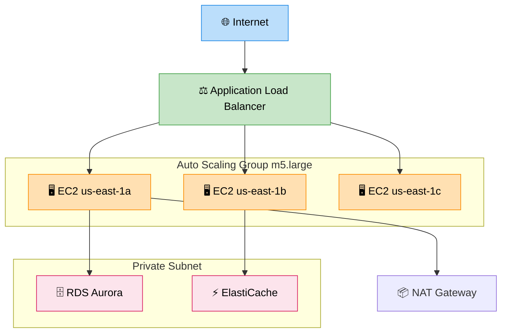

# EC2 — Amazon Elastic Compute Cloud

> **Subject**: AWS Cloud · **Group**: ☁️ Core Services · **Topic**: 01 of 12
> **Status**: ✅ Done

---

## PART 1

---

### 1. What is it?

**EC2 (Elastic Compute Cloud)** is AWS's virtual machine service — rent a server in the cloud, choose CPU/RAM/OS, and run any workload. It's the foundational compute layer of AWS.

Think of it as: **a virtual server you control completely**, billed by the second.

---

### 2. Key Concepts

| Concept            | What it is                                                                |
| ------------------ | ------------------------------------------------------------------------- |
| **Instance**       | A virtual machine (VM) running on AWS hardware                            |
| **AMI**            | Amazon Machine Image — snapshot of OS + software used to launch instances |
| **Instance Type**  | CPU + RAM combination (t3.micro, m5.large, c5.xlarge)                     |
| **Security Group** | Virtual firewall — controls inbound/outbound traffic                      |
| **Key Pair**       | SSH access credentials                                                    |
| **User Data**      | Bootstrap script that runs on first launch                                |
| **EBS Volume**     | Attached persistent storage (disk)                                        |
| **Elastic IP**     | Static public IP address                                                  |

---

### 3. Instance Type Families

| Family     | Optimized For       | Common Types          | Use Case                               |
| ---------- | ------------------- | --------------------- | -------------------------------------- |
| **t3/t4g** | Burstable (general) | t3.micro, t3.large    | Dev, low traffic, small apps           |
| **m5/m6i** | Balanced CPU+RAM    | m5.large, m5.xlarge   | Web servers, small DBs                 |
| **c5/c6i** | Compute-optimized   | c5.xlarge, c5.4xlarge | Batch processing, gaming, ML inference |
| **r5/r6i** | Memory-optimized    | r5.large, r5.4xlarge  | In-memory DBs, large datasets          |
| **i3/i4i** | Storage-optimized   | i3.xlarge             | Cassandra, Redis, OLAP                 |
| **p3/p4**  | GPU                 | p3.2xlarge            | ML training, video rendering           |
| **g4dn**   | GPU + inference     | g4dn.xlarge           | ML inference, gaming streaming         |

---

### 4. Purchasing Options (Critical for Cost Optimization)

| Option                | Cost vs On-Demand | Commitment           | When to Use                                |
| --------------------- | ----------------- | -------------------- | ------------------------------------------ |
| **On-Demand**         | Baseline (100%)   | None                 | Dev/test, unpredictable workloads          |
| **Reserved (1-year)** | ~40% cheaper      | 1 year               | Steady-state production workloads          |
| **Reserved (3-year)** | ~60% cheaper      | 3 years              | Committed long-term workloads              |
| **Savings Plans**     | ~40-60% cheaper   | 1 or 3 year          | Flexible (applies to EC2, Lambda, Fargate) |
| **Spot Instances**    | ~70-90% cheaper   | None (interruptible) | Batch jobs, fault-tolerant workloads       |
| **Dedicated Host**    | Most expensive    | Optional RI          | BYOL licensing, compliance                 |

---

### 5. EC2 Architecture in Production



```
TYPICAL 3-TIER WEB APP:
─────────────────────────────────────────────────────────

Internet → [Application Load Balancer]
                 ↓
    [Auto Scaling Group — Web/App tier]
    EC2: m5.large × 2-10 instances (auto-scale on CPU)
    Multi-AZ: us-east-1a, us-east-1b, us-east-1c
                 ↓
    [RDS Aurora] in private subnet

VPC LAYOUT:
  Public Subnet:  ALB, NAT Gateway, Bastion Host
  Private Subnet: EC2 app servers, RDS, ElastiCache

SECURITY GROUPS:
  ALB-SG:  inbound 443 from 0.0.0.0/0
  App-SG:  inbound 8080 from ALB-SG only
  DB-SG:   inbound 5432 from App-SG only
```

---

## PART 2

---

### 6. When to Use EC2

✅ **Use EC2 when**:

- You need full OS control (custom kernel, OS tuning)
- Long-running workloads (Lambda 15-min max)
- Stateful applications (sticky sessions, local disk)
- Lift-and-shift from on-premise
- Custom software that can't run in containers easily
- High-performance computing with GPU/optimized instances

❌ **Don't use EC2 when**:

- Short-lived or event-driven tasks → use **Lambda**
- Containerized microservices you don't want to manage → use **ECS Fargate**
- Managed DB workloads → use **RDS / Aurora**
- Simple static sites → use **S3 + CloudFront**

---

### 7. Auto Scaling — Key Interview Topic

```
Auto Scaling Group (ASG):
  Min: 2 instances (always running)
  Max: 10 instances (never exceed)
  Desired: 4 instances (current target)

SCALING POLICIES:
  Target Tracking:   maintain CPU at 60% → scale out/in automatically
  Step Scaling:      CPU > 70% → add 2; CPU > 90% → add 4
  Scheduled:         scale up to 8 at 9am Monday; scale down to 2 at 6pm Friday
  Predictive:        ML-based; forecast traffic and scale proactively

SCALE IN PROTECTION:
  Mark instance as "protected from scale in" during critical operations

LIFECYCLE HOOKS:
  On launch: run bootstrap script (register with service discovery)
  On terminate: drain connections (ALB deregistration delay: 30s default)
```

---

### 8. AWS Architecture Example

```
PRODUCTION WEB APP:
  [Route 53] → weighted routing or latency-based
  [CloudFront] → cache static assets (S3 origin) and API responses
  [WAF] → rate limiting, SQL injection protection
  [ALB] → path-based routing (/api → App-SG, /admin → Admin-SG)
  [ASG × 2] → one per tier (app + worker)
  [EC2: m5.large] → Reserved 1-year (baseline) + Spot (burst)
  [EBS gp3] → OS volume per instance
  [EFS] → shared file storage (if needed across instances)
  [RDS Aurora Multi-AZ] → private subnet
  [SSM Session Manager] → SSH without bastion host (security best practice)
  [CloudWatch] → CPU, memory (custom metric), disk, ALB metrics
  [Systems Manager Patch Manager] → auto-patching for security

MIXED PURCHASING STRATEGY:
  2 Reserved instances → always-on baseline
  4-8 On-Demand → normal scale-out
  Spot instances → batch processing queue workers
```

---

### 9. Interview-Ready Explanation (30 sec)

> _"EC2 is AWS's virtual machine service — it gives me full control over the OS and runtime. I use it for stateful applications, long-running processes, or workloads that need specific instance types like GPU for ML or memory-optimized for large in-memory caches._
>
> _In production, I always put EC2 in an Auto Scaling Group across multiple AZs, behind an Application Load Balancer. For cost: Reserved Instances for the baseline steady-state load (40-60% savings), On-Demand for normal scaling, and Spot for fault-tolerant batch workloads (70-90% savings)."_

---

### 10. Common Interview Questions

**Q1: What is the difference between stopping and terminating an EC2 instance?**

> Stop: instance is shut down; EBS root volume persists; data preserved; you can start it again. You're not charged for instance hours while stopped (but still charged for EBS storage). Terminate: instance is permanently deleted; root EBS volume deleted by default (unless `DeleteOnTermination=false`). The key insight: stop is like putting a computer to sleep; terminate is like throwing it away. For stateful apps, stop instances during off-hours to save cost. For stateless apps in ASGs, terminate and launch fresh instances.

**Q2: How do you ensure an EC2 instance always has the latest application code?**

> Four patterns: (1) User data script on launch: pull latest code from S3 or CodeDeploy agent. (2) Custom AMI (Golden AMI): bake application code into AMI; update AMI on each release. Fastest boot time. (3) CodeDeploy: push deployments to running instances with rolling/blue-green strategies. (4) Container-based: use ECS instead — deploy new task definition with new container image. Golden AMI + CodeDeploy is the most common for traditional EC2. Container approach is recommended for new systems.

**Q3: What is an EC2 Spot Instance and when would you use it?**

> Spot Instances use unused EC2 capacity at 70-90% discount. The trade-off: AWS can interrupt them with 2-minute warning when capacity is needed. Use cases: batch processing (video transcoding, data analysis), distributed ML training (with checkpointing), stateless workers, CI/CD build pipelines. Never use for: databases, web servers serving live traffic, anything that can't tolerate interruption. Best practice: use Spot with Auto Scaling's "capacity-optimized" allocation strategy (picks instance types with most available capacity, reducing interruptions). Always checkpoint long jobs so they can resume from the last checkpoint after interruption.

---

> **Next Topic →** [02 · Lambda](./02-lambda.md)
