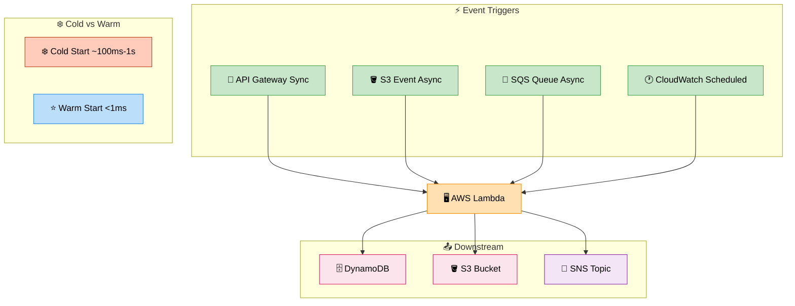

# Lambda — AWS Lambda (Serverless Functions)

> **Subject**: AWS Cloud · **Group**: ☁️ Core Services · **Topic**: 02 of 12
> **Status**: ✅ Done

---

## PART 1

---

### 1. What is it?

**AWS Lambda** is a serverless compute service — run code without provisioning or managing servers. You upload a function, Lambda runs it in response to events, and you pay only for the compute time used (per 1ms execution).

Lambda handles: scaling, patching, availability, capacity — you handle only the code.

---

### 2. Key Concepts

| Concept                     | Detail                                                  |
| --------------------------- | ------------------------------------------------------- |
| **Function**                | Your code package (zip or container image)              |
| **Handler**                 | Entry point function called by Lambda                   |
| **Runtime**                 | Node.js, Python, Java, Go, .NET, Ruby, custom runtime   |
| **Memory**                  | 128MB – 10GB (CPU scales proportionally with memory)    |
| **Timeout**                 | Max 15 minutes per invocation                           |
| **Concurrency**             | Number of simultaneous function instances               |
| **Cold Start**              | ~100ms-1s delay when a new instance is initialized      |
| **Warm Start**              | <1ms — reusing an already-initialized instance          |
| **Layers**                  | Shared code/dependencies (libraries, runtimes)          |
| **Reserved Concurrency**    | Hard limit on max simultaneous instances for a function |
| **Provisioned Concurrency** | Pre-warm N instances to eliminate cold starts           |

---

### 3. Event Sources (Triggers)

| Trigger               | Pattern                      | Use Case                        |
| --------------------- | ---------------------------- | ------------------------------- |
| **API Gateway**       | Sync (HTTP request/response) | REST API, WebSocket             |
| **ALB**               | Sync (HTTP)                  | Web traffic with load balancing |
| **S3**                | Async (event notification)   | File processing on upload       |
| **SQS**               | Async (polling)              | Queue-based processing          |
| **SNS**               | Async (push)                 | Event notifications             |
| **EventBridge**       | Async                        | Scheduled jobs, event routing   |
| **DynamoDB Streams**  | Async (streaming)            | React to DB changes             |
| **Kinesis**           | Async (streaming)            | Stream processing               |
| **Cognito**           | Sync (auth hooks)            | User pool triggers              |
| **CloudWatch Events** | Async                        | Scheduled cron jobs             |

---

### 4. Lambda Limits to Know

| Limit                        | Value                                             |
| ---------------------------- | ------------------------------------------------- |
| **Max execution time**       | 15 minutes                                        |
| **Max memory**               | 10 GB                                             |
| **Max deployment package**   | 50MB (zipped), 250MB (unzipped), 10GB (container) |
| **Max concurrency**          | 1,000 per region (default; can request increase)  |
| **Ephemeral storage (/tmp)** | 512MB default, up to 10GB                         |
| **Max payload (sync)**       | 6MB request, 6MB response                         |
| **Max payload (async)**      | 256KB                                             |
| **Environment variables**    | 4KB total                                         |

---

### 5. Cold Start Optimization



```
WHAT CAUSES COLD STARTS:
  Lambda needs to:
    1. Provision a container
    2. Load the runtime (Node.js, Python, JVM)
    3. Load your code + dependencies
    4. Initialize global scope (DB connections, SDK clients)

  Java JVM cold start: 1-5 seconds ❄️ (worst)
  Python/Node.js cold start: 50-200ms (acceptable)
  Go/Rust custom runtime: <50ms ✅

HOW TO REDUCE COLD STARTS:
  1. Use Python/Node.js over Java
  2. Minimize deployment package size (only include what you need)
  3. Move SDK client initialization OUTSIDE the handler:

     # BAD — creates new client on every invocation:
     def handler(event, context):
         s3 = boto3.client('s3')  ← cold AND warm starts
         ...

     # GOOD — initialized once per container:
     s3 = boto3.client('s3')      ← only on cold start
     def handler(event, context):
         ...

  4. Use Provisioned Concurrency for latency-critical functions
     (pre-warm N instances; eliminates cold starts; costs more)

  5. Lambda SnapStart (Java): pre-snapshot initialized JVM state
     Reduces Java cold start from 5s → ~200ms
```

---

## PART 2

---

### 6. When to Use Lambda

✅ **Use Lambda when**:

- Event-driven workloads (S3 upload, SQS message, API call)
- Short-lived processing (< 15 minutes)
- Variable/unpredictable traffic (scale to zero; no idle cost)
- Scheduled tasks (cron jobs, cleanup)
- Backend for mobile/web APIs (stateless)

❌ **Don't use Lambda when**:

- Long-running jobs > 15 minutes → use ECS/Fargate or Step Functions
- Stateful applications (Lambda is stateless by design)
- Ultra-low latency requirements where cold starts are unacceptable → Provisioned Concurrency or ECS
- Large deployment packages (video processing ML model 5GB+)
- Always-on high-throughput workloads → EC2/ECS cheaper (Lambda concurrency cost)

---

### 7. Lambda Concurrency Model

```
CONCURRENCY:
  Each simultaneous request = 1 Lambda instance
  1,000 concurrent requests → 1,000 Lambda instances

  Unreserved concurrency: shared pool (default)
  Reserved concurrency: hard cap for one function (throttles if exceeded; 429 back to caller)
  Provisioned concurrency: pre-warmed instances (no cold start)

THROTTLING:
  If concurrency limit hit: Lambda returns 429 (TooManyRequestsException)
  For SQS triggers: SQS retries automatically
  For API Gateway sync: 429 returned to client

SCALING SPEED:
  First 500 instances: instant (burst limit)
  After 500: +500 instances/min (linear scaling)

  Problem: sudden spike from 0 → 10,000 requests
  First 500 handled immediately; next 9,500 throttled until scaling catches up
  Solution: SQS buffer in front of Lambda (absorbs spike; Lambda processes at its pace)
```

---

### 8. AWS Architecture Example

```
SERVERLESS API:
  [Route 53] → [CloudFront] → [API Gateway]
                                    ↓
                             [Lambda functions]
                              ├── GET /products → query DynamoDB
                              ├── POST /orders  → write DynamoDB + SNS
                              ├── GET /users    → query RDS (via RDS Proxy)
                              └── POST /upload  → generate S3 presigned URL

ASYNC PROCESSING:
  [S3: uploads] → trigger → [Lambda: process-image] → [S3: thumbnails]
  [SQS: orders] → trigger → [Lambda: process-order] → [RDS]
  [EventBridge: daily 2am] → [Lambda: cleanup-expired-sessions] → DynamoDB

RDS PROXY (important for Lambda + RDS):
  Lambda creates new DB connection on every cold start
  RDS has connection limit (e.g., db.t3.medium = 66 connections)
  100 concurrent Lambdas = 100 new connections → DB overwhelmed

  SOLUTION: RDS Proxy
  Lambda → [RDS Proxy] → [RDS Aurora]
  RDS Proxy maintains persistent connection pool (5-30 connections to DB)
  Regardless of Lambda concurrency (1,000), only 20 real DB connections
  Required for: Lambda + RDS/Aurora setups

OBSERVABILITY:
  CloudWatch Logs: automatic (every invocation logged)
  X-Ray: distributed tracing (enable Active Tracing on function)
  Lambda Insights: memory, CPU, network per function
```

---

### 9. Interview-Ready Explanation (30 sec)

> _"Lambda is AWS's serverless compute — I write a function, Lambda runs it in response to events like API calls, S3 uploads, or SQS messages. No servers to manage, automatic scaling, and I pay only for execution time._
>
> _The key trade-offs: cold starts add latency (50-500ms) — I mitigate with Provisioned Concurrency for latency-critical paths and use Python/Node.js over Java. The 15-minute timeout means I can't run long jobs. For Lambda + RDS, I always use RDS Proxy to prevent connection exhaustion._
>
> _Best fit: event-driven, short-lived, variable traffic. For always-on, high-throughput workloads, EC2 or ECS Fargate is often more cost-effective."_

---

### 10. Common Interview Questions

**Q1: How do you handle Lambda + RDS connection exhaustion?**

> Lambda can scale to 1,000+ concurrent instances, each trying to open a DB connection. RDS has hard connection limits (e.g., db.t3.medium: 66 connections). Result: `too many connections` errors. Solution: RDS Proxy sits between Lambda and RDS. Lambda connects to RDS Proxy (cheap, pooled). RDS Proxy maintains a small pool of real DB connections. Regardless of Lambda concurrency, RDS only sees 20-30 connections. Always use RDS Proxy for Lambda + RDS/Aurora.

**Q2: How do you reduce Lambda cold start time?**

> Five strategies: (1) Use Python or Node.js (50-200ms cold start) instead of Java (1-5s). (2) Minimize package size — smaller zip = faster loading. Use Lambda Layers for shared dependencies. (3) Initialize SDK clients and DB connections outside the handler function (in global scope) — these initialize only on cold start, not every invocation. (4) Enable Lambda SnapStart for Java — pre-snapshots the initialized JVM, reducing cold start from 5s to ~200ms. (5) Provisioned Concurrency — pre-warm N instances permanently. Eliminates cold starts entirely. Cost: pay for provisioned instances even when idle.

**Q3: What are Lambda Destinations vs DLQ?**

> Both handle async Lambda failures, but differently. DLQ: when Lambda fails after all retries, the original event is sent to an SQS or SNS dead-letter queue. You only see failures. Lambda Destinations: more flexible — configure separate destinations for success and failure. On success: event + result metadata → SQS/SNS/EventBridge/Lambda. On failure: event + error metadata → same options. Lambda Destinations gives more context (includes function response and error info) and handles both success and failure routing. DLQ only handles failure and only for async invocations. Use Destinations for new development; DLQ is the older pattern.

---

> **Next Topic →** [03 · S3](./03-s3.md)
