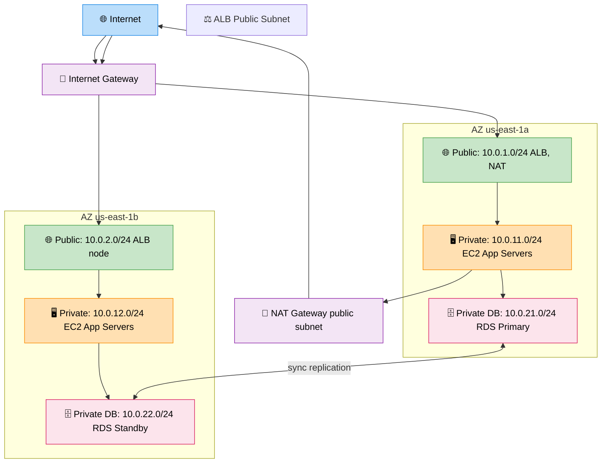

# VPC — Amazon Virtual Private Cloud

> **Subject**: AWS Cloud · **Group**: ☁️ Core Services · **Topic**: 07 of 12
> **Status**: ✅ Done

---

## PART 1

---

### 1. What is it?

**Amazon VPC (Virtual Private Cloud)** is a logically isolated section of the AWS cloud where you launch resources in a virtual network that you define. Think of it as your own private data center inside AWS, with full control over IP ranges, subnets, routing, and network security.

---

### 2. Key Concepts

| Concept                    | Detail                                                                |
| -------------------------- | --------------------------------------------------------------------- |
| **VPC**                    | Isolated virtual network; tied to a region; you define the CIDR block |
| **Subnet**                 | Sub-division of VPC; tied to ONE Availability Zone                    |
| **Public Subnet**          | Has a route to an Internet Gateway; resources can have public IPs     |
| **Private Subnet**         | No direct internet route; resources use NAT Gateway for outbound      |
| **Internet Gateway (IGW)** | Allows traffic between VPC and the internet                           |
| **NAT Gateway**            | Allows private subnet resources to reach internet (outbound only)     |
| **Route Table**            | Rules for where traffic goes (local, IGW, NAT, peering)               |
| **Security Group**         | Stateful virtual firewall at the instance/resource level              |
| **Network ACL (NACL)**     | Stateless firewall at the subnet level                                |
| **VPC Peering**            | Private networking between two VPCs (same or different accounts)      |
| **Transit Gateway**        | Hub-and-spoke; connect many VPCs + on-premise networks                |
| **VPC Endpoints**          | Private connection to AWS services without internet                   |

---

### 3. Public vs Private Subnets



```
VPC CIDR: 10.0.0.0/16 (65,536 IPs)
  Public Subnets:
    10.0.1.0/24 (us-east-1a) — 256 IPs
    10.0.2.0/24 (us-east-1b) — 256 IPs

  Private Subnets:
    10.0.11.0/24 (us-east-1a) — 256 IPs
    10.0.12.0/24 (us-east-1b) — 256 IPs

WHAT GOES WHERE:
  Public Subnet:  ALB, NAT Gateway, Bastion Host (or SSM)
  Private Subnet: EC2 app servers, RDS, ElastiCache, ECS tasks

ROUTING:
  Public Subnet Route Table:
    10.0.0.0/16 → local
    0.0.0.0/0   → Internet Gateway (igw-xxx)

  Private Subnet Route Table:
    10.0.0.0/16 → local
    0.0.0.0/0   → NAT Gateway (nat-xxx) ← outbound internet via NAT

NOTE: AWS reserves 5 IPs per subnet (first 4 + last 1)
      /24 subnet = 256 - 5 = 251 usable IPs
```

---

### 4. Security Groups vs NACLs

| Dimension           | Security Group                         | NACL                                           |
| ------------------- | -------------------------------------- | ---------------------------------------------- |
| **Level**           | Resource level (EC2, RDS, Lambda)      | Subnet level                                   |
| **State**           | Stateful (return traffic auto-allowed) | Stateless (return traffic needs explicit rule) |
| **Rules**           | Allow only (no deny rules)             | Allow AND deny                                 |
| **Rule evaluation** | All rules evaluated; any Allow wins    | Rules evaluated in order (lowest number first) |
| **Default**         | Deny all inbound; allow all outbound   | Allow all inbound and outbound                 |

```
SECURITY GROUP CHAINING (best practice):
  ALB-SG:     inbound 443 from 0.0.0.0/0
  App-SG:     inbound 8080 from ALB-SG (reference, not IP!)
  DB-SG:      inbound 5432 from App-SG
  Cache-SG:   inbound 6379 from App-SG

  This is more secure than IP-based rules: only ALB can reach App, only App can reach DB
```

---

### 5. Connectivity Options

```
INTERNET GATEWAY: VPC ↔ Internet (public resources)

NAT GATEWAY (per AZ, ~$0.045/hr + data):
  Private resources → NAT Gateway (in public subnet) → Internet Gateway → Internet
  Direction: outbound only (no inbound from internet)
  HA: deploy NAT Gateway in EACH AZ → route private subnets to local NAT
  (single NAT Gateway = single point of failure for outbound internet)

VPC PEERING: direct private connection between 2 VPCs
  CIDR ranges must not overlap
  Not transitive: A peers B, B peers C ≠ A can reach C

TRANSIT GATEWAY (hub-and-spoke):
  Connect 10s or 100s of VPCs + on-premise (VPN/Direct Connect)
  Transitive routing enabled
  Better than mesh VPC peering for large networks

VPC ENDPOINTS (private S3/DynamoDB access, no internet):
  Gateway Endpoint: S3, DynamoDB (free; add to route table)
  Interface Endpoint (PrivateLink): other AWS services (cost ~$0.01/hr)

  Benefit: traffic stays within AWS network; no NAT Gateway data charges
```

---

## PART 2

---

### 6. When to Know VPC Deeply

VPC architecture comes up in every system design interview. You're expected to know:

- Default VPC vs custom VPC
- Multi-AZ subnet design
- Public/private subnet separation
- Security group chaining
- NAT Gateway HA setup
- VPC Endpoints for cost and security

---

### 7. Common VPC Interview Traps

```
TRAP 1: Single NAT Gateway
  Anti-pattern: one NAT Gateway for all AZs
  Problem: if that AZ fails, ALL private subnets lose internet
  Fix: one NAT Gateway per AZ; each private subnet routes to its local NAT

TRAP 2: Overlapping CIDR for VPC Peering
  Problem: VPC A (10.0.0.0/16) peers VPC B (10.0.0.0/16) → routing conflict
  Fix: plan CIDR ranges before creating VPCs; use non-overlapping ranges

TRAP 3: NACLs are stateless
  Allow inbound 443 → also need to allow return traffic (ephemeral ports 1024-65535)
  Security Groups don't have this problem (stateful)

TRAP 4: Route Table priority
  More specific route wins
  10.0.0.0/24 → local BEATS 0.0.0.0/0 → IGW for local traffic
```

---

### 8. AWS Architecture Example

```
PRODUCTION 3-TIER VPC:
─────────────────────────────────────────────────────────
  VPC: 10.0.0.0/16

  PUBLIC SUBNETS:
    10.0.1.0/24 (us-east-1a):
      ALB, NAT Gateway A, Bastion (if no SSM)
    10.0.2.0/24 (us-east-1b):
      ALB (Multi-AZ), NAT Gateway B

  PRIVATE SUBNETS (App Tier):
    10.0.11.0/24 (us-east-1a): ECS tasks, EC2 app
    10.0.12.0/24 (us-east-1b): ECS tasks, EC2 app

  PRIVATE SUBNETS (Data Tier):
    10.0.21.0/24 (us-east-1a): RDS Primary, ElastiCache
    10.0.22.0/24 (us-east-1b): RDS Standby, ElastiCache Replica

  INTERNET GATEWAY → Public Subnets
  NAT GATEWAY A (1a) → App Subnet 1a route table
  NAT GATEWAY B (1b) → App Subnet 1b route table
  (No NAT for Data Tier — DBs don't need internet)

  VPC GATEWAY ENDPOINT: S3 (free; keeps S3 traffic private)
  VPC INTERFACE ENDPOINT: Secrets Manager (if in private subnet)

  SECURITY GROUPS:
    alb-sg: 443 from 0.0.0.0/0
    app-sg: 8080 from alb-sg
    db-sg:  5432 from app-sg
    cache-sg: 6379 from app-sg

  MONITORING:
    VPC Flow Logs → CloudWatch Logs or S3 → Athena queries
    Flow logs: capture all traffic (accept + reject) for security audit
```

---

### 9. Interview-Ready Explanation (30 sec)

> _"VPC is your isolated virtual network in AWS. For production, I always design a multi-AZ VPC with public and private subnets. Public subnets host the load balancer and NAT Gateways. Private subnets host application servers and databases — they're never directly accessible from the internet._
>
> _Security: I use Security Group chaining — ALB SG only, app can only receive from ALB, DB can only receive from app. This is more secure than IP-based rules because it follows resources, not IPs._
>
> _Key HA note: deploy one NAT Gateway per AZ so an AZ failure doesn't kill outbound internet for other AZs. Use VPC Gateway Endpoints for S3 and DynamoDB to keep that traffic off the internet and avoid NAT data transfer charges."_

---

### 10. Common Interview Questions

**Q1: What is the difference between a Security Group and a Network ACL?**

> Security Group: stateful (return traffic automatically allowed), works at the resource level, allow rules only, all rules evaluated simultaneously. Network ACL: stateless (must explicitly allow return traffic), works at subnet level, allow AND deny rules, evaluated by rule number order (lowest first). In practice: use Security Groups for most network security (easier to manage, stateful). Use NACLs for subnet-level blocks — e.g., blocking a known malicious IP range. Because NACLs are stateless, you must allow inbound AND outbound including ephemeral return ports (1024-65535) which is error-prone.

**Q2: How does a resource in a private subnet access the internet?**

> Via NAT Gateway. Flow: private subnet resource → sends packet to default route (0.0.0.0/0) → Route Table points to NAT Gateway (in public subnet) → NAT Gateway translates source IP to its own public IP → Internet Gateway → internet. Return traffic: internet → IGW → NAT Gateway → translates back to private IP → resource. The private resource's IP is never exposed to the internet — NAT Gateway is the public face. Important: NAT Gateway is AZ-specific; for HA, deploy one per AZ and route each AZ's private subnet to its local NAT Gateway.

**Q3: When would you use VPC Peering vs Transit Gateway?**

> VPC Peering: direct 1:1 connection between two VPCs. Not transitive (A↔B, B↔C does not mean A↔C). Good for 2-5 VPCs needing to communicate. Transit Gateway: hub-and-spoke model. All VPCs connect to a central Transit Gateway; routing is transitive. Good for 10+ VPCs, or when adding new VPCs frequently (add one connection to TGW, not N peerings). Cost: VPC Peering is cheaper (no per-attachment cost). Transit Gateway costs ~$0.05/hr per attachment + data. Use VPC Peering for simple, small topologies. Use Transit Gateway for large, growing multi-VPC architectures or hybrid (VPN/Direct Connect) connectivity.

---

> **Next Topic →** [08 · ALB](./08-alb.md)
