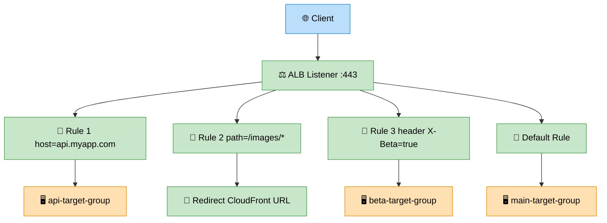

# ALB — Application Load Balancer

> **Subject**: AWS Cloud · **Group**: ☁️ Core Services · **Topic**: 08 of 12
> **Status**: ✅ Done

---

## PART 1

---

### 1. What is it?

**Application Load Balancer (ALB)** is AWS's Layer 7 HTTP/HTTPS load balancer. It distributes incoming traffic across multiple targets (EC2, containers, Lambda, IP addresses) with rich routing rules based on URL path, hostname, headers, and query parameters.

| Load Balancer Type | Layer          | Best For                                  |
| ------------------ | -------------- | ----------------------------------------- |
| **ALB**            | 7 (HTTP/HTTPS) | Web apps, APIs, microservices             |
| **NLB**            | 4 (TCP/UDP)    | Ultra-low latency, static IP, non-HTTP    |
| **CLB**            | 4/7 (legacy)   | Avoid for new deployments                 |
| **GWLB**           | 3 (IP)         | Third-party firewalls, network appliances |

---

### 2. Key Concepts

| Concept                 | Detail                                                                 |
| ----------------------- | ---------------------------------------------------------------------- |
| **Listener**            | Port + protocol ALB listens on (80, 443)                               |
| **Target Group**        | Set of targets (EC2, ECS tasks, Lambda, IPs) that receive traffic      |
| **Rule**                | Condition → Action (forward, redirect, fixed response)                 |
| **Health Check**        | ALB probes targets; unhealthy targets removed from rotation            |
| **Sticky Sessions**     | Route same user to same target (ALB cookie or app cookie)              |
| **Connection Draining** | Before deregistering a target, wait for in-flight requests to complete |

---

### 3. Routing Rules



```
ALB LISTENER (port 443):
  Rule 1: Host header is api.myapp.com → forward to [api-target-group]
  Rule 2: Host header is admin.myapp.com → forward to [admin-target-group]
  Rule 3: Path starts with /api/ → forward to [backend-tg]
  Rule 4: Path starts with /images/ → redirect to CloudFront URL
  Rule 5: Header X-Beta=true → forward to [beta-target-group] (A/B testing)
  Default: forward to [main-target-group]

WEIGHTED ROUTING (Blue/Green or Canary):
  Target Group 1 (new version): weight=10%
  Target Group 2 (old version): weight=90%
  → 10% of users get new version
  Gradually increase to 100% as confidence grows

LAMBDA AS TARGET:
  ALB → invokes Lambda function directly
  Lambda returns JSON with statusCode, headers, body
  Good for: event-driven endpoints, lightweight APIs
```

---

### 4. ALB + HTTPS + ACM

```
HTTPS SETUP (managed by ACM — no certificate management):

  1. Request certificate in ACM:
     acm.request_certificate(
         DomainName='myapp.com',
         SubjectAlternativeNames=['*.myapp.com', 'api.myapp.com'],
         ValidationMethod='DNS'
     )

  2. Add DNS validation CNAME record to Route 53
  3. ACM auto-validates and issues certificate
  4. Attach ACM certificate to ALB HTTPS listener
  5. ACM auto-renews before expiry — zero manual intervention

  ALB LISTENER 80 → redirect to 443 (HTTP to HTTPS):
    Action: Redirect
    Protocol: HTTPS, Port: 443
    Status: 301 (permanent)

SECURITY POLICY:
  ALB supports TLS 1.2 and TLS 1.3
  Use ELBSecurityPolicy-TLS13-1-2-2021-06 (latest recommended)
  Disables deprecated TLS 1.0/1.1
```

---

### 5. Health Checks

```
TARGET GROUP HEALTH CHECK:
  Protocol: HTTP
  Path: /health
  Interval: 30 seconds
  Timeout: 5 seconds
  Healthy threshold: 2 consecutive successes
  Unhealthy threshold: 3 consecutive failures

WHAT /health SHOULD RETURN:
  200 OK if the app is ready to serve traffic
  Check: DB connected, cache connected, critical dependencies up
  Return 503 if: DB connection pool exhausted, maintenance mode

UNHEALTHY BEHAVIOR:
  ALB stops routing to unhealthy targets
  ASG health check can terminate and replace unhealthy instances
  Health check must succeed before new instances receive traffic (Grace Period)
```

---

## PART 2

---

### 6. When to Use ALB vs NLB

| Use ALB                         | Use NLB                          |
| ------------------------------- | -------------------------------- |
| HTTP/HTTPS applications         | TCP, UDP, TLS traffic            |
| Path-based / host-based routing | Ultra-low latency (<1ms)         |
| Microservices routing           | Static IP addresses needed       |
| WebSocket, HTTP/2, gRPC         | Millions of requests per second  |
| Lambda targets                  | IP-based targets from on-premise |
| WAF integration                 | Gaming, IoT, real-time streaming |

---

### 7. ALB Access Logs and Monitoring

```
LOGGING:
  ALB Access Logs → S3 (enable in ALB attributes)
  Fields: timestamp, client_ip, request, target, latency, response_code, ...

  Query with Athena:
    SELECT client_ip, count(*) as requests
    FROM alb_logs
    WHERE response_code = '5xx'
    GROUP BY client_ip
    ORDER BY requests DESC

CLOUDWATCH METRICS (key ones):
  RequestCount: total requests
  TargetResponseTime: backend latency (alarm if p99 > 1s)
  HTTPCode_ELB_5XX: ALB-generated 5xx errors
  HTTPCode_Target_5XX: target (app) 5xx errors
  HealthyHostCount: number of healthy targets (alarm if < 2)
  UnHealthyHostCount: alert if > 0 (something is failing)

ALARM EXAMPLES:
  ALB p99 latency > 2s → page on-call
  5xx error rate > 1% → page on-call
  HealthyHostCount < 2 → critical alert
```

---

### 8. AWS Architecture Example

```
MICROSERVICES ROUTING WITH ALB:
─────────────────────────────────────────────────────────

Internet → [Route 53] → [CloudFront + WAF] → [ALB]

ALB LISTENERS:
  :443 rules:
    /api/users/* → [ECS: user-service TG] (port 8080)
    /api/orders/* → [ECS: order-service TG] (port 8081)
    /api/products/* → [ECS: product-service TG] (port 8082)
    /admin/* → [EC2: admin-server TG] + IP restriction header
    /* (default) → [ECS: frontend-service TG]

ECS + ALB INTEGRATION:
  ECS task definition maps to a target group
  ECS service: registers/deregisters tasks automatically on scale
  Port: dynamic (ECS picks available port; ALB discovers it)
  Health check: /health on each container

DEREGISTRATION DELAY (connection draining):
  Default: 300 seconds (5 min)
  For fast-cycling containers: reduce to 30 seconds
  During ALB target deregistration: in-flight requests complete before removal

BLUE/GREEN WITH ALB:
  Blue TG (current): 100%
  Deploy: create Green TG with new version
  Shift: 90/10 → 50/50 → 0/100
  Rollback: shift weights back (instant)
  Or use CodeDeploy ALB integration for automated Blue/Green
```

---

### 9. Interview-Ready Explanation (30 sec)

> _"ALB is AWS's Layer 7 load balancer — it understands HTTP and routes traffic based on path, hostname, headers, and query strings. This makes it ideal for microservices: a single ALB routes `/api/users` to the User Service and `/api/orders` to the Order Service._
>
> _For HTTPS: attach ACM certificates — zero manual cert management, auto-renewal. For health checks: ALB probes each target's `/health` endpoint and removes unhealthy targets from rotation automatically._
>
> _Key difference from NLB: ALB is for HTTP applications with routing rules. NLB is for ultra-low latency TCP/UDP or when you need a static IP."_

---

### 10. Common Interview Questions

**Q1: How do you achieve zero-downtime deployments with ALB?**

> Blue/Green deployment: run two target groups (Blue = current version, Green = new version). ALB forwards 100% to Blue initially. Deploy new version to Green and verify it's healthy. Shift weighted routing gradually: 90/10 → 50/50 → 0/100. Monitor error rates and latency at each step. Roll back instantly by shifting weights back to Blue. The deregistration delay (connection draining) ensures in-flight requests to the old version complete before those instances are fully removed. This provides zero-downtime deployment with instant rollback capability.

**Q2: What is the difference between ALB sticky sessions and application-level sessions?**

> ALB sticky sessions: ALB sets a cookie (`AWSALB`) on the user's browser. On subsequent requests, ALB reads this cookie and routes to the same target. Problem: if that target dies, the session is lost. Application-level sessions: store session in a shared external store (ElastiCache Redis, DynamoDB). ANY backend server can serve the request because session data is centrally accessible. Best practice: always use application-level sessions. ALB sticky sessions are a last resort for legacy applications that can't use external session storage. Sticky sessions break horizontal scaling and complicate rolling deployments.

**Q3: How does ALB integrate with ECS?**

> ECS services register tasks dynamically with ALB target groups. When ECS scales out (launches a new task), it registers the task's IP and dynamic port with the target group. When scaling in or doing a deployment, it deregisters the old task after the connection draining period. The key: ECS tasks use dynamic ports — you don't need to worry about port conflicts across tasks on the same EC2 host. ECS service definition specifies the target group ARN and container port; ECS handles registration/deregistration automatically. For Fargate, each task gets its own ENI (Elastic Network Interface) — ALB connects directly to the task's IP.

---

> **Next Topic →** [09 · SQS](./09-sqs.md)
