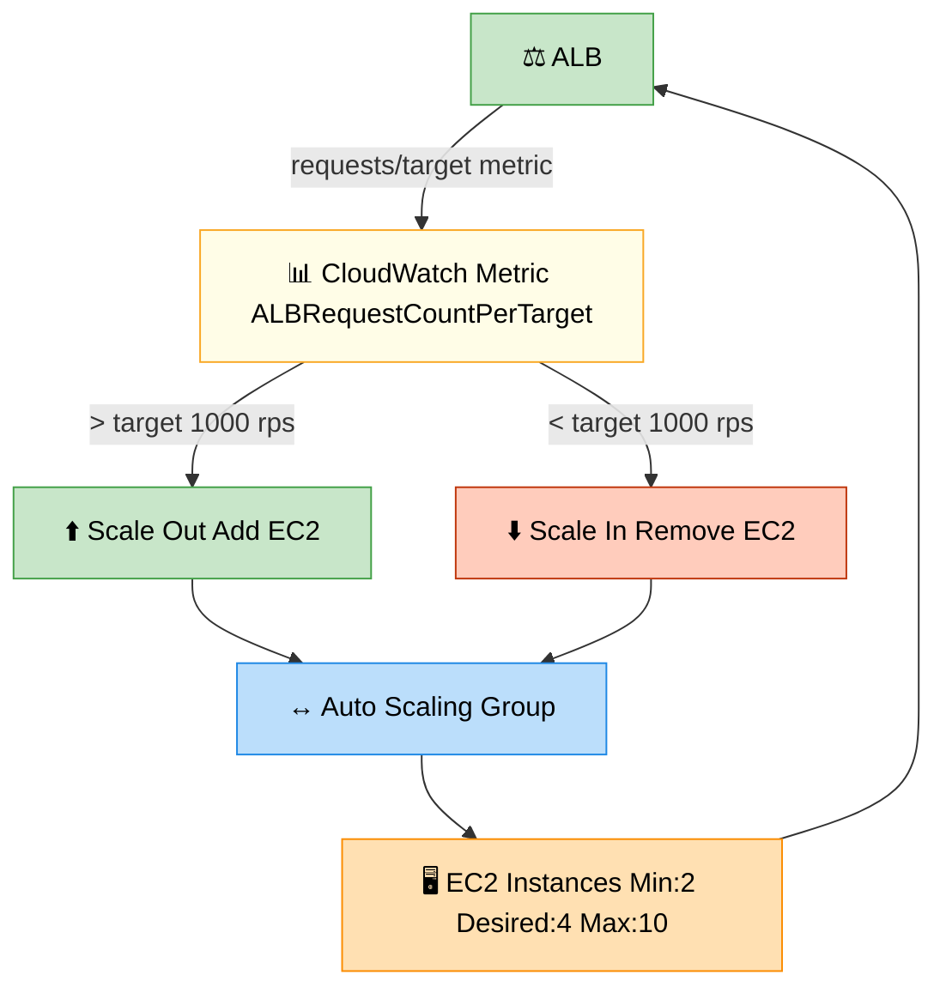

# Auto Scaling — Dynamic Capacity Management

> **Subject**: AWS Cloud · **Group**: 🔒 High Availability · **Topic**: 02 of 2
> **Status**: ✅ Done

---

## PART 1

---

### 1. What is it?

**AWS Auto Scaling** automatically adjusts compute capacity to match demand. Scale out (add instances) during traffic spikes; scale in (remove instances) when load drops. This maintains performance during peaks and reduces cost during quiet periods.

Three types of Auto Scaling:

| Type                         | What Scales               | Key Service              |
| ---------------------------- | ------------------------- | ------------------------ |
| **EC2 Auto Scaling**         | EC2 instances in an ASG   | Auto Scaling Groups      |
| **ECS Service Auto Scaling** | ECS task count            | Application Auto Scaling |
| **DynamoDB Auto Scaling**    | Read/Write Capacity Units | Application Auto Scaling |

---

### 2. EC2 Auto Scaling Group (ASG)

```
ASG KEY SETTINGS:
  Launch Template: defines instance config (AMI, type, SG, IAM role, UserData)
  Min capacity: minimum running instances (never go below)
  Desired capacity: current target (ASG tries to maintain this count)
  Max capacity: ceiling (never exceed this)

  AZs: list of AZs to balance across
  Health check type: EC2 (instance status) or ELB (ALB health check — preferred)
  Health check grace period: seconds before ASG checks health of new instance

INSTANCE LIFECYCLE:
  Pending → InService → (Terminating) → Terminated
    ↑
  Pending:Wait — lifecycle hook (run scripts before instance receives traffic)
  Terminating:Wait — lifecycle hook (drain connections before termination)

LAUNCH TEMPLATE vs LAUNCH CONFIGURATION:
  Launch Template: newer, preferred, supports versioning, mixed instance types, Spot
  Launch Configuration: legacy, immutable, avoid for new setups
```

---

### 3. Scaling Policies



```
1. TARGET TRACKING (recommended for most cases):
   Set a target value for a metric; ASG adjusts to maintain it

   Example: ALBRequestCountPerTarget = 1000
   → If avg requests/target > 1000: add instances
   → If avg requests/target < 1000: remove instances
   → Self-correcting; no threshold tuning needed

   Best metrics:
     ALBRequestCountPerTarget (web apps)
     CPUUtilization (60-70% target)
     SQSApproximateNumberOfMessagesVisible / number of instances

2. STEP SCALING (manual thresholds):
   CloudWatch Alarm triggers scaling action with steps:
     CPU < 20%: remove 2 instances
     CPU 60-80%: add 1 instance
     CPU 80-100%: add 3 instances
   More control; more configuration; good for non-linear scaling

3. SIMPLE SCALING (legacy):
   One alarm → one action → cooldown period
   Too slow to react (waits for cooldown before re-evaluating)
   Avoid; use Step or Target Tracking

4. SCHEDULED SCALING:
   Pre-defined scale events based on time
   Example:
     Monday-Friday 8am UTC: set desired=10 (before business hours)
     Monday-Friday 10pm UTC: set desired=2 (after hours)
     Black Friday: set min=20 starting Nov 29
   Use: known traffic patterns, batch jobs at specific times

5. PREDICTIVE SCALING (ML-based):
   Analyzes 2 weeks of historical patterns
   Predicts future load; pre-scales BEFORE demand hits
   Eliminates lag between load increase and scale-out
   Use: recurring traffic patterns (weekly peaks, daily cycles)
```

---

### 4. ECS Service Auto Scaling

```
ECS SERVICE AUTO SCALING:
  Scales ECS task count (not EC2 instances if using Fargate)
  Uses Application Auto Scaling API

  Metrics:
    ECSServiceAverageCPUUtilization
    ECSServiceAverageMemoryUtilization
    ALBRequestCountPerTarget (if behind ALB)

  Target tracking example (Fargate):
    Metric: ECSServiceAverageCPUUtilization
    Target: 50%
    Min tasks: 2
    Max tasks: 100
    Scale-out cooldown: 60s
    Scale-in cooldown: 300s (conservative scale-in to avoid yo-yo)

  FARGATE SCALE SPEED:
    New task startup: ~30-60 seconds (no EC2 launch time)
    Faster than EC2 ASG (~3-5 min for new instance)

  ECS ON EC2 (not Fargate):
    Two layers of scaling:
      1. ECS Service Auto Scaling: scales task count
      2. EC2 ASG: scales instance count when cluster is out of capacity
    Use Cluster Auto Scaling (CAS) to link them automatically
```

---

### 5. Scaling Cooldowns and Warmup

```
COOLDOWN PERIOD:
  After scaling action, ASG waits before evaluating alarms again
  Default: 300 seconds (5 minutes)
  Prevents thrashing: adding/removing instances too rapidly

  Set lower for fast-responding apps (scale quickly)
  Set higher for slow-to-start apps (avoid premature scale-in while new instances warm)

INSTANCE WARMUP:
  Period after launch before new instance metrics contribute to aggregates
  Without warmup: new CPU-heavy instances (booting, app starting) inflate avg CPU
    → triggers another scale-out event → snowball effect

  Set warmup = time for instance to be healthy and serving normal traffic
  Example: if app takes 120s to start → instance warmup = 120s

SCALE-IN PROTECTION:
  Mark specific instances as scale-in protected
  ASG won't terminate them during scale-in events
  Use case: protect an instance running a long-running batch job

  aws autoscaling set-instance-protection \
    --instance-ids i-abc123 \
    --auto-scaling-group-name my-asg \
    --protected-from-scale-in
```

---

## PART 2

---

### 6. When to Use Which Scaling Strategy

| Situation                        | Recommended Policy                                          |
| -------------------------------- | ----------------------------------------------------------- |
| Standard web app                 | Target Tracking: ALBRequestCountPerTarget                   |
| CPU-bound workload               | Target Tracking: CPUUtilization (60-70%)                    |
| Queue-based processing           | Target Tracking or Step: SQS queue depth                    |
| Predictable daily/weekly pattern | Scheduled + Predictive                                      |
| Unknown pattern, first deploy    | Step Scaling (conservative) then migrate to Target Tracking |
| Lambda                           | Concurrency scaling is automatic (no config needed)         |

---

### 7. Cost and Over-Scaling

```
AUTO SCALING COST CONSIDERATIONS:
  Scaling out too aggressively: more instances = more cost (even idle)
  Scaling in too fast: performance spike before scale-out catches up

  BEST PRACTICES:
    Min = HA minimum (≥2, not cost minimum)
    Max = cost ceiling (don't let runaway autoscaling bill you)
    Target tracking at 60-70% (buffer before alarm)
    Scale-out fast, scale-in slow (cooldown: scale-out 120s, scale-in 300s)

  MIXED INSTANCE POLICY (cost optimization):
    ASG uses Spot instances for 70%, On-Demand for 30%
    Multiple instance types (diversified Spot pools → lower interruption risk)

    Example fleet:
      On-Demand base: 2 × m5.large
      Spot pool: [m5.large, m4.large, c5.large] at 70%

    Spot saving: ~70% vs On-Demand
    Risk: Spot interruption (2-min warning) → handle gracefully (drain connections)

  SAVINGS PLANS / RESERVED INSTANCES:
    Commit to 1-3 year usage → up to 72% saving on On-Demand
    Compute Savings Plan: flexible across EC2 types, Lambda, Fargate
    Apply to the baseline (minimum On-Demand); use Spot for burst
```

---

### 8. AWS Architecture Example

```
FULL AUTO SCALING ARCHITECTURE:
─────────────────────────────────────────────────────────
  [Route 53] → [ALB] → [EC2 ASG: api-servers]
                              ↕ (scale based on ALB RPT)
  [CloudWatch Alarm] ← ALBRequestCountPerTarget

  ASG Config:
    Min: 2 (AZ spread: 1 per AZ)
    Desired: 4
    Max: 50
    Launch Template: api-lt-v12
    Mixed fleet: 2 On-Demand base + Spot remainder
    Health check: ELB (ALB)

  TARGET TRACKING POLICY:
    ALBRequestCountPerTarget = 1000
    Scale-out cooldown: 120s
    Scale-in cooldown: 300s

  SCHEDULED SCALING:
    Mon-Fri 07:45 UTC: set min=6 (morning ramp-up)
    Mon-Fri 22:00 UTC: set min=2 (overnight)

  LIFECYCLE HOOKS:
    Launching: wait 60s → run health validation script → complete
    Terminating: wait 30s → deregister from ALB (drain) → complete

  CLOUDWATCH ALARMS:
    GroupInServiceInstances < 2 → ALARM → SNS → PagerDuty
    GroupInServiceInstances > 40 → WARNING → SNS → Slack (nearing max)

ECS FARGATE AUTO SCALING:
  Service: api-service
  Min tasks: 2, Max tasks: 100
  Target tracking: ECSServiceAverageCPUUtilization = 50%
  Scale-out: +4 tasks when CPU > 50% for 1 minute
  Scale-in: -2 tasks when CPU < 30% for 5 minutes
```

---

### 9. Interview-Ready Explanation (30 sec)

> _"Auto Scaling adjusts capacity automatically to match demand. For EC2: use an Auto Scaling Group with target tracking — set ALBRequestCountPerTarget to 1000 and ASG scales instances to maintain that ratio. Min=2 for HA, Max=50 as cost ceiling._
>
> _For spiky traffic: use scheduled scaling to pre-warm before known peaks (e.g., scale out at 7:45am before business hours). For cost: use mixed instance policy — On-Demand for the baseline, Spot for 70% of burst capacity._
>
> _Two scaling dimensions for ECS: Service Auto Scaling adjusts task count; Cluster Auto Scaling adjusts EC2 instance count. With Fargate, you only manage task count — no EC2 to scale."_

---

### 10. Common Interview Questions

**Q1: What is the difference between Target Tracking and Step Scaling?**

> Target Tracking: you specify a target metric value; ASG automatically calculates the right number of instances to maintain it. Example: ALBRequestCountPerTarget=1000 means ASG adds instances until each serves ~1000 req/sec. Self-managing, no threshold configuration needed. Best for most web applications. Step Scaling: you define CloudWatch alarms at specific thresholds, each triggering a step (add/remove N instances). Example: CPU 60-80% → add 1; CPU 80-100% → add 3; CPU <20% → remove 2. More control and visibility into exact triggers. Better when scaling is non-linear or you want explicit control. Disadvantage: requires tuning thresholds and doesn't automatically account for different traffic patterns. Default to Target Tracking; use Step when you need more nuanced scaling behavior.

**Q2: How do you avoid over-scaling or under-scaling?**

> Over-scaling (too many instances, cost waste): set Max capacity ceiling; use scale-in cooldown 300s+ (don't scale in too fast during brief CPU dips); use instance warmup (don't count starting instances in metrics); target tracking at 60-70% CPU (not 90% — leaves headroom). Under-scaling (not enough instances, performance impact): use predictive scaling for known patterns (pre-scales before demand); reduce scale-out cooldown (react faster); set target lower than you think you need (better to have slightly too many than too few); use load testing to validate scaling thresholds before production. Key: test scaling by running load tests and watching CloudWatch metrics + instance count graphs. Validate both scale-out speed (does it react fast enough?) and scale-in behavior (does it stabilize without oscillation?).

**Q3: How do Spot instances work with Auto Scaling and how do you handle interruptions?**

> Spot instances are unused EC2 capacity at 60-90% discount. AWS can reclaim them with 2 minutes notice (Spot interruption). Use with ASG mixed instance policy: specify a Spot percentage (e.g., 70%) and multiple instance types (m5.large, m4.large, c5.large) to diversify across Spot pools. If one pool is unavailable, ASG uses another. Handling interruption: (1) ALB connection draining: when Spot instance gets interruption notice, ALB stops sending new requests; existing requests complete in deregistration delay window. (2) Graceful shutdown: application handles SIGTERM by finishing in-flight requests. (3) ASG detects instance termination → launches replacement in another pool/type. Stateless apps handle Spot perfectly — no persistent state on instance. Don't use Spot for: database instances, instances with local state, or instances needing > 90% uptime.

---

> ✅ **High Availability Complete (2/2)**
> **Next Group →** [Cost Awareness](../04-Cost-Awareness/)
