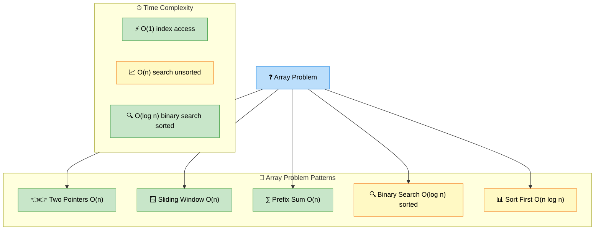

# Arrays — Patterns, Techniques, and Interview Problems

> **Subject**: DSA · **Group**: 🧩 Core Topics · **Topic**: 01 of 6
> **Status**: ✅ Done

---

## PART 1

---

### 1. Core Concepts

An **array** is a contiguous block of memory storing elements of the same type. O(1) index access. The foundation of most DSA problems.



```
ARRAY FUNDAMENTALS:
  Access by index: O(1)
  Search (unsorted): O(n)
  Search (sorted): O(log n) — binary search
  Insert at end: O(1) amortized (dynamic array)
  Insert at index: O(n) — shift elements
  Delete at index: O(n) — shift elements

KEY INSIGHT:
  Most array problems reduce to one of:
    1. Two Pointers
    2. Sliding Window
    3. Prefix Sum
    4. Binary Search (on sorted arrays)
    5. Sorting first, then solving
```

---

### 2. Two Pointers Pattern

```python
# PATTERN: Two pointers from both ends
# Use when: sorted array, find pair/triplet with target sum

def two_sum_sorted(nums, target):
    left, right = 0, len(nums) - 1
    while left < right:
        s = nums[left] + nums[right]
        if s == target:
            return [left, right]
        elif s < target:
            left += 1
        else:
            right -= 1
    return []

# PATTERN: Fast and slow pointer
# Use when: remove duplicates in-place, partition array

def remove_duplicates(nums):  # LeetCode 26
    if not nums:
        return 0
    slow = 0
    for fast in range(1, len(nums)):
        if nums[fast] != nums[slow]:
            slow += 1
            nums[slow] = nums[fast]
    return slow + 1

# PATTERN: Three pointers (Dutch National Flag)
# Use when: LeetCode 75 - Sort Colors (0s, 1s, 2s)

def sort_colors(nums):
    low, mid, high = 0, 0, len(nums) - 1
    while mid <= high:
        if nums[mid] == 0:
            nums[low], nums[mid] = nums[mid], nums[low]
            low += 1; mid += 1
        elif nums[mid] == 1:
            mid += 1
        else:
            nums[mid], nums[high] = nums[high], nums[mid]
            high -= 1
```

---

### 3. Prefix Sum Pattern

```python
# PATTERN: Prefix sum for range queries
# O(n) precompute, O(1) range sum query

def range_sum(nums, queries):
    prefix = [0] * (len(nums) + 1)
    for i, num in enumerate(nums):
        prefix[i+1] = prefix[i] + num

    # Sum of nums[l..r] = prefix[r+1] - prefix[l]
    results = []
    for l, r in queries:
        results.append(prefix[r+1] - prefix[l])
    return results

# PATTERN: Prefix sum + HashMap (subarray sum equals k)
# LeetCode 560 - Subarray Sum Equals K

def subarray_sum(nums, k):
    count = 0
    prefix_sum = 0
    seen = {0: 1}  # prefix_sum: frequency

    for num in nums:
        prefix_sum += num
        # If (prefix_sum - k) was seen, that subarray sums to k
        count += seen.get(prefix_sum - k, 0)
        seen[prefix_sum] = seen.get(prefix_sum, 0) + 1

    return count
# Time: O(n), Space: O(n)
```

---

### 4. Binary Search on Arrays

```python
# BINARY SEARCH TEMPLATE (find exact target):
def binary_search(nums, target):
    left, right = 0, len(nums) - 1
    while left <= right:
        mid = left + (right - left) // 2  # avoid overflow
        if nums[mid] == target:
            return mid
        elif nums[mid] < target:
            left = mid + 1
        else:
            right = mid - 1
    return -1

# BINARY SEARCH ON ANSWER (search space, not array):
# LeetCode 875 - Koko Eating Bananas
# "find minimum speed k such that all bananas eaten in h hours"

def min_eating_speed(piles, h):
    def can_finish(speed):
        return sum((p + speed - 1) // speed for p in piles) <= h

    left, right = 1, max(piles)
    while left < right:
        mid = (left + right) // 2
        if can_finish(mid):
            right = mid   # try smaller speed
        else:
            left = mid + 1
    return left
# Time: O(n log max_pile)

# FIND FIRST/LAST POSITION (LeetCode 34):
def search_range(nums, target):
    def find_first(nums, target):
        left, right = 0, len(nums) - 1
        result = -1
        while left <= right:
            mid = (left + right) // 2
            if nums[mid] == target:
                result = mid
                right = mid - 1  # keep searching left
            elif nums[mid] < target:
                left = mid + 1
            else:
                right = mid - 1
        return result

    first = find_first(nums, target)
    # Mirror for last position (search right)
    ...
```

---

### 5. Kadane's Algorithm (Max Subarray)

```python
# KADANE'S ALGORITHM: Maximum subarray sum
# LeetCode 53 - Key: local max vs global max

def max_subarray(nums):
    max_sum = nums[0]
    current = nums[0]

    for num in nums[1:]:
        current = max(num, current + num)  # start fresh or extend
        max_sum = max(max_sum, current)

    return max_sum
# Time: O(n), Space: O(1)

# VARIATION: Maximum product subarray (LeetCode 152)
# Key: track both min and max (negative × negative = positive)

def max_product(nums):
    max_prod = min_prod = result = nums[0]

    for num in nums[1:]:
        candidates = (num, max_prod * num, min_prod * num)
        max_prod = max(candidates)
        min_prod = min(candidates)
        result = max(result, max_prod)

    return result
```

---

## PART 2

---

### 6. Must-Know Problems

| Problem                      | LeetCode | Pattern              | Time       |
| ---------------------------- | -------- | -------------------- | ---------- |
| Two Sum                      | #1       | HashMap              | O(n)       |
| Best Time to Buy/Sell Stock  | #121     | Track min, scan once | O(n)       |
| Contains Duplicate           | #217     | HashSet              | O(n)       |
| Maximum Subarray             | #53      | Kadane's             | O(n)       |
| Product of Array Except Self | #238     | Prefix + Suffix      | O(n)       |
| Maximum Product Subarray     | #152     | Kadane's variant     | O(n)       |
| Find Min in Rotated Array    | #153     | Binary Search        | O(log n)   |
| 3Sum                         | #15      | Sort + Two Pointers  | O(n²)      |
| Merge Intervals              | #56      | Sort, merge          | O(n log n) |
| Subarray Sum Equals K        | #560     | Prefix + HashMap     | O(n)       |

---

### 7. Key Interview Patterns

```
DECISION FRAMEWORK:

  Q: "Find pair/triplet with target sum"
     → Sort + Two Pointers (sorted) or HashMap (unsorted)

  Q: "Subarray with max/min sum"
     → Kadane's algorithm

  Q: "Range sum query"
     → Prefix Sum

  Q: "Count subarrays with condition"
     → Prefix Sum + HashMap

  Q: "Search in sorted array"
     → Binary Search

  Q: "Rotate/shift array"
     → Reverse trick: rotate right k → reverse all, reverse [0:k], reverse [k:]

  Q: "In-place modification, no extra space"
     → Two pointers

  Q: "Merge two sorted arrays"
     → Two pointers from back (fill from largest to smallest, no shift needed)
```

---

### 8. Product of Array Except Self (No Division)

```python
# LeetCode 238 — Classic interview problem
# No division operator; O(1) extra space

def product_except_self(nums):
    n = len(nums)
    result = [1] * n

    # Forward pass: result[i] = product of all elements before i
    prefix = 1
    for i in range(n):
        result[i] = prefix
        prefix *= nums[i]

    # Backward pass: multiply by product of all elements after i
    suffix = 1
    for i in range(n - 1, -1, -1):
        result[i] *= suffix
        suffix *= nums[i]

    return result
# Time: O(n), Space: O(1) excluding output array

# TRACE: nums = [1, 2, 3, 4]
# Forward:  result = [1, 1, 2, 6]
# Backward: result = [24, 12, 8, 6] ✓
```

---

### 9. Interview-Ready Explanation (30 sec)

> _"Arrays are the most fundamental data structure — contiguous memory, O(1) index access. Most interview problems use one of four patterns: Two Pointers for searching/partitioning in sorted arrays; Prefix Sum for range queries and subarray problems; Kadane's for max subarray; and Binary Search for sorted arrays or search-space reduction problems._
>
> _Key tricks: prefix sum + HashMap to count subarrays; sort first to enable two pointers; the reverse trick for rotation. For in-place problems: two pointers avoid extra space. Always ask: is the input sorted? That unlocks binary search and two pointers."_

---

### 10. Common Interview Questions

**Q1: Two Sum — multiple approaches and when to use each?**

> Approach 1 (HashMap, unsorted): iterate through array, for each element check if `target - element` is in HashMap. O(n) time, O(n) space. Best for: unsorted input, one-pass solution. Approach 2 (Two Pointers, sorted): sort first then use left+right pointers. O(n log n) time, O(1) extra space (if modifying is allowed). Best for: follow-up that says "now find all pairs" or when array is already sorted. Approach 3 (Brute Force): nested loops O(n²) — mention only to dismiss. In interview: always start with HashMap O(n) unless the array is already sorted or you need to return indices with sorted array (indices change after sort — use HashMap instead).

**Q2: Walk through the logic of Kadane's algorithm.**

> At each position, we have two choices: start a new subarray at this element, or extend the current subarray. `current = max(num, current + num)`. If `current + num < num`, that means the accumulated sum is negative — it only hurts to include it, so start fresh. Track the global maximum throughout. Key insight: we never need to look at all possible subarrays explicitly — at each step, the optimal subarray ending at position i is either just `nums[i]` (start fresh) or the best subarray ending at i-1 extended by `nums[i]`. The recurrence is: `dp[i] = max(nums[i], dp[i-1] + nums[i])`. Kadane's is O(n) time, O(1) space — optimal. Common follow-up: return the actual subarray (track start and end indices).

**Q3: How do you merge overlapping intervals?**

> Sort intervals by start time. Iterate: if current interval's start ≤ last merged interval's end → overlapping, merge by updating end to max of both ends. Otherwise → non-overlapping, add current to result. Example: `[[1,3],[2,6],[8,10],[15,18]]` → sort by start (already sorted) → merge [1,3] and [2,6] → [1,6]; [8,10] no overlap; [15,18] no overlap → `[[1,6],[8,10],[15,18]]`. Time O(n log n) for sort, O(n) for merge pass. Common follow-up: "insert an interval into a sorted non-overlapping list" (LeetCode 57) — same idea but handle the insert position and merge affected intervals.

---

> **Next Topic →** [02 · Strings](./02-strings.md)
