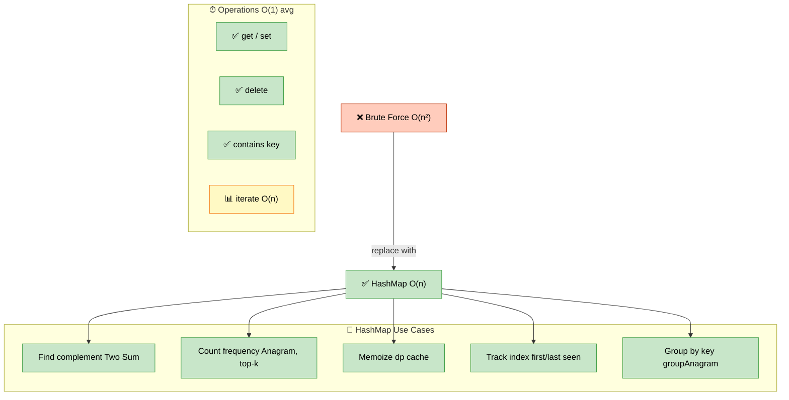

# HashMap — Patterns, Techniques, and Interview Problems

> **Subject**: DSA · **Group**: 🧩 Core Topics · **Topic**: 03 of 6
> **Status**: ✅ Done

---

## PART 1

---

### 1. Core Concepts

**HashMap** (dict in Python, HashMap in Java, Map in JavaScript) maps keys to values with O(1) average time for get/set/delete. The most versatile data structure for turning O(n²) brute-force solutions into O(n).



```
HASHMAP COMPLEXITIES:
  Get/Set/Delete: O(1) average, O(n) worst (hash collisions)
  Contains key: O(1) average
  Iteration: O(n)

WHEN HASHMAP UNLOCKS EFFICIENCY:
  "Find complement" problems: store seen elements → O(1) lookup vs O(n) scan
  "Count frequency": Counter → O(1) access per character
  "Cache/memoize": store computed results → avoid recomputation
  "Index/position tracking": store index of element for O(1) retrieval
  "Group by property": group elements by computed key

PYTHON HASHMAP TOOLS:
  dict: basic key-value
  collections.Counter: specialized for frequency counts
  collections.defaultdict: auto-initializes missing keys
  set: hashmap without values (membership testing O(1))
```

---

### 2. Two Sum Pattern (Foundation)

```python
# TWO SUM — The archetypal HashMap problem (LeetCode 1)
# Brute force: O(n²)  |  HashMap: O(n)

def two_sum(nums, target):
    seen = {}  # value → index
    for i, num in enumerate(nums):
        complement = target - num
        if complement in seen:
            return [seen[complement], i]
        seen[num] = i
    return []

# PATTERN GENERALIZATION:
# "For each element, I need to find SOMETHING I've seen before"
# → Store what you've seen in a HashMap
# → For each new element, check if the "complement" is in the map

# FOUR SUM COUNT (LeetCode 454):
# Count tuples (i,j,k,l) such that A[i]+B[j]+C[k]+D[l] == 0
def four_sum_count(A, B, C, D):
    ab_sums = {}
    for a in A:
        for b in B:
            ab_sums[a+b] = ab_sums.get(a+b, 0) + 1

    count = 0
    for c in C:
        for d in D:
            count += ab_sums.get(-(c+d), 0)
    return count
# Time: O(n²)  Space: O(n²)
```

---

### 3. Frequency Counter Pattern

```python
from collections import Counter, defaultdict

# CHARACTER FREQUENCY:
def top_k_frequent(nums, k):  # LeetCode 347
    count = Counter(nums)
    # Bucket sort by frequency: O(n)
    buckets = [[] for _ in range(len(nums) + 1)]
    for num, freq in count.items():
        buckets[freq].append(num)

    result = []
    for i in range(len(buckets) - 1, 0, -1):
        result.extend(buckets[i])
        if len(result) >= k:
            return result[:k]

# RANSOM NOTE (LeetCode 383):
def can_construct(ransomNote, magazine):
    mag_count = Counter(magazine)
    for c in ransomNote:
        if mag_count[c] <= 0:
            return False
        mag_count[c] -= 1
    return True

# VALID SUDOKU — HashMap for rows, cols, boxes (LeetCode 36):
def is_valid_sudoku(board):
    rows = defaultdict(set)
    cols = defaultdict(set)
    boxes = defaultdict(set)  # key: (row//3, col//3)

    for r in range(9):
        for c in range(9):
            val = board[r][c]
            if val == '.':
                continue
            box = (r // 3, c // 3)
            if val in rows[r] or val in cols[c] or val in boxes[box]:
                return False
            rows[r].add(val)
            cols[c].add(val)
            boxes[box].add(val)
    return True
```

---

### 4. HashMap for Indexing / Lookup

```python
# STORE FIRST/LAST OCCURRENCE:
def find_longest_subarray_by_sum(arr, target):
    prefix_sum = {0: -1}  # sum: first index
    total = max_len = 0

    for i, num in enumerate(arr):
        total += num
        if total - target in prefix_sum:
            max_len = max(max_len, i - prefix_sum[total - target])
        if total not in prefix_sum:  # store first occurrence only
            prefix_sum[total] = i
    return max_len

# ISOMORPHIC STRINGS (LeetCode 205):
def is_isomorphic(s, t):
    s_to_t = {}
    t_to_s = {}
    for cs, ct in zip(s, t):
        if cs in s_to_t and s_to_t[cs] != ct:
            return False
        if ct in t_to_s and t_to_s[ct] != cs:
            return False
        s_to_t[cs] = ct
        t_to_s[ct] = cs
    return True

# WORD PATTERN (LeetCode 290):
def word_pattern(pattern, s):
    words = s.split()
    if len(pattern) != len(words):
        return False
    char_to_word = {}
    word_to_char = {}
    for c, w in zip(pattern, words):
        if c in char_to_word and char_to_word[c] != w:
            return False
        if w in word_to_char and word_to_char[w] != c:
            return False
        char_to_word[c] = w
        word_to_char[w] = c
    return True
```

---

### 5. Set Operations

```python
# SETS: hash-based O(1) membership; useful for deduplication and intersection

# CONTAINS DUPLICATE (LeetCode 217):
def contains_duplicate(nums):
    return len(nums) != len(set(nums))

# INTERSECTION OF TWO ARRAYS (LeetCode 349):
def intersection(nums1, nums2):
    return list(set(nums1) & set(nums2))

# LONGEST CONSECUTIVE SEQUENCE (LeetCode 128):
def longest_consecutive(nums):
    num_set = set(nums)
    max_streak = 0

    for n in num_set:
        if n - 1 not in num_set:  # start of a new sequence
            streak = 1
            while n + streak in num_set:
                streak += 1
            max_streak = max(max_streak, streak)

    return max_streak
# Time: O(n) — each number visited at most twice (once in outer loop, once in while)
# Key insight: only start counting from the beginning of a sequence
```

---

## PART 2

---

### 6. Must-Know Problems

| Problem                      | LeetCode | Pattern                   | Time        |
| ---------------------------- | -------- | ------------------------- | ----------- |
| Two Sum                      | #1       | Complement in HashMap     | O(n)        |
| Valid Anagram                | #242     | Counter comparison        | O(n)        |
| Group Anagrams               | #49      | HashMap with sorted key   | O(nk log k) |
| Top K Frequent Elements      | #347     | Counter + bucket sort     | O(n)        |
| Longest Consecutive Sequence | #128     | HashSet + start detection | O(n)        |
| Subarray Sum Equals K        | #560     | Prefix sum + HashMap      | O(n)        |
| Contains Duplicate II        | #219     | HashMap: value → index    | O(n)        |
| Isomorphic Strings           | #205     | Two-way HashMap           | O(n)        |
| Word Pattern                 | #290     | Two-way HashMap           | O(n)        |
| Valid Sudoku                 | #36      | HashSet per row/col/box   | O(81)       |

---

### 7. Key Interview Patterns

```
DECISION FRAMEWORK:

  Q: "Find pair/element that satisfies condition"
     → HashMap: store complements as you go

  Q: "Count frequency of elements"
     → Counter; process results

  Q: "Check if two structures have same pattern"
     → Two-way HashMap (both directions)

  Q: "First/last occurrence of something"
     → HashMap: key → index

  Q: "Cache expensive computation"
     → HashMap as memoization table (functools.lru_cache in Python)

  Q: "Find elements that appear exactly N times"
     → Counter, filter by count

  Q: "Detect duplicate within k distance"
     → HashMap: value → last index; check gap
```

---

### 8. LRU Cache (HashMap + Doubly Linked List)

```python
# LeetCode 146 — Classic design problem

class LRUCache:
    def __init__(self, capacity):
        self.cap = capacity
        self.cache = {}  # key → node
        # Dummy head and tail for O(1) insert/delete
        self.head = Node(0, 0)  # MRU side (most recent)
        self.tail = Node(0, 0)  # LRU side (least recent)
        self.head.next = self.tail
        self.tail.prev = self.head

    def get(self, key):
        if key in self.cache:
            node = self.cache[key]
            self._remove(node)
            self._insert(node)  # move to front (MRU)
            return node.val
        return -1

    def put(self, key, value):
        if key in self.cache:
            self._remove(self.cache[key])
        node = Node(key, value)
        self.cache[key] = node
        self._insert(node)
        if len(self.cache) > self.cap:
            lru = self.tail.prev
            self._remove(lru)
            del self.cache[lru.key]

    def _remove(self, node):
        node.prev.next = node.next
        node.next.prev = node.prev

    def _insert(self, node):  # insert after head
        node.next = self.head.next
        node.prev = self.head
        self.head.next.prev = node
        self.head.next = node

# In Python: use collections.OrderedDict for simpler LRU implementation
from collections import OrderedDict
class LRUCacheSimple:
    def __init__(self, capacity):
        self.cap = capacity
        self.cache = OrderedDict()

    def get(self, key):
        if key not in self.cache:
            return -1
        self.cache.move_to_end(key)
        return self.cache[key]

    def put(self, key, value):
        self.cache[key] = value
        self.cache.move_to_end(key)
        if len(self.cache) > self.cap:
            self.cache.popitem(last=False)  # remove LRU
```

---

### 9. Interview-Ready Explanation (30 sec)

> _"HashMap is the go-to tool for turning O(n²) problems into O(n). The core insight: instead of searching through already-seen elements (O(n) per search), store them in a HashMap for O(1) lookup._
>
> _The Two Sum pattern generalizes to almost every 'find a pair/complement' problem. Frequency counting with Counter solves character/element problems. Two-way HashMap handles pattern matching (isomorphic strings, word pattern)._
>
> _For design problems: HashMap + doubly linked list = LRU Cache. HashMap + sorted keys = group anagrams. HashMap + prefix sums = subarray sum problems."_

---

### 10. Common Interview Questions

**Q1: What is the time complexity of HashMap operations and when can they degrade?**

> Average case: O(1) for get, put, delete, contains. This assumes a good hash function distributes keys uniformly across buckets. Worst case: O(n) — happens when many keys hash to the same bucket (hash collision). This is called hash collision or a degenerate hash table. In practice: Python's dict uses open addressing with a well-tuned hash function; worst case is extremely rare for normal input. If an interviewer asks about adversarial input: hash collision attacks can degrade to O(n). Modern languages randomize hash seeds per program run to prevent denial-of-service via hash flooding. For interview purposes: assume O(1) average; mention O(n) worst case if asked.

**Q2: How would you implement a HashMap from scratch?**

> Core components: (1) Array of buckets (fixed size, typically power of 2). (2) Hash function: maps key to bucket index (`hash(key) % bucket_count`). (3) Collision resolution: chaining (each bucket is a linked list) or open addressing (linear probe to next empty bucket). (4) Load factor: when `size / bucket_count > 0.7`, resize (double buckets, rehash all keys). Implementation: `MyHashMap` with `put(key, val)`, `get(key)`, `remove(key)`. Key operations: hash function maps key to bucket, traverse linked list in bucket for exact key match. Resize doubles the array and re-inserts all keys. The amortized O(1) comes from: occasional O(n) resize + n O(1) operations amortized over all operations = O(1) average.

**Q3: Explain how you'd solve the Longest Consecutive Sequence problem in O(n).**

> Key insight: only start counting a consecutive sequence from its beginning — the number with no left neighbor. Put all numbers in a HashSet. For each number, check if `num - 1` is NOT in the set (meaning `num` is the start of a sequence). If it's a start, count forward: how many consecutive numbers exist starting from `num`? Increment count while `num + count` is in the set. Update global maximum. Why O(n): although we have nested loops, each number is visited at most twice — once as a potential start (outer loop) and once as part of a streak (inner loop). Numbers that are not sequence starts are visited only once (outer loop check fails immediately). Total operations = O(n). Without the "is sequence start" check, we'd have O(n²) in the worst case.

---

> **Next Topic →** [04 · Sliding Window](./04-sliding-window.md)
