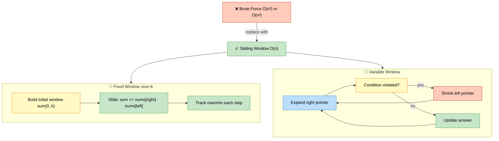

# Sliding Window — Patterns, Techniques, and Interview Problems

> **Subject**: DSA · **Group**: 🧩 Core Topics · **Topic**: 04 of 6
> **Status**: ✅ Done

---

## PART 1

---

### 1. Core Concept

**Sliding Window** eliminates redundant work in subarray/substring problems by maintaining a window that slides through the array. Instead of re-computing the whole subarray for every position, you add one element (right) and remove one element (left) — O(n) instead of O(n²) or O(n³).



```
WITHOUT SLIDING WINDOW:
  "Max sum of subarray of length k"
  Brute force: for each i, sum nums[i:i+k] → O(n×k)

WITH SLIDING WINDOW:
  Initial window: sum(nums[0:k])
  Slide: sum += nums[right] - nums[left]  → O(n) total

TWO TYPES:
  1. Fixed window size k: window is always exactly k elements
  2. Variable window size: expand right, shrink left based on condition
```

---

### 2. Fixed Window Template

```python
# TEMPLATE: Fixed window of size k

def fixed_window(nums, k):
    # Step 1: build initial window
    window_sum = sum(nums[:k])
    max_sum = window_sum

    # Step 2: slide — remove leftmost, add rightmost
    for i in range(k, len(nums)):
        window_sum += nums[i] - nums[i - k]
        max_sum = max(max_sum, window_sum)

    return max_sum

# MAXIMUM AVERAGE SUBARRAY I (LeetCode 643):
def find_max_average(nums, k):
    window_sum = sum(nums[:k])
    max_sum = window_sum
    for i in range(k, len(nums)):
        window_sum += nums[i] - nums[i-k]
        max_sum = max(max_sum, window_sum)
    return max_sum / k

# PERMUTATION IN STRING (LeetCode 567):
# "Does s2 contain a permutation of s1?"
from collections import Counter

def check_inclusion(s1, s2):
    if len(s1) > len(s2):
        return False
    need = Counter(s1)
    window = Counter(s2[:len(s1)])
    if window == need:
        return True
    for i in range(len(s1), len(s2)):
        window[s2[i]] += 1
        left = s2[i - len(s1)]
        window[left] -= 1
        if window[left] == 0:
            del window[left]
        if window == need:
            return True
    return False
# Optimize: track 'matches' count instead of comparing dicts each iteration
```

---

### 3. Variable Window Template

```python
# TEMPLATE: Variable window — expand right, shrink left when invalid

def variable_window(nums, condition):
    left = 0
    result = 0
    window_state = {}  # or counter, or sum — track window invariant

    for right in range(len(nums)):
        # EXPAND: include nums[right] in window
        # update window_state with nums[right]

        # SHRINK: while window is invalid, move left forward
        while not condition(window_state):
            # remove nums[left] from window_state
            left += 1

        # window is valid: update result
        result = max(result, right - left + 1)

    return result

# LONGEST SUBSTRING WITH AT MOST K DISTINCT CHARACTERS:
def length_of_longest_substring_k_distinct(s, k):
    count = {}
    left = max_len = 0

    for right, c in enumerate(s):
        count[c] = count.get(c, 0) + 1

        while len(count) > k:  # too many distinct chars
            left_c = s[left]
            count[left_c] -= 1
            if count[left_c] == 0:
                del count[left_c]
            left += 1

        max_len = max(max_len, right - left + 1)
    return max_len
```

---

### 4. Classic Variable Window Problems

```python
# LONGEST SUBSTRING WITHOUT REPEATING CHARS (LeetCode 3):
def length_of_longest_substring(s):
    seen = {}
    left = max_len = 0
    for right, c in enumerate(s):
        if c in seen and seen[c] >= left:
            left = seen[c] + 1
        seen[c] = right
        max_len = max(max_len, right - left + 1)
    return max_len

# MINIMUM SIZE SUBARRAY SUM (LeetCode 209):
# Smallest contiguous subarray with sum >= target
def min_sub_array_len(target, nums):
    left = total = 0
    min_len = float('inf')
    for right in range(len(nums)):
        total += nums[right]
        while total >= target:
            min_len = min(min_len, right - left + 1)
            total -= nums[left]
            left += 1
    return 0 if min_len == float('inf') else min_len
# Time: O(n) — left and right each move at most n times

# FRUIT INTO BASKETS (LeetCode 904):
# Max fruits you can pick with only 2 types of fruit
# = Longest subarray with at most 2 distinct values
def total_fruit(fruits):
    basket = {}
    left = max_count = 0
    for right, fruit in enumerate(fruits):
        basket[fruit] = basket.get(fruit, 0) + 1
        while len(basket) > 2:
            basket[fruits[left]] -= 1
            if basket[fruits[left]] == 0:
                del basket[fruits[left]]
            left += 1
        max_count = max(max_count, right - left + 1)
    return max_count
```

---

### 5. Hard Sliding Window Problems

```python
# MINIMUM WINDOW SUBSTRING (LeetCode 76):
from collections import Counter

def min_window(s, t):
    if not t:
        return ""
    need = Counter(t)
    missing = len(t)    # total chars still needed
    left = start = end = 0

    for right, c in enumerate(s, 1):  # 1-indexed right
        if need[c] > 0:
            missing -= 1
        need[c] -= 1

        if missing == 0:
            # shrink from left
            while need[s[left]] < 0:
                need[s[left]] += 1
                left += 1
            # record best window
            if end == 0 or right - left < end - start:
                start, end = left, right
            # remove leftmost to look for next window
            need[s[left]] += 1
            missing += 1
            left += 1

    return s[start:end]

# SLIDING WINDOW MAXIMUM (LeetCode 239): use Monotonic Deque
from collections import deque
def max_sliding_window(nums, k):
    dq = deque()  # stores indices; front = max of window
    result = []
    for i, num in enumerate(nums):
        # remove elements outside window
        while dq and dq[0] < i - k + 1:
            dq.popleft()
        # remove smaller elements (they'll never be max)
        while dq and nums[dq[-1]] < num:
            dq.pop()
        dq.append(i)
        if i >= k - 1:
            result.append(nums[dq[0]])
    return result
# Time: O(n), each element pushed/popped at most once
```

---

## PART 2

---

### 6. Must-Know Problems

| Problem                            | LeetCode | Pattern                          | Time   |
| ---------------------------------- | -------- | -------------------------------- | ------ |
| Longest Substring No Repeat        | #3       | Variable window                  | O(n)   |
| Minimum Window Substring           | #76      | Variable window + Counter        | O(n)   |
| Permutation in String              | #567     | Fixed window + Counter           | O(n)   |
| Fruit Into Baskets                 | #904     | Variable window, 2 distinct      | O(n)   |
| Minimum Size Subarray Sum          | #209     | Variable window, sum ≥ k         | O(n)   |
| Sliding Window Maximum             | #239     | Fixed window + Monotonic Deque   | O(n)   |
| Max Consecutive Ones III           | #1004    | Variable window, k zeros allowed | O(n)   |
| Longest Repeating Char Replacement | #424     | Variable window + count          | O(n)   |
| Find All Anagrams                  | #438     | Fixed window + Counter           | O(n)   |
| Substring with Concatenation       | #30      | Fixed window + Counter           | O(n×m) |

---

### 7. Key Interview Patterns

```
SLIDING WINDOW RECOGNITION:

  KEYWORDS that signal sliding window:
    "subarray / substring"
    "contiguous sequence"
    "window of size k"
    "longest / shortest with condition"
    "at most / at least k distinct"

  FIXED vs VARIABLE:
    "window of exact size k" → Fixed window
    "smallest/largest window satisfying condition" → Variable window

  SHRINK CONDITION:
    "at most k distinct chars" → shrink when distinct > k
    "sum >= target" → shrink while condition holds; record min size
    "no repeating" → shrink when duplicate found

  WHAT TO TRACK IN WINDOW:
    Sum → running total
    Characters → Counter dict
    Distinct count → len(dict)
    Max element → Monotonic Deque
```

---

### 8. Longest Repeating Character Replacement

```python
# LeetCode 424 — Key insight: window is valid if
# window_size - count_of_most_frequent <= k

def character_replacement(s, k):
    count = {}
    left = max_count = max_len = 0

    for right, c in enumerate(s):
        count[c] = count.get(c, 0) + 1
        max_count = max(max_count, count[c])

        # window is invalid: can't fix with k replacements
        while (right - left + 1) - max_count > k:
            count[s[left]] -= 1
            left += 1

        max_len = max(max_len, right - left + 1)

    return max_len

# TRACE: s="AABABBA", k=1
# At each right: track max frequency in window
# window - max_freq > k → shrink
# Key: max_count never decreases (optimization: we only care about windows
#      larger than current best, which requires max_count to increase)
```

---

### 9. Interview-Ready Explanation (30 sec)

> _"Sliding window converts O(n²) subarray problems to O(n) by maintaining a window that slides through the array. Add the right element, remove the left when the window becomes invalid._
>
> _Two variants: fixed size (max sum of k elements — just add right, subtract k-steps-ago-left) and variable size (longest/shortest satisfying a condition — expand right, shrink left until valid again)._
>
> _Key recognition: the problem asks about a contiguous subarray/substring, with 'longest,' 'shortest,' 'at most k,' or 'exactly k distinct.' The condition tells you when to shrink the window."_

---

### 10. Common Interview Questions

**Q1: What is the difference between fixed and variable sliding window?**

> Fixed window: size is always exactly k. You initialize a window of size k, then slide by adding `nums[right]` and removing `nums[right - k]` (the element that fell off the back). Used when the problem specifies an exact window size. Variable window: size changes. You expand by moving right pointer forward (always). You shrink by moving left forward when some condition is violated (window becomes invalid). The window is valid when a condition holds (e.g., sum ≥ target, ≤ k distinct chars). Used for "longest/shortest" problems without a fixed k. The key difference: fixed window has a predictable shrink point (exactly k steps back); variable window has a data-dependent shrink point (when condition is violated).

**Q2: How do you solve "Minimum Window Substring" step by step?**

> Target: find smallest substring of s that contains all characters of t. Setup: `need = Counter(t)`, `missing = len(t)`. Use 1-indexed right pointer. For each character at right: if `need[c] > 0`, a needed character was added, decrement `missing`. Always decrement `need[c]`. When `missing == 0` (all of t covered): shrink left as long as `need[s[left]] < 0` (that character is extra). Record window size if best so far. Advance left past one character (increment `missing` back by 1, increment `need`). Why this works: `need[c] < 0` means the character is surplus; we can safely remove it from left. We stop shrinking when removing another character would cause `missing > 0`. Time O(n) because left and right each traverse s once.

**Q3: When would you use a Monotonic Deque with sliding window?**

> When you need the maximum (or minimum) of the current window at O(1) per step. Without deque: find max of window = O(k) per step → O(n×k) total. With deque: maintain a deque where values are decreasing (for max). For each new element: remove all elements from the back of the deque that are smaller than the new element (they can never be the max of any future window). Add new element's index. Remove from front if the index is outside the window. Front of deque is always the max of the current window. Time O(n): each element is pushed and popped at most once. Space O(k). Classic problem: Sliding Window Maximum (LeetCode 239). Also used in: Next Greater Element, Largest Rectangle in Histogram, Daily Temperatures.

---

> **Next Topic →** [05 · Basic Recursion](./05-basic-recursion.md)
