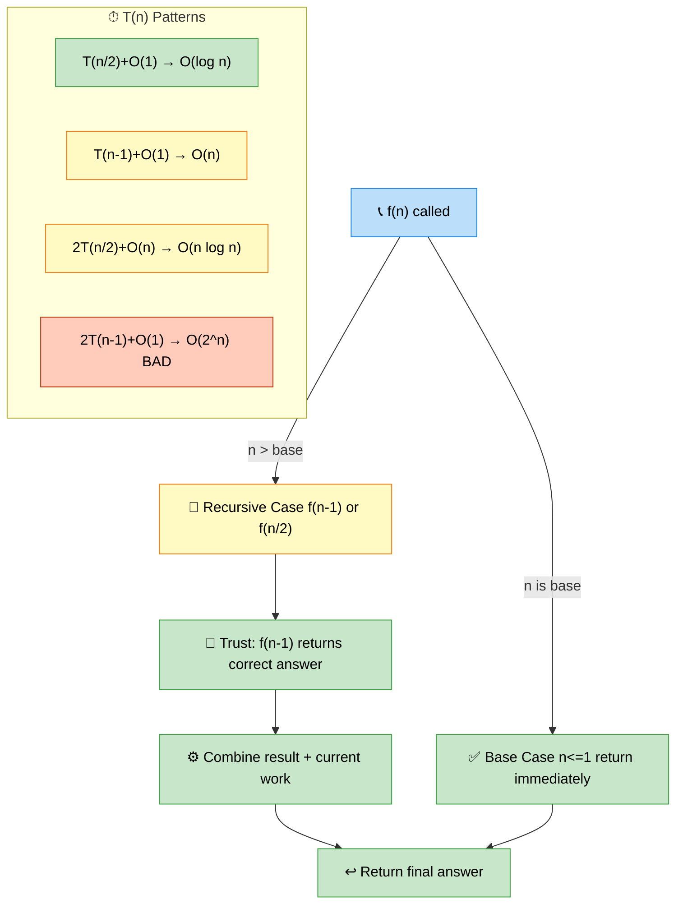

# Basic Recursion — Patterns, Techniques, and Interview Problems

> **Subject**: DSA · **Group**: 🧩 Core Topics · **Topic**: 05 of 6
> **Status**: ✅ Done

---

## PART 1

---

### 1. Core Concepts

**Recursion** solves problems by breaking them into smaller subproblems of the same shape, until a base case is reached. Every recursive solution has:

1. **Base case**: stop condition (smallest valid input)
2. **Recursive case**: call self with smaller input
3. **Trust the recursion**: assume the recursive call returns the correct answer



```
RECURSION FUNDAMENTALS:
  Call stack: each call occupies stack frame
  Stack overflow: too deep recursion (Python default: 1000)
  Tail recursion: last action is recursive call (some langs optimize)

TIME COMPLEXITY:
  T(n) = number of subproblems × work per subproblem

  Binary recursion (halving):  T(n) = T(n/2) + O(1)  → O(log n)
  Linear recursion:            T(n) = T(n-1) + O(1)  → O(n)
  Branch 2, halving:           T(n) = 2T(n/2) + O(n) → O(n log n) [merge sort]
  Branch 2, linear:            T(n) = 2T(n-1) + O(1) → O(2^n) [bad!]

RECURSION → ITERATION:
  Linear recursion → loop
  Binary recursion → stack (explicit) or BFS/DFS
  Tail recursion → loop with accumulator
```

---

### 2. Factorial and Fibonacci (Foundation)

```python
# FACTORIAL — the "hello world" of recursion:
def factorial(n):
    if n <= 1:         # base case
        return 1
    return n * factorial(n - 1)  # trust: factorial(n-1) returns (n-1)!

# FIBONACCI — introduces overlapping subproblems:
# Naive recursion: O(2^n) — catastrophic!
def fib_naive(n):
    if n <= 1:
        return n
    return fib_naive(n-1) + fib_naive(n-2)

# Memoized: O(n) time, O(n) space
def fib_memo(n, memo={}):
    if n in memo:
        return memo[n]
    if n <= 1:
        return n
    memo[n] = fib_memo(n-1, memo) + fib_memo(n-2, memo)
    return memo[n]

# Bottom-up DP: O(n) time, O(1) space
def fib_dp(n):
    if n <= 1:
        return n
    a, b = 0, 1
    for _ in range(2, n + 1):
        a, b = b, a + b
    return b

# LESSON: recursion → memoization → bottom-up DP is a standard optimization path
```

---

### 3. Tree Recursion Patterns

```python
# The most natural use of recursion: tree traversal
# "Do something at a node, then recursively do it for children"

# BINARY TREE MAX DEPTH (LeetCode 104):
def max_depth(root):
    if not root:
        return 0
    return 1 + max(max_depth(root.left), max_depth(root.right))
# Trust: max_depth(root.left) returns correct depth of left subtree

# INVERT BINARY TREE (LeetCode 226):
def invert_tree(root):
    if not root:
        return None
    root.left, root.right = invert_tree(root.right), invert_tree(root.left)
    return root

# PATH SUM (LeetCode 112):
def has_path_sum(root, target):
    if not root:
        return False
    if not root.left and not root.right:  # leaf
        return root.val == target
    return (has_path_sum(root.left, target - root.val) or
            has_path_sum(root.right, target - root.val))

# VALIDATE BST (LeetCode 98) — pass min/max bounds:
def is_valid_bst(root, min_val=float('-inf'), max_val=float('inf')):
    if not root:
        return True
    if not (min_val < root.val < max_val):
        return False
    return (is_valid_bst(root.left, min_val, root.val) and
            is_valid_bst(root.right, root.val, max_val))
```

---

### 4. Backtracking (Recursive Exploration)

```python
# BACKTRACKING TEMPLATE:
# "Explore all choices; undo if it doesn't work"

def backtrack(path, choices, result):
    if is_complete(path):
        result.append(path[:])  # copy current state
        return
    for choice in choices:
        if is_valid(choice, path):
            path.append(choice)   # make choice
            backtrack(path, new_choices, result)
            path.pop()            # undo choice (backtrack)

# SUBSETS (LeetCode 78):
def subsets(nums):
    result = []
    def backtrack(start, path):
        result.append(path[:])
        for i in range(start, len(nums)):
            path.append(nums[i])
            backtrack(i + 1, path)
            path.pop()
    backtrack(0, [])
    return result

# PERMUTATIONS (LeetCode 46):
def permutations(nums):
    result = []
    def backtrack(path, remaining):
        if not remaining:
            result.append(path[:])
            return
        for i, num in enumerate(remaining):
            path.append(num)
            backtrack(path, remaining[:i] + remaining[i+1:])
            path.pop()
    backtrack([], nums)
    return result

# COMBINATIONS (LeetCode 77) — choose k from 1..n:
def combine(n, k):
    result = []
    def backtrack(start, path):
        if len(path) == k:
            result.append(path[:])
            return
        for i in range(start, n + 1):
            path.append(i)
            backtrack(i + 1, path)
            path.pop()
    backtrack(1, [])
    return result
```

---

### 5. Divide and Conquer

```python
# MERGE SORT — classic divide and conquer:
def merge_sort(nums):
    if len(nums) <= 1:
        return nums

    mid = len(nums) // 2
    left = merge_sort(nums[:mid])
    right = merge_sort(nums[mid:])
    return merge(left, right)

def merge(left, right):
    result = []
    i = j = 0
    while i < len(left) and j < len(right):
        if left[i] <= right[j]:
            result.append(left[i]); i += 1
        else:
            result.append(right[j]); j += 1
    result.extend(left[i:])
    result.extend(right[j:])
    return result
# Time: O(n log n), Space: O(n)

# BINARY SEARCH (recursive form):
def binary_search_rec(nums, target, left=0, right=None):
    if right is None:
        right = len(nums) - 1
    if left > right:
        return -1
    mid = (left + right) // 2
    if nums[mid] == target:
        return mid
    elif nums[mid] < target:
        return binary_search_rec(nums, target, mid + 1, right)
    else:
        return binary_search_rec(nums, target, left, mid - 1)

# POWER FUNCTION (fast exponentiation):
def my_pow(x, n):  # LeetCode 50
    if n == 0:
        return 1
    if n < 0:
        return 1 / my_pow(x, -n)
    if n % 2 == 0:
        half = my_pow(x, n // 2)
        return half * half
    return x * my_pow(x, n - 1)
# Time: O(log n) — halves n each time
```

---

## PART 2

---

### 6. Must-Know Problems

| Problem                     | LeetCode | Pattern               | Time          |
| --------------------------- | -------- | --------------------- | ------------- |
| Invert Binary Tree          | #226     | Tree recursion        | O(n)          |
| Max Depth Binary Tree       | #104     | Tree recursion        | O(n)          |
| Validate BST                | #98      | Recursion with bounds | O(n)          |
| Merge Two Sorted Lists      | #21      | Linked list recursion | O(n)          |
| Subsets                     | #78      | Backtracking          | O(2^n)        |
| Permutations                | #46      | Backtracking          | O(n!)         |
| Combinations                | #77      | Backtracking          | O(n choose k) |
| Letter Combinations (Phone) | #17      | Backtracking          | O(4^n)        |
| Generate Parentheses        | #22      | Backtracking          | O(4^n / √n)   |
| Pow(x, n)                   | #50      | Divide and conquer    | O(log n)      |

---

### 7. Recursion Mental Model

```
THREE QUESTIONS to solve any recursive problem:

1. WHAT IS THE BASE CASE?
   "What is the smallest valid input where I know the answer directly?"
   Empty list → return 0 or []
   Single node → return node.val or True/False
   n == 0 → return 1 (factorial) or 0

2. WHAT DOES ONE RECURSIVE CALL RETURN?
   "Trust that recursion works perfectly for n-1 or subtrees"
   max_depth(root.left) returns the exact max depth of left subtree
   Don't trace through it; just trust it

3. HOW DO I USE THE RECURSIVE RESULT?
   "Given correct answers for subproblems, how do I compute the full answer?"
   max_depth = 1 + max(left_depth, right_depth)
   total_sum = root.val + left_sum + right_sum

COMMON MISTAKE: trying to trace the full recursion in your head
FIX: trust the definition; use the returned value correctly
```

---

### 8. Generate Parentheses

```python
# LeetCode 22 — Beautiful backtracking example

def generate_parentheses(n):
    result = []

    def backtrack(path, open_count, close_count):
        if len(path) == 2 * n:
            result.append(''.join(path))
            return

        if open_count < n:
            path.append('(')
            backtrack(path, open_count + 1, close_count)
            path.pop()

        if close_count < open_count:  # can only close if we have more opens
            path.append(')')
            backtrack(path, open_count, close_count + 1)
            path.pop()

    backtrack([], 0, 0)
    return result

# For n=2: ["(())", "()()"]
# Key invariant: close_count <= open_count at all times (valid prefix)

# TRACE for n=2:
# '(' → '((' → '(()' → '(())' ✓
#             ← backtrack
#      '()' → '()(' → '()()' ✓
```

---

### 9. Interview-Ready Explanation (30 sec)

> _"Recursion breaks a problem into smaller subproblems of the same shape. Three steps: define the base case, trust that the recursive call returns the correct answer for smaller input, and compose the result using that trusted answer._
>
> _Most tree problems are naturally recursive — max depth = 1 + max(left depth, right depth). Backtracking extends recursion with undoing choices, used for generating permutations, subsets, and combinations._
>
> _Memoization (caching results) converts exponential recursion (Fibonacci naive: O(2^n)) to linear O(n). When you see overlapping subproblems in recursion, memoize."_

---

### 10. Common Interview Questions

**Q1: How do you prevent stack overflow in deep recursion?**

> Python has a default recursion limit of ~1000 (set via `sys.setrecursionlimit`). For very deep recursion: (1) Convert to iteration with an explicit stack (always possible for DFS). (2) Tail recursion optimization: Python doesn't do TCO natively, but you can restructure to use a loop. (3) Increase the limit (`sys.setrecursionlimit(10000)`) — risky, not production-safe. (4) Bottom-up DP instead of top-down memoization (iterative, no stack). In interviews: mention the risk for deep trees (n up to 10^5 would overflow default Python recursion). For balanced BST of height log n, depth is fine. For a degenerate tree (linked list), use iterative DFS. Iterative DFS with explicit stack is always safer for production code.

**Q2: What is the difference between recursion and dynamic programming?**

> Recursion is a technique (function calls itself). Dynamic programming is an optimization technique for recursion with overlapping subproblems and optimal substructure. Three forms: (1) Plain recursion: no caching, recomputes everything. (2) Memoization (top-down DP): recursive + cache. First call computes and stores; subsequent calls return cached result. Same logic as recursion but O(n) not O(2^n). (3) Bottom-up DP (tabulation): fill a table iteratively, building from base cases up. No recursion stack. In interviews: start with recursive solution to establish correctness, then optimize with memoization if TLE. If the interviewer asks for DP, they want the bottom-up approach. Both memoization and bottom-up have the same time complexity — bottom-up has better constant factors (no function call overhead, no stack).

**Q3: How do you write the backtracking solution for Letter Combinations of a Phone Number?**

> Map each digit to its letters: `{'2': 'abc', '3': 'def', ...}`. Recursive function: if path length equals digits length, add to results and return. Otherwise, take the next digit (at position = current path length), iterate over its letters, add letter to path, recurse, remove letter (backtrack). Base case: empty digits → return empty list. For digits = "23": start with '2' letters (a,b,c), for each → try '3' letters (d,e,f) → produce "ad","ae","af","bd","be","bf","cd","ce","cf". Time O(4^n × n) — at most 4 letters per digit (7,9 have 4), n digits. Space O(n) for the recursion stack. Key: backtracking with `path.append(c)` → recurse → `path.pop()` is cleaner than string concatenation (strings are immutable; creating new string each call is also fine for short strings).

---

> **Next Topic →** [06 · Sorting](./06-sorting.md)
