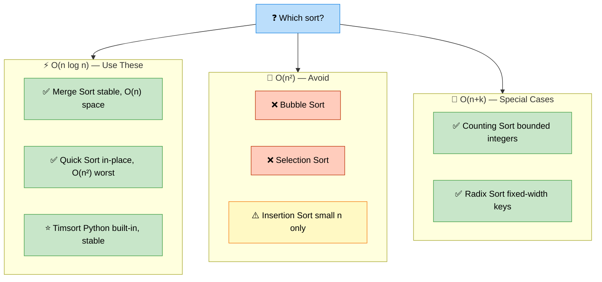

# Sorting — Algorithms, Techniques, and Interview Problems

> **Subject**: DSA · **Group**: 🧩 Core Topics · **Topic**: 06 of 6
> **Status**: ✅ Done

---

## PART 1

---

### 1. Core Concepts

**Sorting** transforms an unsorted collection into a sorted one. More importantly, sorting often _enables_ more efficient algorithms — binary search, two pointers, interval merging, and many greedy solutions all require sorted input.



```
SORTING ALGORITHM COMPARISON:
  Algorithm      | Time (avg)  | Time (worst) | Space | Stable?
  ────────────────────────────────────────────────────────────
  Bubble Sort    | O(n²)       | O(n²)        | O(1)  | Yes
  Selection Sort | O(n²)       | O(n²)        | O(1)  | No
  Insertion Sort | O(n²)       | O(n²)        | O(1)  | Yes
  Merge Sort     | O(n log n)  | O(n log n)   | O(n)  | Yes ←
  Quick Sort     | O(n log n)  | O(n²)        | O(log n) | No
  Heap Sort      | O(n log n)  | O(n log n)   | O(1)  | No
  Counting Sort  | O(n + k)    | O(n + k)     | O(k)  | Yes ←
  Radix Sort     | O(n × d)    | O(n × d)     | O(n)  | Yes
  Timsort        | O(n log n)  | O(n log n)   | O(n)  | Yes ← Python's sort()

  KEY: n = elements, k = value range, d = digits

PYTHON BUILT-INS:
  list.sort()    → in-place Timsort, O(n log n), stable
  sorted(iterable) → returns new sorted list
  sorted(arr, key=lambda x: x[1])  → sort by custom key
  sorted(arr, reverse=True)        → descending
```

---

### 2. Merge Sort (Know Deeply)

```python
def merge_sort(nums):
    if len(nums) <= 1:
        return nums

    mid = len(nums) // 2
    left = merge_sort(nums[:mid])
    right = merge_sort(nums[mid:])
    return merge(left, right)

def merge(left, right):
    result = []
    i = j = 0
    while i < len(left) and j < len(right):
        if left[i] <= right[j]:
            result.append(left[i]); i += 1
        else:
            result.append(right[j]); j += 1
    result.extend(left[i:])
    result.extend(right[j:])
    return result

# Time: O(n log n) — log n levels × n merges per level
# Space: O(n) — auxiliary arrays during merge
# Stable: yes — equal elements maintain original order
# USE MERGE SORT WHEN: stable sort needed, linked list (no random access OK),
#                      counting inversions (modification of merge step)

# COUNT INVERSIONS (pairs where i < j but nums[i] > nums[j]):
def count_inversions(nums):
    if len(nums) <= 1:
        return nums, 0
    mid = len(nums) // 2
    left, l_inv = count_inversions(nums[:mid])
    right, r_inv = count_inversions(nums[mid:])
    merged, split_inv = merge_count(left, right)
    return merged, l_inv + r_inv + split_inv

def merge_count(left, right):
    result, inversions, i, j = [], 0, 0, 0
    while i < len(left) and j < len(right):
        if left[i] <= right[j]:
            result.append(left[i]); i += 1
        else:
            inversions += len(left) - i  # all remaining left elements form inversions
            result.append(right[j]); j += 1
    result.extend(left[i:]); result.extend(right[j:])
    return result, inversions
```

---

### 3. Quick Sort (Know the Idea)

```python
def quick_sort(nums, left=0, right=None):
    if right is None:
        right = len(nums) - 1
    if left >= right:
        return
    pivot_idx = partition(nums, left, right)
    quick_sort(nums, left, pivot_idx - 1)
    quick_sort(nums, pivot_idx + 1, right)

def partition(nums, left, right):
    pivot = nums[right]
    i = left - 1
    for j in range(left, right):
        if nums[j] <= pivot:
            i += 1
            nums[i], nums[j] = nums[j], nums[i]
    nums[i+1], nums[right] = nums[right], nums[i+1]
    return i + 1

# Average: O(n log n), Worst: O(n²) (sorted input with bad pivot choice)
# Fix: randomize pivot selection
# Space: O(log n) average for recursion stack
# USE QUICK SORT WHEN: in-place needed, average case performance matters
# NOTE: Python's built-in sort (Timsort) is almost always better in practice
```

---

### 4. Custom Sorting (Interview Tricks)

```python
# SORT BY MULTIPLE CRITERIA:
people = [("Alice", 30), ("Bob", 25), ("Charlie", 30)]
# Sort by age ascending, then name descending:
people.sort(key=lambda x: (x[1], [-ord(c) for c in x[0]]))
# Or: sort(key=lambda x: (x[1], x[0]))  # ascending age, ascending name

# SORT CUSTOM OBJECTS:
from functools import cmp_to_key
def compare(a, b):
    if a < b: return -1
    if a > b: return 1
    return 0
sorted_nums = sorted(nums, key=cmp_to_key(compare))

# LARGEST NUMBER (LeetCode 179) — custom comparator:
def largest_number(nums):
    strs = [str(n) for n in nums]
    strs.sort(key=cmp_to_key(lambda a, b: 1 if a+b > b+a else -1), reverse=True)
    result = ''.join(strs)
    return '0' if result[0] == '0' else result
# ["3","30"] → "3" + "30" = "330" vs "30" + "3" = "303" → "3" comes first

# SORT COLORS (Dutch National Flag, LeetCode 75):
def sort_colors(nums):
    low = mid = 0
    high = len(nums) - 1
    while mid <= high:
        if nums[mid] == 0:
            nums[low], nums[mid] = nums[mid], nums[low]
            low += 1; mid += 1
        elif nums[mid] == 1:
            mid += 1
        else:
            nums[mid], nums[high] = nums[high], nums[mid]
            high -= 1
# Time: O(n), Space: O(1) — one pass!
```

---

### 5. Heap Sort and Priority Queue

```python
import heapq

# PYTHON HEAP: min-heap by default
# Push: O(log n), Pop: O(log n), Peek top: O(1)

# K LARGEST ELEMENTS (LeetCode 215 — Kth Largest):
def find_kth_largest(nums, k):
    # Maintain a min-heap of size k
    heap = nums[:k]
    heapq.heapify(heap)  # O(k)
    for num in nums[k:]:
        if num > heap[0]:
            heapq.heapreplace(heap, num)  # O(log k)
    return heap[0]
# Time: O(n log k), Space: O(k)

# OR: use heapq.nlargest (simpler but same complexity):
def find_kth_largest_v2(nums, k):
    return heapq.nlargest(k, nums)[-1]

# MERGE K SORTED ARRAYS:
def merge_k_sorted(arrays):
    heap = []
    for i, arr in enumerate(arrays):
        if arr:
            heapq.heappush(heap, (arr[0], i, 0))

    result = []
    while heap:
        val, arr_idx, elem_idx = heapq.heappop(heap)
        result.append(val)
        if elem_idx + 1 < len(arrays[arr_idx]):
            next_val = arrays[arr_idx][elem_idx + 1]
            heapq.heappush(heap, (next_val, arr_idx, elem_idx + 1))
    return result
# Time: O(n log k) where n = total elements, k = number of arrays
```

---

## PART 2

---

### 6. Must-Know Problems

| Problem                    | LeetCode | Technique                             | Time       |
| -------------------------- | -------- | ------------------------------------- | ---------- |
| Sort Colors                | #75      | Dutch National Flag (3-way partition) | O(n)       |
| Merge Intervals            | #56      | Sort + merge                          | O(n log n) |
| Largest Number             | #179     | Custom comparator                     | O(n log n) |
| Kth Largest Element        | #215     | Quickselect / Min-heap                | O(n avg)   |
| Meeting Rooms II           | #253     | Sort + min-heap                       | O(n log n) |
| Sort an Array              | #912     | Implement merge sort                  | O(n log n) |
| Find K Pairs Smallest Sums | #373     | Min-heap                              | O(k log k) |
| Wiggle Sort                | #280     | One-pass swap                         | O(n)       |
| H-Index                    | #274     | Sort descending                       | O(n log n) |
| Pancake Sorting            | #969     | Simulation                            | O(n²)      |

---

### 7. Key Patterns

```
SORTING TO ENABLE OTHER ALGORITHMS:

  "Find pairs/triplets with target sum"
     → Sort first → Two Pointers (O(n²) vs O(n³) brute force)

  "Merge overlapping intervals"
     → Sort by start → single pass merge

  "Greedy scheduling (e.g., meeting rooms)"
     → Sort by start time → process in order

  "Find kth element"
     → Options: Sort O(n log n), Min-heap O(n log k), Quickselect O(n avg)

  "Count elements meeting condition"
     → Sort → binary search for boundary (O(n log n) setup, O(log n) per query)

WHEN NOT TO SORT:
  Need original order/indices → use indices alongside values, or HashMap
  Already sorted input → don't re-sort (binary search directly)
  k << n for top-k problems → heap is better than full sort
```

---

### 8. Quickselect (Kth Largest in O(n) Average)

```python
# LeetCode 215 — Kth Largest Element
# Quickselect: partition like quicksort, only recurse into relevant half

import random

def find_kth_largest(nums, k):
    k_idx = len(nums) - k  # kth largest = (n-k)th smallest (0-indexed)

    def quickselect(left, right):
        pivot_idx = random.randint(left, right)
        nums[pivot_idx], nums[right] = nums[right], nums[pivot_idx]
        pivot = nums[right]

        i = left
        for j in range(left, right):
            if nums[j] <= pivot:
                nums[i], nums[j] = nums[j], nums[i]
                i += 1
        nums[i], nums[right] = nums[right], nums[i]

        if i == k_idx:
            return nums[i]
        elif i < k_idx:
            return quickselect(i + 1, right)
        else:
            return quickselect(left, i - 1)

    return quickselect(0, len(nums) - 1)

# Average: O(n) — each partition eliminates half the elements
# Worst: O(n²) — bad pivot selection (fixed by random pivot)
# Space: O(log n) average recursion stack
```

---

### 9. Interview-Ready Explanation (30 sec)

> _"Sorting enables most interval, greedy, and two-pointer algorithms. In Python, `sorted()` or `list.sort()` gives you O(n log n) Timsort — use it. Know Merge Sort deeply (stable, O(n log n) worst, can be modified for counting inversions). Know Quick Sort conceptually (in-place but O(n²) worst case — random pivot fixes this)._
>
> _Quickselect finds kth element in O(n) average without full sort. For top-k problems: min-heap of size k is O(n log k) — better than O(n log n) sort when k is small._
>
> _Practical interview rule: if you need to sort, just sort — don't implement it. Implement Merge Sort or Quick Sort only if explicitly asked."_

---

### 10. Common Interview Questions

**Q1: When would you use Merge Sort vs Quick Sort?**

> Merge Sort: guaranteed O(n log n) worst case; stable (preserves relative order of equal elements); good for linked lists (no random access needed for merging). Extra O(n) space. Use when: stability required, worst-case guarantee needed, sorting linked lists. Quick Sort: O(n log n) average, O(n²) worst case (avoidable with random pivot); in-place O(log n) space; better cache performance (accesses contiguous memory in partition). Use when: in-place required, average case is acceptable, working with arrays in memory. In practice: most standard library sorts (Python's Timsort, Java's Arrays.sort for primitives) are hybrids that combine insertion sort for small arrays, merge sort for objects (stability), and quick sort for primitives. For interviews: know Merge Sort implementation; Quick Sort conceptually.

**Q2: What is Timsort and why does Python use it?**

> Timsort is a hybrid algorithm combining Merge Sort and Insertion Sort. It exploits natural runs (already-sorted sequences) in real-world data. Algorithm: divide array into runs (natural sorted sequences or forced by insertion sort for small runs); merge runs using merge sort. Minimum run size: 32-64 elements. Why Python uses it: (1) O(n log n) worst case (like merge sort). (2) O(n) best case for nearly sorted data (better than pure merge sort). (3) Stable (preserves relative order of equal elements). (4) Works extremely well on real-world data which often has partial sorting. Guarantees: O(n) for already-sorted input, O(n log n) for random input, always stable. Java uses it for `Arrays.sort(Object[])` as well.

**Q3: How do you find the kth largest element efficiently?**

> Three approaches with different tradeoffs: (1) Sort: O(n log n) — simple but not optimal. (2) Min-Heap of size k: iterate through array; maintain heap where top is kth largest. Push each element; if heap size > k, pop the minimum. After all elements, heap top = kth largest. Time O(n log k), space O(k). Best when k << n and you also want top-k elements, not just kth. (3) Quickselect: O(n) average, O(n²) worst. Partition like quicksort. If pivot ends at index n-k, that's our answer. Otherwise recurse only into the relevant half. Best when you need only the kth element and average-case performance matters. For most interviews: implement the min-heap approach (simpler, stable O(n log k)). Mention quickselect for bonus points.

---

> ✅ **DSA Core Topics Complete (6/6)**
> ✅ **All Subjects Complete: System Design (28/28), AWS Cloud (17/17), DSA (6/6)**
> 🎉 **LearnHub Content Generation — FULLY COMPLETE**
